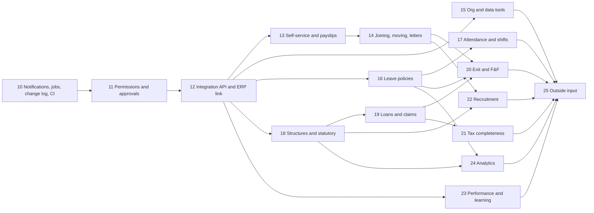

# HRMS — handover

**Last updated:** 27 Sept 2026 · **Current phase:** 13 of 25 done (self-service and payslips: corrections, year to date, PDF payslips by email, the installable app). Next is phase 14, joining, moving and letters.

**Live:** https://hrms-amogh24.vercel.app · **Repository:** `github.com/KernelLex/hrms` (branch `main`) · **Continuous integration:** GitHub Actions on every push

This is the one document for this project. It says what the software is, how it is built, what it looks like, where it stands, what is left, and what stands between it and production. A developer who reads it should be able to work on any part of the system without first reading the code or anything else.

---

## Contents

1. [How to use this document](#1-how-to-use-this-document)
2. [What this is](#2-what-this-is)
3. [Where it stands](#3-where-it-stands)
4. [Getting started](#4-getting-started)
5. [How it is built](#5-how-it-is-built)
6. [Screens and who sees them](#6-screens-and-who-sees-them)
7. [Conventions, gotchas and decisions](#7-conventions-gotchas-and-decisions)
8. [Design language](#8-design-language)
9. [What is left](#9-what-is-left)
10. [Production readiness](#10-production-readiness)
11. [History](#11-history)

---

## 1. How to use this document

- **It replaces every other document** the project had: the product README, the status report, the build plan, the roadmap, the production-readiness list, the design language and the plan for phases 10 to 25. Their content is all here. `AGENTS.md` / `CLAUDE.md` are instructions for coding assistants, not project documentation.
- **`README.md` is for the client**, not developers: the software's features in plain language, how to try it, a short "Coming next" list, and what it does not cover yet. Update it in the same commit whenever a phase adds or changes a feature, moving shipped items out of "Coming next". No dates or phase numbers in it.
- **`API.md` is the one other document**, and it has a different reader: the developers of a system that connects to the HRMS, starting with the client's ERP. It is the guide to the API; its reference section is generated from the code, and a test fails when it falls behind (§7.1).
- **Section references** in code comments point here. `HANDOVER.md §8.9` means section 8.9, the design language's components. The original blueprint and HTML mockups in `HR MODULE/` are kept as reference for features, not for appearance (see §6.3).
- **Keep it current as part of the work, not after it.** At the end of every phase, in the same commit:
  - rewrite §3 (where it stands) — the date, the figures, the phase table, the known gaps;
  - move the finished phase from §9 into §11 (history), noting where the build differed from the plan;
  - update §4 to §8 wherever the phase changed setup, architecture, screens, conventions or design;
  - update §10 — close what the phase closed, add what it revealed.
  - update `README.md` with any feature the phase added or changed, in the client's language.
- **Collaborating.** Propose a change to the plan by editing §9 in a pull request; record a decision in §7.3 with the reason; record anything that needs someone outside the team in phase 25 (§9.6). No timelines or effort estimates: this document says what and why, not how long.
- **Commits** are made as `tfthushaar`, and carry no co-author or tool attribution lines.

---

## 2. What this is

The HR module of an ERP. It holds the organisation's structure, the people in it, and the four things a company has to get right every month: pay them, track their time, hire their replacements, and account for their tax. It is modelled on how SAP HCM organises the same problem, and built to be operated by people who have never used SAP.

It is a **module of the ERP the client is building in-house**. The two systems will exchange data in both directions through an API (phase 12 onwards, §9.2): this module sends people, organisation, time, payroll and the payroll journal; the ERP sends back what it owns — accounts, cost centres, payment confirmations, earnings and deductions that start on its side. There are no connectors to third-party ERPs; the client's ERP is the only one.

It is a **working prototype** of an Indian company's HR back office — Indian payroll, Indian income tax, rupees, Indian dates — deployed and usable, with a demo organisation (Acme Manufacturing) seeded.

### 2.1 Who uses it

- **HR administrators** run the back office: build the org structure, hire and transfer people, maintain employee records, run payroll, produce statutory returns, and decide who can do what.
- **Managers** approve their team's leave, rate their team's performance, and recommend increments.
- **Employees** see what the company holds about them, apply for leave, watch their balances, read their payslips, declare their tax investments and download their Form 16.
- **Roles HR creates** — a recruiter who sees candidates but no pay, an auditor who reads but cannot change. Roles are sets of permissions (§5.6), so each gets exactly the screens its permissions allow.

Each role opens to its own home screen, showing only what that person has to decide or act on: one card of what needs attention, the four figures that matter to them, and what is coming up.

### 2.2 What it covers

**Org management.** Companies, personnel areas and sub-areas, jobs, departments and positions, each with validity dates, so the structure has a history. Positions carry reporting lines, so the org chart is derived from data, not drawn.

**Core HR.** Every fact about a person is a dated record (an *infotype*, in SAP's word), not a field that gets overwritten. Employees ask for corrections to their own record, which HR approves — a bank change with proof and a second approver — and the change is written from the day it applies. Change someone's salary and the old figure is closed off, not destroyed, so you can ask what anyone's pay, position or address was on any past date. Hiring is a guided action: the records are created together or not at all. HR files each person's documents on their record. Every read of pay, bank, tax and documents is logged, and every change is logged with its value before and after.

**Time and absence.** Leave types, annual entitlements, and requests that go through a configurable approval flow — by default the employee's reporting manager; longer leave can add HR. The balance moves on approval, and unpaid leave reaches payroll as a deduction. Attendance, overtime, work schedules, public holidays and a team calendar sit alongside.

**Payroll.** A period opens, locks for processing and is posted. The run works gross to net — basic pay for the days each person was employed, allowances, recurring and one-off payments, unpaid-leave proration, arrears, provident fund and tax — and produces a payslip that itemises every line with the year to date, on screen and as a PDF, emailed to each person password-protected when the month is posted. It handles joiners, leavers and mid-month raises by the day; pays arrears once when a paid month's inputs change; spreads tax across the year; runs off-cycle payments; and flags everyone new or whose pay moved 10% before posting. Runs are background jobs, so they finish with the screen closed. Downstream: the bank transfer file, the ledger journal by cost centre, and the statutory remittances.

**Recruitment.** A requisition opens hiring for a vacant position and describes the role — title, description, qualifications, skills, experience, type, place, a budget HR alone sees, and the hiring manager. Published, it appears on a public **careers site** where candidates apply with their resume, no account needed. Each application is **screened** — the profile rejected, or taken to interview — then goes through as many **interview rounds** as it needs, each with its own interviewer, date, time, place and notes, until the candidate is **approved or rejected**. An approved candidate is made an offer and converted into an employee through the same hiring action Core HR uses. Interviewers are told when they are asked, see their rounds under My interviews, and record their own notes.

**Performance and increments.** An annual cycle: goals, self and manager ratings, calibration, and increments that become the next basic-pay record payroll reads.

**Tax and Form 16.** Declarations under both regimes, the quarterly register of tax deducted and deposited, and both parts of Form 16, which reconcile against each other. Section 87A includes the new regime's marginal relief.

**Reports.** Headcount, payroll cost and leave by department, attrition, and CSV exports.

**On phones.** Every screen works at phone width, and the app installs to a phone's home screen; it keeps only its own code on the device, never anyone's data.

**Platform.** Notifications in an inbox and by email (recorded in an outbox until a provider is connected), background jobs, a change log of every write, permissions and roles HR edits, and an approval engine with delegation and escalation.

**Integration.** A versioned REST API (`/api/v1`) through which the client's ERP, and any other system HR connects, reads people, organisation, time and payroll; writes what it owns; hears about every change through signed webhooks or a pull feed; and reports back what it booked and paid. HR manages connected systems, record ownership, sync issues and a reconciliation of every journal on the Integrations screens.

### 2.3 How the modules connect

The value is in the seams:

- A hire in **recruitment** creates the employee in **core HR**.
- An approved unpaid leave in **time** becomes a deduction in **payroll**.
- An approved increment in **performance** becomes the basic pay **payroll** reads next month.
- Tax deducted by **payroll** becomes the register that **Form 16** is built from.
- Payroll results post to the **finance** ledger by the cost centre on each employee's org assignment, and go to the **client's ERP**, which books the journal, pays the salaries and says so (§9.2).
- Every change, in any module, becomes an **event** the ERP can receive (§9.3).

---

## 3. Where it stands

### 3.1 At a glance

| | |
|---|---|
| Phases complete | 0 to 9 (the original build), 10 to 14 of the extended plan. Part A runs to 24; Part B is 25. |
| Screens | 38 of 38 from the blueprint, plus 7 added in phase 9, 6 in phase 10, 6 in phase 11, and 16 in phase 12: six Integrations screens, the public API reference and error pages, and eight for the recruitment workflow, including the public careers site; phase 13 added the corrections inbox, request forms and an offline page; phase 14 added 6: the Career tab, transfer and promotion wizards, My tasks, Probation due and Letter templates |
| Database tables | 99, in 14 migrations (0000 to 0013) |
| Engines | Time-slice, quota, payroll, tax, time evaluation; plus the job runner and the approval engine |
| Permissions | 31, in ten groups; 3 built-in roles and a Recruiter role as the example |
| Integration API | 55 endpoints under `/api/v1`, 26 event types, 18 scopes. The guide for integrators is `API.md`; the live reference is `/developers`. |
| Automated tests | **272 passing** in 31 files (`npm test`), including an authorisation matrix over every Server Function and route, contract tests over every API endpoint, and the mock ERP's whole scenario |
| UI audit | **292 of 292** role, screen and width combinations clean (`npm run audit:ui`), as four people at 1280 and 375 pixels |
| CI | Typecheck, lint, tests, production build, UI audit and the mock ERP over HTTP on every push |
| Pending on others | Cloudflare R2 (not enabled on the account), email delivery (no provider chosen), and the rest of phase 25 |

### 3.2 Phases

| # | Phase | Status |
|---|---|---|
| 0 | Toolchain and repository | done |
| 1 | Foundation: design system, shell, auth, data layer | done |
| 2 | Org management (OM-01…08) | done |
| 3 | Core HR (CH-01…05), time-slice engine | done |
| 4 | Time and absence (TM-01…05), quota engine | done |
| 5 | Payroll (PY-01…05), payroll and tax engines | done |
| 6 | Recruitment (RC-01…05), hire conversion | done |
| 7 | Performance (PM-01…05), increment push | done |
| 8 | Tax and Form 16 (TDS-01…05) | done |
| 9 | Finish: dashboards, command menu, documents, print, states, phones, accessibility, tests, known gaps | done (R2 pending) |
| 10 | Notifications, background jobs, the change log and CI | done |
| 11 | Permissions and approvals | done |
| 12 | Integration API and the two-way ERP link, with the recruitment workflow reworked | done |
| 13 | Self-service and payslips | done |
| 14 | Joining, moving and letters | done |
| 15 | Org and data tools | **next** |
| 16–24 | Leave policies, attendance, statutory payroll, loans and claims, exits, tax completeness, recruitment, performance and learning, analytics | planned (§9.5) |
| 25 | Outside input: the ERP go-live, email, R2, e-signature and the rest | waits on you and the client (§9.6) |

### 3.3 Infrastructure

| Service | Status | Detail |
|---|---|---|
| GitHub | working | `KernelLex/hrms`; Actions runs CI on every push and pull request |
| Turso | working | `hrms-kernellex.aws-us-west-2.turso.io`, migrated to 0013 and seeded. One database: production and the demo are the same (§10). |
| Vercel | working | Project `amogh24/hrms`; deploys `main` on push; Vercel Cron calls `/api/cron/tick` daily |
| Email | recording only | No provider connected: every email is written to the outbox and readable on the Outbox screen, not sent |
| Cloudflare R2 | pending | Not enabled on the Cloudflare account (API error 10042). Documents are stored in the database until it is (§5.8). |

### 3.4 Demo accounts

The sign-in page lists four accounts; **one click signs straight in**. The password form is folded under "Sign in with a password"; every password is `demo1234`. Set `DEMO_SIGN_IN=off` to remove one-click sign-in.

| Account | Role | Sees |
|---|---|---|
| Priya Sharma, `hr.admin` | HR administrator | The whole back office, reports, exports, roles and approval flows |
| Ravi Kumar, `ravi.kumar` | Manager and employee | Their team's approvals, ratings and calendar, their own records, and the interviews they are asked to take |
| Arjun Mehta, `arjun.mehta` | Employee | Their own profile, leave, payslips, declaration, Form 16 and appraisal, a culture round to take under My interviews, and an address change waiting for HR |
| Neha Iyer, `neha.iyer` | Recruiter (a role HR created) | Requisitions, applications, interviews and candidates — and no pay anywhere |

The careers site, `/careers`, needs no account: the demo's HR executive role is published there. The API reference at `/developers` is public too.

### 3.5 Verification

| Check | Result |
|---|---|
| `npm test` | 272 passing: the seed re-run twice on an already-seeded database, checked for duplicates, corrections (dated writes, two approvers, refusals, the API), payslips (year to date against the year's payslips, one protected email per person, resend, downloads), the installable app, time slices, quotas, payroll, tax, retro, off-cycle, batching, increments, Form 16, time evaluation, storage, exports, search, dashboards, variance, profile, reports, notifications, jobs, the change log, permissions, approvals, the recruitment workflow and careers page, onboarding checklists and tasks, transfers and promotions through the time-slice engine, probation confirm/extend/end, letters (merge, PDF, immutability), the API (every endpoint against its schema, tokens, scopes, address and rate limits, company limits, idempotency, errors, the OpenAPI document, the guided-actions endpoint and its events), the mock ERP's scenario in-process with webhook retries, parking and replay, signatures, pay never shown without its scope, and the authorisation matrix |
| Mutation checks | Six deliberate bugs in the payroll and tax engines each fail a test; the outbox regression test fails on the old per-minute delivery key; the authorisation matrix fails when one Server Function's check is loosened |
| `npm run audit:ui` | 292 of 292 clean: every screen as HR, manager, employee and recruiter at 1280 and 375 pixels, the careers site and the API error page, with axe (WCAG 2 A and AA) and a sideways-scroll check |
| `npm run sandbox` | The mock ERP's 20 steps against a running app over HTTP, receiving real signed webhooks: 20 of 20 |
| `API.md` | Its reference is generated from the endpoint definitions; a test fails when it is stale |
| `npx tsc --noEmit`, `npm run lint`, `next build` | clean |
| CI | all of the above on GitHub Actions, on every push |

### 3.6 Known gaps

Honest about what the software does not do yet. What production needs is in §10.

- **Statutory scope is partial.** Employee provident fund and income tax only: no ESI, professional tax, labour welfare fund, gratuity, employer PF or EPS, and no ECR or 24Q files (phase 18 and 21).
- **Retro sees additions, not deletions,** and stops at the financial year. The change log now records deletions, which phase 21 uses.
- **One-off payments are taxed as salary,** without section 89 relief for arrears (phase 21).
- **Employee pickers load everyone.** Fine at hundreds, wrong at thousands.
- **Scope on screens covers employee records only.** A role limited to some companies sees only their people on the employee list, record, search, documents and export; payroll, time, tax and performance screens are organisation-wide for anyone holding their permission. API clients, by contrast, are held to their companies on every resource.
- **The service layer holds what the API writes** — hiring, employee fields, absences, one-off and recurring payments, remittance payments, cost centres, accounts, acknowledgements and payment confirmations. Other Server Functions keep their logic until their module is next worked on.
- **Ownership is enforced in the API, not yet on HR's screens.** A field HR hands to the ERP is refused to the HRMS through the API's rules, but HR's own forms do not yet show it read-only as "Managed in the ERP".
- **Webhook retries wait for work.** A delivery that failed is retried when the next request runs the queue, or at the daily tick; on a plan with a frequent tick it is on the minute (§10).
- **Payslip emails wait in the outbox** like every email until a provider is connected; the Outbox screen opens each one's PDF as it would be sent. The PDF's password is the first four letters of the first name and the day and month of birth, because PANs are not held (phase 21).
- **Only payslips are PDFs.** Form 16 and letters still print from the browser (phases 14 and 21).
- **Recruitment sends no invitations yet.** Interviewers are told in the app (and by email once a provider is connected), and candidates get an acknowledgement in the outbox; calendar invitations, offer letters and structured scorecards are phase 22. The careers site is protected by a hidden field and a daily limit per address until Turnstile (phase 25).
- **Only leave uses the approval engine.** Salary changes, payroll release and the bank file do not yet need a second person (§10).
- **Email is recorded, not sent,** until a provider is connected (phase 25).
- **The scheduled tick is daily.** Work queued by a request runs at once and keeps itself going; only weekly reminders, escalation and the sweep wait for the day's tick. The tick accepts any caller until `CRON_SECRET` is set — harmless, since it only runs work already queued.
- **The change log starts at phase 10.** Earlier changes show in the dated history and `created_by` columns.
- **Local development points at production** unless `TURSO_DATABASE_URL=file:.local/dev.db` is set (§4.3). There is one Turso database.

### 3.7 Blockers

- **R2 is not enabled** on the Cloudflare account. To finish it: enable R2 Object Storage in the dashboard (a payment method is asked for even on the free tier); `npx wrangler r2 bucket create hrms-documents`; create an API token with *Object Read & Write* on that bucket under R2 → Manage API tokens; set `R2_ACCOUNT_ID`, `R2_ACCESS_KEY_ID`, `R2_SECRET_ACCESS_KEY` and `R2_BUCKET` in `.env.local` and Vercel, and redeploy. New uploads go to R2; existing ones keep being read from the database.
- **Rotate the Turso auth token.** It has been pasted into chat transcripts more than once.

---

## 4. Getting started

### 4.1 What you need

- **Node.js 22 or 24** and npm. **Git.** A **Chrome or Edge** install for the UI audit (it drives the installed browser; nothing is downloaded).
- For deploying: push access to `github.com/KernelLex/hrms`; the Vercel project `amogh24/hrms`; the Turso database; later a Cloudflare account with R2. All have free tiers that cover the prototype.
- The **Turso CLI has no Windows build**; the dashboard does everything it would (create databases, mint tokens), and the app, migrations and seed talk to Turso over HTTPS from Node.

### 4.2 Environment variables

Copy `.env.example` to `.env.local` (never commit it):

| Variable | What |
|---|---|
| `TURSO_DATABASE_URL` | `libsql://…turso.io` for Turso, or `file:./.local/dev.db` for a local file |
| `TURSO_AUTH_TOKEN` | The Turso token; empty for a local file |
| `AUTH_SECRET` | Signs session cookies and the job runner's hand-off. `node -e "console.log(require('crypto').randomBytes(32).toString('base64'))"` |
| `DEMO_SIGN_IN` | `off` removes one-click demo sign-in |
| `R2_ACCOUNT_ID`, `R2_ACCESS_KEY_ID`, `R2_SECRET_ACCESS_KEY`, `R2_BUCKET` | All four set: new documents go to R2. Any empty: documents are stored in the database. |
| `APP_URL` | Where links in emails point; Vercel supplies the production URL, so set it only elsewhere |
| `CRON_SECRET` | When set, `/api/cron/tick` refuses calls without it (Vercel Cron sends it) |
| `SANDBOX_CLIENT_SECRET` | Local and CI only. When set, the seed creates the sandbox API clients `cl_mock_erp` (secret: this value) and `cl_sandbox_hr` (this value plus `-hr`). **Never set in production**, where HR registers each client and sees its secret once. |

A value already in the environment wins over `.env.local`, for Next.js and the scripts alike.

### 4.3 Running it

```bash
npm ci
TURSO_DATABASE_URL=file:.local/dev.db npm run db:reset   # migrate and seed a local database
TURSO_DATABASE_URL=file:.local/dev.db npx next dev       # the app against it, on localhost:3000
```

Work that changes data should always run against a local file: `.env.local` points at the one Turso database, which is also the live demo.

To work on the API, seed the local database with the sandbox clients and run the mock ERP against it:

```bash
export TURSO_DATABASE_URL=file:.local/dev.db SANDBOX_CLIENT_SECRET=any-long-value
npm run db:reset && npm run dev     # then, in another terminal with the same two variables:
npm run sandbox
```

| Command | Does |
|---|---|
| `npm run dev` | Development server |
| `npm run build`, `npm start` | Production build and server |
| `npm run db:generate` | Generates a migration from schema changes (`drizzle-kit generate`). **Read the SQL** before applying it (§7.2). |
| `npm run db:migrate` | Applies pending migrations to whatever `TURSO_DATABASE_URL` names |
| `npm run db:seed` / `db:reset` | Seeds the demo organisation / migrates then seeds. The seed is idempotent. |
| `npm test` | Vitest on a fresh SQLite file (`.vitest/test.db`), migrated and seeded each run; never touches Turso |
| `npm run audit:ui` | Walks every screen as four people at two widths against `BASE_URL` (default `http://localhost:3000`); `-- --only /payroll` for one area, `-- --shots out/` to save screenshots |
| `npm run sandbox` | Runs the mock ERP (`tools/mock-erp`) against `HRMS_URL` (default `http://localhost:3000`), receiving webhooks on port 4010. The database must be seeded with `SANDBOX_CLIENT_SECRET` set, and the same value exported. |
| `npm run api:docs` | Regenerates the reference section of `API.md` from the endpoint definitions. Run it whenever an endpoint, scope, event type or error code changes. |
| `npx tsc --noEmit`, `npm run lint` | Typecheck (run `npx next typegen` first on a clean checkout) and lint |

### 4.4 Deploying

- **Push to `main`.** Vercel deploys; CI runs typecheck, lint, tests, build, the UI audit and the mock ERP (`.github/workflows/ci.yml`).
- **Migrations are applied by hand before the push that needs them:** `npm run db:migrate` with `.env.local` pointing at Turso. A deploy whose code reads a table the database does not have yet fails on every page that reads it (§10 has moving this into the pipeline).
- `vercel.json` schedules the daily tick at 00:30 UTC (06:00 in India).

### 4.5 Working on Windows

The project was built on Windows 11 with Git Bash as the shell for scripts.

- **PowerShell 5.1 writes a byte-order mark** with `Set-Content -Encoding utf8`; in `.env.local` it silently hides the first variable. Write files without a BOM; `readEnv` strips one defensively.
- **Git Bash rewrites arguments that look like paths** (`/admin` becomes `C:/Program Files/Git/admin`). Prefix with `MSYS_NO_PATHCONV=1`, as in `MSYS_NO_PATHCONV=1 npm run audit:ui -- --only /admin`.
- **Without administrator rights**, Node, Git and the GitHub CLI were installed from their portable archives into the user's folder and added to the user PATH; winget could not be used.

---

## 5. How it is built

### 5.1 Stack

| Layer | Choice | Why |
|---|---|---|
| Framework | Next.js 16, App Router, TypeScript, React 19 | Server Components query the database directly; one codebase, one deploy. Next 16 renamed middleware to `proxy.ts`, made `params`, `cookies` and `headers` async, and gives error boundaries `retry()`. **Read `node_modules/next/dist/docs/` before relying on older Next.js knowledge.** |
| Styling | Tailwind CSS 4 | The design tokens (§8.15) map straight onto it |
| Type and icons | Geist through `next/font`; `lucide-react` | Named in the design language |
| Database | Turso (libSQL, which is SQLite) through `@libsql/client` | HTTP transport, so serverless functions need no connection pool |
| Queries | Drizzle ORM and drizzle-kit | Typed queries; migrations are plain SQL files, committed and reviewed |
| Documents | Cloudflare R2 through `aws4fetch`, or the database until R2 is enabled | Presigned downloads, no egress fees, no SDK weight |
| PDFs | `@cantoo/pdf-lib`, drawn directly | Pure JavaScript, fast in a serverless job, and it encrypts (AES-256) for password-protected payslips (§7.3) |
| Auth | A `jose`-signed session cookie; permissions read from the database per request | One credentials provider and seeded users do not need Auth.js |
| Validation | zod | The same schemas validate API requests, shape responses and generate the OpenAPI document |
| API reference | Scalar, loaded from jsDelivr on `/developers` | Renders the generated OpenAPI 3.1 document; no account |
| Hosting | Vercel | Push to deploy, preview URLs on branches, Cron for the daily tick |
| Tests | Vitest | Engines, repositories and Server Functions against a real schema in a local file |
| UI audit | `playwright-core` and `@axe-core/playwright` | Every screen, role and width, with WCAG checks |

### 5.2 Repository layout

```
hrms/
  HANDOVER.md                this document
  API.md                     the guide for developers of connected systems; its reference is generated
  README.md                  for the client: every feature in plain language
  AGENTS.md, CLAUDE.md       instructions for coding assistants
  HR MODULE/                 the original blueprint and HTML mockups (features only, §6.3)
  .github/workflows/ci.yml   the full check on every push
  vercel.json                the daily cron tick
  drizzle.config.ts          migrations out of src/db/schema into src/db/migrations
  vitest.config.mts          the test runner, pointed at .vitest/test.db
  scripts/
    ui-audit.ts              npm run audit:ui
    api-docs.ts              npm run api:docs
    dev-session.ts           a signed session cookie for scripted checks
  public/sw.js, offline.html the installed app's service worker and offline page
  tools/mock-erp/            the mock ERP: erp.ts (a client written from API.md), scenario.ts, run.ts
  tests/                     npm test; support/ holds global setup (migrate + seed), mocks and fixtures
  src/
    proxy.ts                 optimistic sign-in redirect only; real checks are on the server
    db/
      schema/                one file per module: security, org, personnel, time, payroll, tax,
                             recruitment, performance, app, workflow; re-exported by index.ts
      migrations/            generated SQL, committed; hand-written parts marked in the file
      seed/                  the demo organisation (index.ts) and npm run db:seed (run.ts)
      migrate.ts, load-env.ts
    app/
      sign-in/               outside the shell; one-click demo accounts
      careers/               outside the shell, public: open roles and applying
      manifest.ts, icon.tsx, apple-icon.tsx   what makes the app installable
      developers/            public: the API reference (Scalar) and /developers/errors
      (app)/                 everything behind the shell, one folder per area:
        page.tsx             the role-aware home
        me/ reports/ inbox/ approvals/ change-log/ outbox/ admin/
        org/ core-hr/ time/ payroll/ recruitment/ performance/ tax/
      api/                   health, documents, exports, the bank file, jobs/kick, cron/tick;
                             v1/[...path] hands every API call to the one router in lib/api
      actions/               Server Functions, one file per module
    components/              the design system in React: ui, inputs, shell, dialog, toast,
                             command menu, tables, charts, documents, payslip, form16, change log
    lib/
      auth.ts access.ts permissions.ts   session, permission checks, the permission catalogue
      db.ts env.ts money.ts dates.ts csv.ts
      nav.ts commands.ts     sidebar and command menu, filtered by permission
      change-log.ts change-format.ts access-log.ts
      notifications.ts email.ts storage.ts demo.ts document-kinds.ts
      jobs/                  queue.ts, handlers.ts, runner.ts
      api/                   the integration API: router.ts, clients.ts (tokens), events.ts (events and
                             webhooks), openapi.ts, reference.ts (API.md), format.ts, problem.ts,
                             scopes.ts, sandbox.ts, resources/ (the endpoint definitions)
      services/              business rules the screens and the API share: people, records, integration,
                             corrections
      documents/             payslip-pdf.ts: the payslip drawn as a PDF
      payslip-mail.ts, payslip-password.ts, email-attachments.ts   payslips by email
      corrections-values.ts  what an employee may ask to change, and its names
      recruitment.ts, recruitment-values.ts   recruitment's shared rules, and its fixed lists
      workflow/              engine.ts, processes.ts, leave.ts, completions.ts, adopt.ts
      engines/               timeslice.ts, quota.ts, payroll.ts, tax.ts, time-evaluation.ts
      repositories/          hand-written SQL reads: employees, home, profile, calendar, reports,
                             variance, change-log, access, integrations, recruitment, payslips
```

### 5.3 SQLite rules

Turso is SQLite. Getting any of these wrong produces wrong numbers or a schema that does not build.

1. **No schemas.** Tables carry a module prefix: `om_company`, `pa_employee`, `py_payroll_run`.
2. **Money is `INTEGER` paise, never `REAL`.** ₹72,000.00 is stored as `7200000`, converted only at the edge, through `src/lib/money.ts`.
3. **Dates are `TEXT` `YYYY-MM-DD`**; `9999-12-31` means open-ended; timestamps are ISO 8601 UTC. Formatting happens only in `src/lib/dates.ts`, in India time.
4. **Booleans are `INTEGER` 0/1.** **Quotas are half-day units**, so a half day is exact.
5. **No stored procedures**: engines are TypeScript in transactions (`client.transaction("write")` or `client.batch()`).
6. **Upserts are `INSERT … ON CONFLICT DO UPDATE`.** Partial and unique indexes work.
7. **Foreign keys** are enforced on Turso; a local file does not enforce them on every pooled connection, so code deletes dependents explicitly rather than relying on cascades.

### 5.4 Data model

92 tables. Every infotype table carries the same time-slice columns: `employee_id, valid_from, valid_to, seq, created_by, created_at`. One table per infotype, as SAP has PA0001, PA0002, PA0008 — never a JSON blob, because payroll must read basic pay as a typed, indexed value.

| Prefix | Tables |
|---|---|
| `om_` | company, personnel_area, personnel_sub_area, job, org_unit, position, reporting_line, cost_centre (sent by the ERP) |
| `pa_` | employee; change_request (a correction an employee asked for, and its approval); infotypes it0000_action, it0001_org_assignment, it0002_personal_data, it0006_address, it0007_planned_working_time, it0008_basic_pay, it0009_bank_details, it0021_family_member, it0105_communication |
| `pt_` | absence_type, attendance_type, quota_type, it2001_absence, it2002_attendance, it2006_absence_quota, leave_request, work_schedule_rule, holiday, time_evaluation_result |
| `py_` | wage_type, payroll_period, it0014_recurring_payment, it0015_additional_payment, payroll_run, run_member, payroll_result, payroll_result_line, bank_transfer_file, bank_transfer_line (with the ERP's payment confirmation), gl_posting, gl_posting_line, statutory_remittance, gl_account (sent by the ERP) |
| `rc_` | requisition (the role as candidates read it, and whether it is published), candidate, application (channel, screening, the decision and the offer), application_stage_history, interview (each round: interviewer, time, place, status, rating, recommendation, notes), hire_conversion |
| `pm_` | appraisal_template, appraisal_cycle, goal, appraisal, calibration, increment_recommendation |
| `tds_` | section_master, tax_slab, employee_declaration, deduction_register, form16 |
| `sec_` | app_user, role, user_role, permission, role_permission, role_scope |
| `app_` | document (registry of stored files) and document_content (bytes when stored in the database), access_log (who read whose records), change_log (who changed what, before and after), notification and notification_pref, outbox (every message waiting to go), job and job_run |
| `wf_` | flow and step (versioned approval routes), request, assignee, action (each decision, on whose behalf), delegation |
| `int_` | client and client_secret (connected systems), request_log, idempotency, external_ref (the ERP's ids against ours), ownership, ack (what the ERP booked or refused), sync_issue, event (the feed), webhook (subscriptions) |

`app_cursor` holds how far the event feed has read the change log.

Two tables the mockups lack but the features need: `py_payroll_result_line` (the per-wage-type detail a payslip renders) and `tds_tax_slab` (slabs per regime and year, so Form 16 Part B is computed, not typed in).

### 5.5 Engines

The line between a prototype and a clickable mockup; everything else is forms over tables.

1. **Time slices** (`engines/timeslice.ts`). Writing an infotype closes, trims, splits or replaces whatever it overlaps, in one transaction (`saveTimeSlice`, or `writeTimeSlice` inside a transaction the caller owns, such as an approval's), and logs each step to the change log in the same transaction. `readAsOf(table, employee, date)` answers "what was true then"; the as-of screen and every salary lookup use it. Addresses and contacts are sliced per type, so a new permanent address closes only the old permanent one. A new slice records the values it replaced, so the change log reads "₹65,000 → ₹72,000".
2. **Quotas** (`engines/quota.ts`). Generates entitlements, counts working days against the schedule and holidays, and moves balances in half-day units with single conditional updates, so two approvals at once cannot overdraw.
3. **Payroll** (`engines/payroll.ts`). Basic pay per working day employed, slice by slice, less unpaid days; percentage allowances; recurring and one-off payments; arrears for posted months whose inputs changed after they were paid; PF and TDS; net. `startRun` fixes who is in a run; `processRunBatch` calculates twenty at a time, each person's reads in one batch and writes in one atomic batch. Regular and off-cycle runs; each one-off paid exactly once. TDS projects the year from what has been paid, subtracts what was deducted, spreads the rest, and takes tax on a one-off in the month it is paid. Missing bank details produce the error row PY-03 shows.
4. **Tax** (`engines/tax.ts`). Slabs by regime and year, standard deduction, 87A rebate with the new regime's marginal relief, 4% cess. Feeds monthly TDS and Form 16 Part B, so Part B reconciles with Part A.
5. **Time evaluation** (`engines/time-evaluation.ts`). Turns absences and attendance into a period's paid days and overtime for payroll.

### 5.6 Platform services

**Sessions and permissions** (`auth.ts`, `access.ts`, `permissions.ts`). The cookie says who is signed in. **What they may do is read from the database on every request** (once per request through React's `cache`): their roles, those roles' permissions, and any scope. So a change on the roles screen applies without anyone signing out.

- Every Server Function calls `requirePermission(...)` (all of), `requireAnyPermission(...)` (any of) or `requireAccess()` (signed in, for things that act on the person's own data or decide by the data). Refusal throws `PermissionError` ("You do not have permission to do that."). Pages call `requirePage([...], redirectTo)`. Routes return 403.
- **Never check a role**, only a permission. The sidebar and command menu are filtered by permission too (`nav.ts`, `commands.ts`).
- **Scope.** A role can be limited to companies or personnel areas (`sec_role_scope`); a person sees every employee if any of their employee-seeing roles is unscoped, otherwise the union. `inScope()` and `scopeCondition()` apply it; today on the employee list, record, search, documents and export.
- **Sensitive fields** have their own permissions: `pay.view` hides the pay column, the basic-pay tab and pay on the as-of view; `bank.view` hides bank details; changing either needs the permission too.
- **The last administrator.** Any change that would leave no active person holding `access.manage` is refused.
- **The authorisation matrix** (`tests/authorisation.test.ts`) calls every Server Function and route as HR, a manager, an employee, a recruiter and someone with no role, and fails if anything lets in someone it should not — or if a new Server Function has no row.

The catalogue (`src/lib/permissions.ts`; the migration keeps `sec_permission` identical, and a test checks it):

| Group | Permissions (sensitive ones marked *) | HR | Manager | Employee | Recruiter |
|---|---|---|---|---|---|
| Organisation | `org.view`, `org.edit` | both | — | — | — |
| People | `employee.view_all`, `employee.view_team`, `employee.edit`, `employee.documents`, `pay.view`*, `bank.view`* | all but view_team | view_team | — | — |
| Time and leave | `time.manage`, `time.team_calendar`, `leave.decide_any` | all | team_calendar | — | — |
| Payroll | `payroll.view`*, `payroll.setup`, `payroll.run`, `payroll.post` | all | — | — | — |
| Tax | `tax.manage` | yes | — | — | — |
| Recruitment | `recruitment.manage`, `recruitment.hire`*, `recruitment.interview` | all | interview | interview | manage, interview |
| Performance | `performance.manage`*, `performance.rate_team`, `performance.rate_any` | manage, rate_any | rate_team | — | — |
| Reports and records | `reports.view`*, `audit.view` | both | — | — | — |
| Administration | `access.manage`, `integrations.manage`* | both | — | — | — |
| Self-service | `self.profile`, `self.leave`, `self.pay`, `self.tax`, `self.appraisal` | all | all | all | — |

Deciding leave is not a permission: it follows the approval flow.

**The approval engine** (`workflow/`). A **flow** is a process's approval route (leave today; corrections, claims and exits later), **versioned** — saving makes a new version and requests keep the one they started on. A **step** says who approves (the reporting manager, their manager, anyone holding a role, or a named person), when it applies (only above so many working days — the first step always applies), and after how many days HR is added (escalation). `planRequest` resolves the first step before the caller's transaction and `writeRequest` writes it inside, so a request and its place on the flow commit together. `decide` checks authority — an assignee, a delegate standing in for one today (the action records **on whose behalf**), or someone with the process's override permission (`leave.decide_any`) — and nobody decides their own request. Deciding is one transaction: a conditional claim on the request, the action, then the next step's assignees and notification, or the process's completion (for leave: the leave request, the quota, the absence, the change-log entries and the employee's notification). A step that resolves to nobody goes to HR. `escalateOverdue` runs daily. **Delegation** ("While I am away" on My profile) hands someone's approvals to another person between two dates. Leave that was pending before the engine existed was adopted onto it by migration 0008.

**Corrections** are the engine's second process. By default HR approves every one, and a bank change adds the employee's reporting manager as a second step — a yes-or-no condition ("only for bank account changes"). The process requires **different people at each step**: whoever approved one step cannot approve the next, and if nobody else could, the first approval is refused with the reason rather than left stuck. The completion writes the change through the time-slice engine from its effective date, inside the deciding transaction, with "Requested by …; approved by … and …" in the change log, and tells the employee.

**Background jobs** (`jobs/`). A queue in the database, needing no outside service. Enqueueing is an insert that can join the caller's transaction; a dedupe key makes the same work a no-op; claiming is one conditional update, so two workers never run one job; a job whose worker died is taken over after five minutes; failures retry after 30 seconds, then 1, 2, 4 minutes and so on up to an hour, then stop as failed. Jobs run in `after()` once the response has gone, eight seconds at a time, and the runner hands off to a fresh invocation of itself with a signed, short-lived request (`/api/jobs/kick`) while work remains. The daily tick (`/api/cron/tick`) queues the scheduled work — weekly self-review reminders, escalation, stranded payroll runs and emails, housekeeping. Handlers: `outbox.deliver`, `webhooks.deliver`, `payroll.run`, `payslips.notify` (publishes a run's payslips: marks and logs each, tells each person in the app, and — where the period emails payslips — queues their protected PDF instead of the plain notice email), `self_review.notify`, `daily`. Each pass of the runner first turns new change-log entries into events. The daily job also drops API call logs after 30 days and idempotency keys after 7.

**The change log** (`change-log.ts`, `change-format.ts`). Every write records who made it (a person, the system, or an API client), the entity, the employee it is about, and only the fields that changed, before and after; nothing for a save that changes nothing; account numbers masked. Inside a transaction use `changeStatement`; around a plain write use `audited()` (reads before and after), `recordCreated()` or `recordDeleted()` (log the rows an insert or delete returned). `describeChange` renders entries as sentences: "Basic pay from 1 Apr 2025 — Amount ₹65,000 → ₹72,000".

**Notifications and email** (`notifications.ts`, `email.ts`). A notification and its email are written with the change that caused them, keyed by event and person, so a retried event tells nobody twice. Each person chooses per kind: inbox, email, both or neither. Kinds today: leave asked for, leave decided, approval waiting (a later step, an escalation, or a delegation), payslip ready, self review due, rating final, a change request decided, an interview to take, and a careers-page application (for whoever runs recruitment). An email can carry attachments described in `app_outbox.attachments` — what to make, not the bytes — rendered when sent or opened on the Outbox screen, so the outbox never holds anyone's pay. Email is built once in the design language with a plain-text version, queued in `app_outbox`, and delivered by the `outbox.deliver` job through a pluggable transport that records messages until phase 25 connects a provider. The Outbox screen shows every message as it would arrive, in a sandboxed frame.

**Documents** (`storage.ts`). One module stores files in R2 when configured and in the database otherwise, recognises them by content rather than name, and serves downloads through a route that checks permission and logs the read. A candidate's files open for whoever runs recruitment and for the people asked to interview that candidate. Payslips and Form 16 are never stored: they are rendered from their records each time. A payslip's PDF (`documents/payslip-pdf.ts`) is drawn from the same `getPayslip` read as the page, so the two cannot disagree.

**The access log** (`access-log.ts`). Reads of pay, bank, tax, documents and exports are logged; HR sees them per employee, and employees see who opened their records. Reads through the API are logged against the client.

**The integration API** (`lib/api/`, `lib/services/`; the contract itself is in `API.md`).

- **One router.** `app/api/v1/[...path]/route.ts` hands every call to `createRouter(ENDPOINTS)`. Each endpoint is a definition — method, path, the scopes it needs and the ones that add fields, zod schemas for query, body and response, whether it is idempotent or has an ETag, an example, and a handler. The router does the rest in one place: the bearer token, the client's address allowlist, the rate limit (`RateLimit-*` headers, `429`), scopes (`403 insufficient_scope`), validation (`400`, `422` with each field), idempotency (`int_idempotency`: a replay answers with the stored response), RFC 9457 problems whose `type` links to `/developers/errors`, `X-Request-Id`, and the request log. The OpenAPI document (`/api/v1/openapi.json`), the contract tests and `API.md`'s reference are generated from the same list, so none of them can drift.
- **Clients and tokens** (`clients.ts`). HR registers a system on the Integrations screen and sees its secret once; secrets are stored hashed, and a rotation keeps the old one working for 24 hours. The token endpoint issues one-hour JWTs signed from `AUTH_SECRET`; a token carries at most the client's current scopes, so removing a scope or suspending the client takes effect at once.
- **Sensitive fields** are absent, not empty, without `pay:read` or `bank:read` — in responses and in events alike.
- **The service layer** (`services/`). What the API writes — a hire, employee fields, absences, payments, cost centres, accounts, acknowledgements, confirmations — goes through the same functions HR's screens call, with the same validation and change log; the change log records the client as the actor.
- **Ownership and ids.** `int_ownership` says which system owns each record type, and for employees each field; the API refuses writes to what the HRMS owns (`owned_by_hrms`). `int_external_ref` keeps the ERP's own id for any record, so the ERP can look records up by its keys.
- **Events** (`events.ts`). Each runner pass reads the change log past a cursor (`app_cursor`) and turns entries into CloudEvents in `int_event`, numbered in sequence and marked with the client that caused them. Webhook subscribers get a row in the outbox per event (never their own changes, unless they ask), delivered by the `webhooks.deliver` job with a Standard Webhooks signature, retried with backoff and parked after ten failures for HR to replay. `GET /events` serves the same events as a feed.
- **What comes back.** Acknowledgements of journals (`int_ack`) show on the posting screen and in the reconciliation report; payment confirmations mark each salary paid or failed; anything that cannot be applied — a payment for someone not in the batch — becomes a sync issue HR retries or discards.
- **The sandbox** (`sandbox.ts`). With `SANDBOX_CLIENT_SECRET` set, the seed creates two clients with known secrets, for the mock ERP, CI and local work.

### 5.7 Cross-module transactions

- **Hiring and conversion** create the employee and their action, org assignment, personal data, working time and basic pay, and mark the position filled — one transaction, with the change-log entries in it.
- **Increment push** writes a new basic-pay slice the next payroll run reads.
- **A leave decision** claims the request, moves the quota, writes the absence and tells the employee — one transaction.
- **A careers-page application** finds or creates the candidate by email, stores the resume (removing a new candidate again if the upload fails), creates the application with its history, and in one batch logs it, tells the recruiters and queues the candidate's acknowledgement.

---

## 6. Screens and who sees them

### 6.1 Inventory

The blueprint defines 38 screens (with 18 nested tabs, 51 form surfaces). What each area holds, and the permission that opens it:

| Area | Screens | Opened by |
|---|---|---|
| Home | Role-aware: needs attention, four figures, coming up | signed in |
| My profile | Own record, masked bank account, documents, who has viewed it, notifications link, "While I am away"; "Request a change" for personal details, addresses and contacts, "Change bank account", and their change requests with withdraw | `self.profile` |
| Notifications | Inbox, preferences | signed in |
| Approvals | One inbox across processes, a tab per process with counts, recently decided; corrections side by side — on record and asked for, changed fields first — with the proof | signed in (shows what is waiting for them) |
| Org structure | Companies, personnel areas, sub-areas, jobs, departments, positions, reporting lines, org chart (OM-01…08) | `org.view` to see, `org.edit` to change |
| Employees | Search and list (CH-04); hire (CH-01); record with a tab per infotype (CH-02), as-of view (CH-03), documents, change log, access log; mass update (CH-05) | `employee.view_all` (a manager's team list: `employee.view_team`); pay and bank tabs need `pay.view` / `bank.view`; logs need `audit.view` |
| Time | Absences, attendance, quotas, time evaluation, schedules, holidays (TM-01…05); team calendar; my leave | `time.manage`; `time.team_calendar`; `self.leave` |
| Payroll | Periods (with "email payslips" per period), wage types, recurring and one-off payments, run (with variance check and off-cycle), payslip with year to date, Download PDF and Email again, bank file, ledger and remittances (PY-01…05); my payslips | `payroll.view`, `payroll.setup`, `payroll.run`, `payroll.post`; `self.pay` |
| Tax | Sections and slabs, declarations, register, Form 16 (TDS-01…05) | `tax.manage`; own declaration and Form 16 with `self.tax` |
| Recruitment | Requisitions (list, open, detail with its applications and the role as candidates read it, edit, publish); applications by stage; each application's page — screening, interview rounds, the decision, the offer, history; interviews upcoming and past; candidates with resumes; conversion (RC-01…05) | `recruitment.manage`; conversion `recruitment.hire` |
| My interviews | The rounds someone is asked to take; each round's page, with the candidate, the role and the notes form | `recruitment.interview` |
| Careers site | Open roles, and each role with the form to apply | public |
| Integrations | Connected systems (connect, settings, secrets, webhook deliveries with replay, recent calls), record ownership, sync issues, reconciliation | `integrations.manage` |
| API reference | `/developers` (the OpenAPI document in Scalar) and `/developers/errors` | public |
| Performance | Cycles, goals, ratings, calibration, increments (PM-01…05); my appraisal | `performance.manage`; `performance.rate_team` / `rate_any`; `self.appraisal` |
| Reports | Headcount, cost, leave, attrition; CSV exports | `reports.view` |
| Change log, Outbox | Organisation-wide change log with filters; every email as it would be sent | `audit.view` |
| Access and approvals | Roles and permissions (list, new, edit with members and scope); approval flows (per process, edit as a new version) | `access.manage` |

Also: the sign-in page, a loading line that appears only if a screen is slow, an error screen with "Try again", and not-found pages inside and outside the shell. The command menu (Ctrl K / ⌘K) reaches every screen the person may open, their actions, and — for those who may see employees — people.

### 6.2 Print

The shell and screen headers stay off paper; A4 margins; ink kept. The payslip prints on one page and downloads as a one-page PDF; Form 16 Part B prints on its own page.

**Installed on a phone**, the app opens full screen from the home screen (the manifest, icons and `public/sw.js`). The service worker keeps only the app's code; offline, it shows `/offline.html`.

### 6.3 The mockups versus the design language

The HTML mockups in `HR MODULE/` define **features**; the design language (§8) defines **appearance**, and where they disagree the design language wins:

| Mockup does | Built instead |
|---|---|
| Green accent on chips, buttons, badges, rows | Ink. One colour, no second accent |
| UPPERCASE headings, letter-spaced kickers | Sentence case, 15px/600 card titles |
| A coloured pill on every table row | An 8px dot and a 13px label; badges only beside a page title |
| Amber "VACANT", green "Active", coloured stages | Status by shape and word, legible in greyscale |
| Dark sidebar | White, 240px, hairline edge |
| Four equal buttons per form | One primary; the rest secondary, ghost or destructive |
| `alert()` on every action | A toast: ink pill, bottom centre, past tense |
| Form and grid on one page with "Edit selected" | A list with a dialog per record |

The hire wizard uses numbered steps with a live summary panel; balance cards are a figure row; the rating distribution is a bar list; the pipeline is a progress track; the org tree is a hairline tree; payslips and Form 16 follow the printed-document pattern. Red appears only where earned: missing bank details, overdue remittances, a negative Form 16 balance. No employee photos: initials on a soft circle.

---

## 7. Conventions, gotchas and decisions

### 7.1 Conventions

- **Commits** describe the change, are made as `tfthushaar`, and carry **no** co-author or tool attribution.
- **Money** crosses no boundary as a float: paise in, a formatted string out, one helper.
- **Every write to employee master data goes through the time-slice engine**, never a bare insert.
- **Every write records a change-log entry**: through the engine, `changeStatement` in a transaction, or `audited()` / `recordCreated()` / `recordDeleted()`.
- **Every Server Function, route and page checks a permission** — never a role — and every new one gets a row in the authorisation matrix.
- **Anything slow, or anything that tells someone something, is a job or an outbox row** written with the change, never work the user waits for.
- **Hand-written SQL reads live in `src/lib/repositories/`.** A list that grows with headcount is paged in SQL (50 rows, page in the URL), never sliced in JavaScript.
- **Dates** are formatted by `src/lib/dates.ts` only: "26 Sept 2026", "2:30 pm", India time. **Copy** follows §8.12: sentence case, verb-plus-object buttons, no emojis.
- **Tests** come with every engine and repository change, and a test that cannot fail is not a test: break the code and watch it fail.
- **The API keeps up with the screens.** A change that alters what the API reads or writes updates its endpoint definitions, events, `API.md` guide and generated reference (`npm run api:docs`) in the same change; the reference test fails otherwise. Within `v1`, changes are additions only.
- **Before pushing:** `npx tsc --noEmit`, `npm run lint`, `npm test`, and `npm run audit:ui` against a running server. CI runs the same, and the mock ERP.
- **Every phase ends** with the migration read and applied to production, the tests and audit green, this document updated (§1), a commit, a push, CI green and the Vercel deployment green.

### 7.2 Gotchas

- **`.onConflictDoNothing()` guards nothing without a matching unique index.** Three repeating infotypes (`pa_it0006_address`, `pa_it0105_communication`, `pa_it0021_family_member`) have none, because HR may legitimately record more than one of a type; the seed relied on it anyway, and every re-run of `db:seed` against the same database — which every phase since 9 has done — silently duplicated every seeded row in production. Fixed by checking before inserting (migration 0012 cleans up what had already accumulated); `tests/seed.test.ts` re-seeds twice and asserts no duplicates.
- **drizzle-kit drops `ON DELETE` from `ALTER TABLE … ADD COLUMN … REFERENCES`** (migration 0006 restores it by hand), and its snapshot must match the schema exactly — regenerate rather than hand-edit a migration's DDL. Data statements appended by hand are marked in the file (0008).
- **Index names are global in SQLite.** Two tables cannot both have `ix_request_status`; prefix new indexes with their table's module.
- **A local SQLite file does not enforce foreign keys** on every pooled connection: delete dependents explicitly.
- **`tsx` cannot resolve extensionless re-exports in `.mts`** — standalone scripts are `.ts`.
- **Unlayered CSS beats every Tailwind utility**; base rules go in `@layer base`.
- **An `sr-only` label can widen the page** inside a table wrapper that is not `position: relative`; `TableScroll` is relative.
- **A grid with no column template grows to its content**: use `grid-cols-1` and `minmax(0,1fr)`.
- **Spanning more columns than a grid has adds columns.** `col-span-3` in a two-column grid makes a third; `FormFull` uses `col-span-full`. The audit cannot see this: nothing overflows, the form is just wrong.
- **A "use server" file may only export async functions**, and every one is a public endpoint: never export a helper from it (two unguarded ones were found and removed in phase 11). Shared constants go in plain modules.
- **`after()` needs a request.** Tests replace it with an immediate call and replace `kickJobs` with nothing; a test works the queue itself with `processJobs()`, so no job races it for SQLite's one writer.
- **The test session** is HR unless a test calls `actAs(session)` (`tests/support/people.ts`); permissions come from the test database, so create people with real roles.
- **Route types are generated.** A clean checkout needs `npx next typegen` before `tsc` (CI does this).
- **Vercel Hobby runs cron at most once a day**; the runner keeps itself going between ticks.
- **A disabled checkbox is not submitted**: a form that disables one must send its value another way.
- **axe waits forever on a frame that cannot run scripts**; the audit excludes the outbox's sandboxed email preview.
- **Constants from a `"use client"` module reach server components as references, not values.** Shared lists (such as `recruitment-values.ts`) live in plain modules both sides import.
- **Page files export only what Next.js expects** (the component, `metadata`, route config); anything else fails the build.
- **A page that reads the database without cookies or headers is prerendered at build time** — against a database CI has not created yet. The public careers pages say `export const dynamic = "force-dynamic"`.
- **Schema files are loaded by drizzle-kit and the seed outside Next.js:** import with relative paths, not `@/`.
- **The careers action is public by design** — the one Server Function anyone may call — so it trusts nothing: content-checked resume, a hidden field for bots, a daily limit per address hash.
- **Icons come from `icon.tsx`** (`/icon/192`, `/icon/512`, `/icon/maskable`) and `apple-icon.tsx`; the manifest names those paths. The proxy lets them, the manifest, `sw.js` and `offline.html` through without a session, or a signed-out phone could not install the app.
- **The service worker must never store a page or an API answer**: they hold pay and bank details. A test checks it stores only `/_next/static` files and icons.
- **A Server Function's check belongs in the function.** A page that only hides a button protects nothing: an employee could once read everyone's salary on a list page with no check, and a manager could decide or set goals for people outside their team by calling the function directly.

### 7.3 Decisions worth remembering

- **Next.js 16, not 15**; **`jose` cookie, not Auth.js**; **one table per infotype**.
- **Money in paise, quotas in half days**: SQLite has no decimal, and `REAL` drifts.
- **The database connects lazily**: connecting at module scope failed the Vercel build while it collected page data.
- **Payroll reads each person in one batch and writes in one atomic batch**, two round trips per employee however much history it consults.
- **Generated files are rendered, not stored**: posted records do not change, so a stored copy could only agree or be wrong.
- **`text-faint` is not used for text people must read**: at 12px it measures 2.6 : 1. Where §8 puts group labels, tab counts and upcoming stage labels in `text-faint`, the build uses `text-muted`, as §8.13 requires.
- **Jobs live in the database**, not a queue service: no account needed, works on any host, replaceable later without changing callers.
- **A notification is written with its cause**, in the same transaction where there is one, and keyed per event and person.
- **The change log keeps only what changed**, with column names as the database has them, rendered into sentences at the edge.
- **Permissions, not roles, everywhere**, read per request; roles are data HR edits. Three built-in roles keep exactly their old rights.
- **Approval flows are versioned**; a request never changes route mid-way.
- **One-click demo sign-in is on by default** because the demo password is printed on the page; the Server Function refuses anything but the seeded demo accounts.
- **Built as decided in phase 12**: REST with webhooks and a pull feed; OAuth client credentials issued here; CloudEvents signed to the Standard Webhooks specification; OpenAPI generated from zod; Scalar for documentation. Still ahead: PDFs by printing the existing HTML (phase 13).
- **One list of endpoint definitions** drives the router, the OpenAPI document, the contract tests and `API.md`'s reference.
- **Events come from the change log**, read by a cursor, rather than each module emitting its own: every logged write becomes an event, and the client that caused it is known, so no system hears its own change back.
- **Recruitment's stages are Applied, Interviewing, Selected, Offered and Hired.** Screened and Interviewed became one stage, Interviewing, because the rounds now say what happened; a rejection keeps the stage it reached. Approving needs at least one round with notes and none still scheduled.
- **PDFs are drawn with pdf-lib, not printed by a headless browser** (§9.4's first choice, decided without the planned spike): a browser is too heavy to start in a serverless job making one PDF per employee, and password protection needs a PDF library anyway. The standard PDF fonts cannot draw ₹, so PDF amounts are plain numbers "in Indian rupees".
- **Emailed payslips are protected with AES-256**; the password is the first four letters of the first name and the day and month of birth (ARJU2108), or the employee number without a date of birth. Downloads while signed in are not protected.
- **Year to date comes from stored lines**, never recalculated: the payslips of the financial year the employee could see (a posted month, or an off-cycle payment) up to this one, plus this one.
- **A correction needs different people at each step**, and a bank change two steps by default.
- **Interview notes are private to the HRMS**, and an interviewer's page shows only their own round, so each judges independently; recruiters see every round on the application.

---

## 8. Design language

The visual and interaction language of this product. It was adopted from Reklama, a product built the same way, and is written so the same style can be rebuilt on any platform. Every value here is what this codebase implements, with one deliberate departure: text people must read is never `text-faint` (§7.3). New screens pass the checklist in §8.16; the UI audit checks what can be checked mechanically.

The style in one sentence: **near-black ink on white, separated by hairlines, with one clear action per screen and red reserved for problems.**

### 8.1 Principles

1. **Ink is the brand.** There is one colour: near-black ink on white. Hierarchy comes from size, weight, grey value and space, never from hue.
2. **Red means something is wrong.** Red is the only other colour. It marks overdue money, errors and destructive actions. It is never decoration and never a way to say "important".
3. **Hairlines, not shadows.** Surfaces are separated by 1px lines and a slight difference between page and panel. Shadows appear only on things that float above the page.
4. **One clear next step.** A screen has at most one filled (primary) button. Everything else is quieter.
5. **Quiet by default, detail on demand.** Show what is needed to decide or act. Put the rest behind "More details", a tab or the next page.
6. **Words do the work.** Sentence case, plain verbs, exact numbers. No emojis, no exclamation marks.

### 8.2 Colour

#### Tokens

All greys are pure neutral (zero chroma). Do not substitute warm or cool greys.

| Token | Hex | Used for |
|---|---|---|
| `ink` | `#171717` | Headings, primary text, primary buttons, active states, filled status, chart bars, focus ring, text selection |
| `ink-hover` | `#404040` | Hover on ink fills; field labels; notice text |
| `text-secondary` | `#525252` | Supporting copy in lists, inactive navigation, avatar initials |
| `text-muted` | `#737373` | Subtitles, labels, metadata, table headers. The lightest grey allowed for text people must read |
| `text-faint` | `#a1a1a1` | Placeholders, counts, timestamps, inactive icons, navigation group labels. Supplementary text only |
| `decor` | `#d4d4d4` | Empty-state icons, row chevrons, the dash for an empty value, hovered control borders |
| `control` | `#e5e5e5` | Input borders, secondary-button ring, unfilled progress segments, timeline connector |
| `line` | `#ebebeb` | Card edges, page and section dividers, table header rule |
| `soft` | `#f5f5f5` | Row dividers inside cards, selected navigation item, chip and segmented tracks, avatars, notices, board columns |
| `canvas` | `#fafafa` | Page background, hover on white rows |
| `surface` | `#ffffff` | Cards, dialogs, inputs, sidebar |
| `danger` | `#e7000b` | Error text, overdue values, destructive button text, error toast |
| `danger-mark` | `#fb2c36` | Problem dots, failed progress segments |
| `danger-strong` | `#c10007` | Text inside red message boxes |
| `danger-soft` | `#fef2f2` | Background of error messages and problem notices, destructive-button hover |
| `danger-line` | `#ffc9c9` | Ring on red badges and on hovered destructive buttons |

#### Rules

- **No second accent.** Success is ink, not green. Information is grey, not blue. Attention is an ink outline, not amber.
- **Status is carried by shape and words, not colour.** Filled, outlined, hatched and grey are distinct in greyscale and for colour-blind users. Always pair the mark with a word.
- **Red always comes with words**, for example "₹8.2 L overdue", never a red dot alone with no explanation nearby.
- **Imagery:** placeholders are greyscale. Real photos are shown as they are, inside a hairline frame, and never tinted.

#### Contrast, measured

| Pair | Ratio | Verdict |
|---|---|---|
| `ink` on white | 17.9 : 1 | Any text |
| `text-secondary` on white | 7.8 : 1 | Any text |
| `text-muted` on white | 4.7 : 1 | Body text (passes WCAG AA) |
| `text-muted` on `canvas` | 4.5 : 1 | Body text, just passes |
| `text-faint` on white | 2.6 : 1 | Never for text people need; only counts, placeholders, timestamps next to a label |
| `danger` on white | 4.8 : 1 | Text |
| `danger-strong` on `danger-soft` | 5.9 : 1 | Text |
| `ink-hover` on `soft` | 9.5 : 1 | Text |

### 8.3 Typography

- **Typeface:** [Geist](https://vercel.com/font), free under the SIL Open Font License and available on Google Fonts. Fallback is the system UI font: SF Pro on Apple, Segoe UI on Windows, Roboto on Android.
- **Features:** `font-feature-settings: "ss01", "cv11"` everywhere. Base letter-spacing is `-0.005em`, and larger sizes are tightened further (see the scale below).
- **Weights:** 400 regular, 500 medium, 600 semibold. Nothing heavier. Emphasis inside a sentence is weight 500 in ink, never bold, italic or underline.
- **Numbers:** use tabular figures (`font-variant-numeric: tabular-nums`) for every amount, count and date that sits in a column or changes. Right-align amounts.
- **Casing:** sentence case for everything, including titles, buttons, tabs, labels, menu items and table headers. No ALL CAPS, no Title Case, no small-caps eyebrow labels.

#### Scale

| Role | Size | Weight | Tracking | Colour |
|---|---|---|---|---|
| Display (home greeting) | 32px | 600 | -0.025em | ink |
| Page title | 28px | 600 | -0.02em | ink |
| Headline figure | 26px | 600 | -0.02em | ink, or `danger` for a problem |
| Dialog title | 17px | 600 | -0.01em | ink |
| Card or section title | 15px | 600 | default | ink |
| Lead text (page subtitle) | 15px | 400 | default | muted |
| Body | 14px | 400 | default | ink or secondary |
| Small (labels, metadata, descriptions, table headers) | 13px | 400, or 500 for field labels | default | muted, labels `#404040` |
| Caption (badges, hints, legends, stage labels, group labels) | 12px | 400 or 500 | default | muted or faint |
| Micro (keyboard hints, avatar initials, count badges, calendar months) | 11px | 400 or 500 | default | varies |
| Data labels (calendar day numbers) | 9–10px | 400 | default | faint; inside data graphics only |

Titles and figures use a line height of about 1.25; body text uses about 1.5. Keep subtitles under about 670px wide and empty-state text under about 380px.

### 8.4 Space and layout

- **Base unit: 4px.** The steps in use are 4, 6, 8, 12, 16, 20, 24, 32, 40 and 48.
- **App frame:**
  - fixed sidebar 240px wide on screens 1024px and wider;
  - content column up to 1180px, centred;
  - side padding 20px on phones, 32px from 640px, 48px from 1024px;
  - top padding 32px, or 48px on desktop.
- **Rhythm:**
  - 32px from the page header to the content;
  - 24–40px between major blocks;
  - 24px gutter between cards;
  - 16px between form fields.
- **Grids:**
  - detail pages have a main column and a side column, roughly 3 : 2 or 2 : 1;
  - figure rows are 4 across on desktop and 2 across on phones.
- **Breakpoints:** 640px and 1024px. Below 1024px the sidebar becomes a drawer and a top bar appears (see Phones in §8.11).
- **Density:**
  - text controls 40px tall;
  - list rows about 48px;
  - navigation rows 36px.
  - Prefer fewer, roomier rows to dense grids.

### 8.5 Shape

| Radius | Used on |
|---|---|
| 3px | Data cells (availability calendar) |
| 4–6px | Legend swatches, keyboard hints |
| 8px | Navigation items, icon buttons, brand mark |
| 12px | Inputs, selects, the search field, hoverable list rows, board cards, command-menu rows, inline error boxes |
| 16px | Cards, panels, notices, board columns, the command menu, screenshots |
| 24px | Dialogs |
| Full (pill) | Buttons, badges, chips, segmented controls, toasts, avatars, status dots, progress segments, count badges |

Larger surfaces get larger radii. Anything you press that carries text is a pill.

### 8.6 Depth and surfaces

There are three levels:
- **page:** `canvas`;
- **resting surface:** white with a 1px `line` edge;
- **floating surface:** white with a shadow.

| Element | Treatment |
|---|---|
| Cards and panels | 1px `line`, no shadow, ever |
| Dialogs | Shadow `0 25px 50px -12px rgb(0 0 0 / 0.10)`; scrim `rgb(0 0 0 / 0.32)` |
| Command menu | Shadow `0 25px 50px -12px rgb(0 0 0 / 0.25)` plus a 1px ring at 5% black; scrim 25% black |
| Toasts | Shadow `0 10px 15px -3px rgb(0 0 0 / 0.10)` |
| Mobile drawer | Large shadow; scrim 30% black |
| Draggable cards | 1px ring at 4% black; on hover `0 2px 12px rgb(0 0 0 / 0.06)` |
| Sticky top bar | White at 85% opacity with a 24px background blur, hairline underneath |

Never give a resting surface both a border and a shadow.

### 8.7 Icons

- **Set:** an outline icon set on a 24px grid with round caps and joins. The product uses [Lucide](https://lucide.dev).
- **Stroke:** 1.75 at every size, or 1.5 for large empty-state icons.
- **Sizes:**
  - 16px in buttons and inline;
  - 18px in navigation;
  - 15px in timeline markers;
  - 20px in the mobile top bar;
  - 28px in empty states.
- **Colour:** icons take the colour of their text. Inactive navigation icons are `text-faint`, and active ones are ink. Icons are never coloured and never sit on coloured tiles.
- **Icon-only buttons** are reserved for universally known actions: close, menu, search, sign out. Each one has an accessible name and a tooltip.
- **Arrows:**
  - a chevron at the end of a row means the row opens something;
  - a trailing arrow appears only on a button that moves a workflow to its next step;
  - never add arrows to text links.

### 8.8 Motion

- **Hover and state changes:** 150ms colour transitions, easing `cubic-bezier(0.4, 0, 0.2, 1)`.
- **Dialog entrance:**
  - 180ms, easing `cubic-bezier(0.2, 0.8, 0.2, 1)`;
  - from opacity 0, 8px lower, at 98.5% scale.
- **Toasts:** appear immediately and leave after 3.5 seconds.
- **Loading:** a small spinner inside the button that was pressed, and the button is disabled. No skeleton shimmer and no full-page spinners for actions.
- **Avoid:** bounce, parallax, looping animation and anything decorative.
- **Reduced motion (recommended):** when the user has asked for less motion, drop the dialog rise and keep only the fade.

### 8.9 Components

#### Buttons

| Variant | Resting | Hover | Use |
|---|---|---|---|
| Primary | Ink fill, white text | `#404040` fill | The one main action on a screen or in a dialog |
| Secondary | White, ink text, 1px inset `control` ring | `canvas` fill, `decor` ring | Other actions |
| Ghost | No fill, `text-secondary` text | `soft` fill, ink text | Cancel, tertiary and toolbar actions |
| Destructive | White, `danger` text, 1px inset `control` ring | `danger-soft` fill, `danger-line` ring | Delete, cancel a booking, mark as lost |

| Size | Height | Side padding | Text |
|---|---|---|---|
| Small | 32px | 12px | 13px |
| Medium (default) | 36px | 16px | 14px |
| Large | 44px | 20px | 15px |

**Common to all sizes:**
- pill shape and weight 500;
- a 16px icon at stroke 1.75, with a 6–8px gap;
- the label never wraps;
- 40% opacity when disabled.

**Rules:**
- **At most one primary button per screen.** A dialog counts as its own screen.
- **Labels are a verb plus its object:** "Send quote", "Record payment", "Add screen".
- **Dialog footers** are right-aligned, with Cancel as a ghost button before the primary button.

#### Text fields and selects

- **Box:**
  - 40px tall, 12px radius, white;
  - 1px `control` border, 12px side padding;
  - 14px ink text, `text-faint` placeholder.
- **Focus:** the border turns ink, with a 4px ring of ink at 5% opacity.
- **Disabled:** `canvas` fill and muted text.
- **Labels and hints:**
  - the label sits above the field, 13px weight 500 in `#404040`, with a 6px gap;
  - a required field gets a grey asterisk after its label;
  - a hint goes below the field, 12px muted.
- **Errors** appear in one block under the fields:
  - `danger-soft` fill, 12px radius, 13px `danger-strong` text;
  - the message says what to change.
- **Offer choices instead of typing:**
  - chips for common answers above a free-text box;
  - a segmented control for 2–4 exclusive options;
  - presets next to date fields.
- **Keep optional fields folded away** under "More details".

#### Chips

- **Resting:**
  - pill shape, 1px `control` border, white;
  - 12px weight 500 text in `#404040`;
  - 4px × 12px padding.
- **Hover:** the border turns `text-faint`.
- **Selected:** ink fill, ink border and white text.

#### Segmented control

- **Track:** a `soft` pill with 4px padding.
- **Options:** pills of 13px weight 500 text, with 6px × 14px padding.
- **Selected option:** white with a small shadow and ink text. Unselected options use `text-secondary`.

#### Cards

- **Card:** white, with a 1px `line` edge and a 16px radius.
- **Header:**
  - padding of 24px at the sides, 20px on top and 12px below;
  - title 15px weight 600;
  - optional description 13px muted;
  - small action buttons aligned right.
- **Rows inside a card** are inset 12px and have a 12px radius, with a `canvas` fill on hover.

#### Figure row

- **One card split into equal cells by hairlines:** 4 across on desktop, 2 on phones.
- **Each cell:**
  - 24px × 20px padding;
  - label 13px muted, then value 26px weight 600, then hint 13px muted.
- **A cell can be a link**, filled with `canvas` on hover.
- **The value turns `danger` only for a problem**, such as money overdue.

#### Tables

- **Header:**
  - 13px weight 400, muted, sentence case;
  - 12px vertical padding;
  - a `line` rule underneath and no fill.
- **Rows:**
  - 14px text with 14px vertical padding;
  - `soft` dividers, with no divider after the last row;
  - `canvas` fill on hover.
- **Alignment:**
  - the first and last cells have 24px outer padding, so they line up with the card header;
  - amounts are right-aligned with tabular figures.
- **Two-line cells:** the main value is ink weight 500, with a muted 12–13px line underneath (a code or a place).
- **On small screens** the table scrolls sideways rather than wrapping cells.

#### Key–value list

- **Label and value:** the label sits left in 13px muted, and the value sits right in 13px ink.
- **Rows:** 12px vertical padding with `soft` dividers.
- **Empty values** show a `decor` dash.

#### Status

| Meaning | Badge | Dot (8px) |
|---|---|---|
| Done, active or confirmed | Ink fill, white text | Filled ink |
| Needs action from us | White, ink text, 1px ink ring | 1.5px ink ring |
| In progress or waiting on someone else | White, `#404040` text, 1px `decor` ring | 1.5px ink ring |
| Neutral, draft or closed | `soft` fill, `text-secondary` text | `decor` fill |
| Problem | White, `danger` text, `danger-line` ring | `danger-mark` fill |

- **Badge:** pill shape, 12px weight 500, 2px × 8px padding, with an optional 6px dot.
- **Where each form goes:**
  - in lists and tables, use the quiet form: an 8px dot and a 13px label;
  - keep badges for the single status beside a page title.

#### Progress track (stages)

- **Segments:** a row of equal segments, 4px tall with pill ends and 6px gaps.
  - Reached: ink.
  - Not reached: `control`.
  - Failed: `danger-mark`.
- **Labels:** 12px, under each segment.
  - Current: ink, weight 500.
  - Done: `text-secondary`.
  - Upcoming: `text-faint`.
  - Failed: `danger`, weight 500.
- **Summary line:** a 13px muted line sits above the track, such as "Stage **Negotiation**".
- **Moving stages:** when the user may change the stage, each segment is a button, and hovering an upcoming segment darkens it to `text-faint`.

#### Tabs

- **Layout:** a row sitting on a `line` rule, with items of 14px text, 12px vertical padding and 24px gaps.
- **States:**
  - active: ink, weight 500, with a 2px ink underline that covers the rule;
  - inactive: muted, turning ink on hover.
- **Counts** follow the label in `text-faint`.

#### Sidebar navigation

- **Frame:** white, 240px wide, with a hairline on the right.
- **Top:**
  - the brand mark and name, with 20px padding;
  - below them a search button: 36px tall, `soft` fill, 12px radius, reading "Search", with a keyboard hint on the right.
- **Groups:**
  - 12px apart;
  - each has a 12px `text-faint` label in sentence case ("Sales", "Operations", "Money", "Admin");
  - **the label folds its group:** it is a button with a 14px chevron, pointing down when open and right when folded. The group holding the current page opens itself; the others stay as the person left them, remembered in their browser (in memory where storage is refused). A long sidebar stays short.
- **Items:**
  - 36px tall, 8px radius, 12px padding;
  - an 18px icon, a 12px gap, then a 14px label.
- **Item states:**
  - active: `soft` fill, ink text, weight 500 and an ink icon;
  - inactive: `text-secondary` text, a `text-faint` icon and a `canvas` fill on hover.
- **Counts:** an ink pill at least 20px wide, with white 11px weight 500 tabular figures.
- **Footer:**
  - a hairline on top;
  - avatar, then name (13px weight 500) and role (12px muted);
  - a sign-out icon button.

#### Command menu

- **Opening:**
  - Ctrl K, or ⌘K on a Mac, from anywhere;
  - also from the sidebar search button.
- **Panel:**
  - centred, 512px wide, 14% down the screen;
  - 16px radius, with the floating shadow and scrim.
- **Input:** 52px tall with 15px text and a `text-faint` search icon. It has no border, only a hairline underneath.
- **Results:**
  - rows with a 12px radius and 10px × 12px padding;
  - the highlighted row has a `soft` fill;
  - an optional hint ("Go to") sits on the right in 12px `text-faint`.
- **Order of results:**
  - actions first ("New quote");
  - then pages;
  - then "Search for …" once two characters are typed.
- **Keys:** arrow keys move through the results, Enter opens one and Esc closes the menu.

#### Dialogs

- **Size:** centred, 448px wide, or 672px for complex forms. On phones the width is the screen width minus 32px.
- **Surface:** 24px radius, the floating shadow, the scrim and the entrance motion.
- **Header:**
  - 24px padding;
  - title 17px weight 600, with a 13px muted description;
  - a round ghost close button at the top right.
- **Body:** scrolls within 75% of the screen height.
- **Footer:** Cancel as a ghost button, then the primary button, aligned right.
- **Destructive confirmations** name the thing being removed.

#### Toasts

- **Placement:** bottom centre, 24px from the edge. They sit above open dialogs.
- **Look:**
  - pill shape, ink fill;
  - white 13px weight 500 text, 10px × 16px padding;
  - the toast shadow.
- **Errors** use a `danger` fill.
- **Behaviour:** each toast leaves after 3.5 seconds, and screen readers announce it as a status.
- **Wording:** one short sentence in the past tense, such as "Quote sent" or "Payment recorded".

#### Notices

- **Inline banner:**
  - 16px radius, `soft` fill;
  - 14px text in `#404040`, with 16px × 14px padding;
  - an optional 16px icon.
- **For problems:** a `danger-soft` fill with `danger-strong` text.

#### Empty states

- **Layout:** centred with 56px vertical padding.
  - Icon: 28px, stroke 1.5, in `decor`.
  - Title: 15px weight 500, ink.
  - Text: one 13px muted line.
  - Action: one button.
- **What it says:** what will appear here, and how to add the first one.

#### Avatars

- **Look:** initials on a `soft` circle, in `text-secondary` weight 500.
  - 32px circle with 11px initials.
  - 24px circle with 10px initials.
- **Never used:** photos, or a different colour for each person.

#### Activity timeline

- **Markers:**
  - 32px circles with a `soft` fill, an ink 15px icon and a 4px white ring;
  - joined by a 1px `control` line;
  - system events use a white marker with a `control` ring and a `text-faint` icon.
- **Each entry:**
  - the person's name in ink weight 500, the verb in `text-secondary`, and the duration in `text-faint`;
  - the time right-aligned in 12px `text-faint` tabular figures;
  - any note below in 14px `text-secondary`.
- **Spacing:** entries are 24px apart.

#### Board (drag and drop)

- **Columns:**
  - 272px wide, `soft` fill, 16px radius, 16px apart;
  - header: name in 14px weight 500, count in `text-faint`.
- **Cards:**
  - white, 12px radius, 14px padding;
  - a 4% black ring, with a soft shadow on hover.
- **While dragging:** the dragged card drops to 40% opacity, and the column under it darkens slightly.
- **Card content:**
  - name in 14px weight 500;
  - up to two lines of context in 13px muted;
  - a 12px muted footer with the next step (in `danger` if overdue) and the deal value in ink weight 500.

#### Tasks and steps

- **Task checkboxes:** 20px circles. A done task is an ink fill with a white 12px tick.
- **Guided multi-step forms:**
  - number each step with a 24px ink circle holding a white 12px number;
  - keep a live summary panel on the right that stays in view while scrolling;
  - show the total in that panel at 26px weight 600.

#### Brand mark and keyboard hints

- **Brand mark:**
  - a 28px ink square with an 8px radius and a white 13px weight 600 initial;
  - the name next to it, 15px weight 600, -0.01em, 10px away.
- **Keyboard hint:**
  - white, 1px `control` ring, 6px radius;
  - 11px muted text, 2px × 6px padding;
  - written "Ctrl K" (⌘K on a Mac).

### 8.10 Charts and data

- **One hue.** Ink on `soft` tracks. There are no categorical rainbows. If a second series cannot be avoided, use `text-faint` and `decor` and label the series directly.
- **Bar lists:**
  - label on the left, up to 144px wide and truncated;
  - bar 12px tall in ink, with a 4px rounded end;
  - value at the tip of the bar in 12px weight 500 tabular figures;
  - the longest bar reaches 85% of the width, so the value always fits.
- **Meters:** an 8px pill with a `soft` track and an ink fill.
- **Negative values** (such as a loss) are the one place red appears in a report.
- **Availability grid:** day cells 14px × 28px, 2px apart, 3px radius.

  | State | Cell |
  |---|---|
  | Free | `soft` |
  | Partly sold | `decor` up to a third, `text-faint` up to two thirds, `text-muted` above that |
  | Fully booked | ink |
  | On hold | White with an ink diagonal hatch (1px lines every 5px at 135°) and a `decor` ring |
  | Maintenance | `control` with a white diagonal hatch at 45° |

  Always show a legend. Every cell also has a plain-text tooltip, such as "12 Oct: 4 of 10 slots sold, 2 on hold".

### 8.11 Page patterns

#### Anatomy of a page

1. **Back link** on detail pages: 13px muted with a left chevron, naming the parent ("Quotes").
2. **Title** at 28px weight 600, with at most one status badge beside it.
3. **Subtitle:** one 15px muted line of context, such as "For Kaveri Silks, prepared by Arjun Rao. Valid until 8 Oct 2026."
4. **Actions** on the same row, aligned right. Secondary actions come first and the one primary action sits at the far right.
5. **Content** starts 32px below.

#### Home

- **Header:** a 13px muted date line, then the greeting at 32px.
- **Needs attention:** a single card with one sentence per item.
  - Each item starts with a status dot, red for problems.
  - The key noun is in ink weight 500.
  - Each row ends with a chevron.
- **Below that:** a row of the four figures that matter for this person, then today's tasks and this week's events.

#### Record pages (a client, quote, booking or invoice)

- **Top card:**
  - the progress track;
  - one sentence on where things stand ("Waiting for the client's decision");
  - the single suggested next step as the primary button.
- **Main column:** the substance, such as line items, the timeline or the tax invoice.
- **Side column:** summary, versions and details, as key–value lists.

#### Lists

- **Above the table:** search on the left, then filters as selects or chips.
- **Counts** appear in the tab labels.
- **When the list is empty,** the empty state sits inside the card.

#### Forms

- **One column, 16px between fields.** Put two fields side by side only when both are short, such as dates or amounts.
- **Optional fields** go under "More details".

#### Sign-in

- **Column:** centred, 380px wide.
- **Contents:**
  - brand mark;
  - title and subtitle;
  - the form;
  - where relevant, a card listing accounts as rows.

#### Phones

- **Navigation:** it moves into a 288px drawer behind a 30% scrim.
- **Top bar:** a 56px sticky, translucent bar holding menu, brand and search.
- **Layout changes:**
  - figure rows go 2 across;
  - tables scroll sideways;
  - two-column pages stack with the main column first.
- **Touch targets:** at least 40px, and 44px where space allows.

#### Printed documents (quotes, invoices, receipts, PDFs)

- **Look:**
  - same typeface and hairline tables, on white, sized for A4;
  - ink only, with a letterhead carrying the brand mark.
- **Figures:** amounts right-aligned in tabular figures, with totals at weight 600.
- **Letterhead contact lines** may use middle dots as separators. This is the only place they are allowed.

### 8.12 Writing

- **Sentence case everywhere.**
- **Buttons** are a verb and its object: "Send quote", "Record payment". Never "Submit", "OK" or "Click here".
- **Say what will happen and when:** "Screens held until 26 Sept, 10:50 pm."
- **Numbers carry their units and use local formats:**
  - "₹4,67,280", "₹14.8 L";
  - "3 of 14", "21% occupied".
  - Dates read "26 Sept 2026", and times "10:50 pm".
- **Metadata** is written with commas, like "LED screen, MG Road". Do not use middle dots, pipes or slashes.
- **Links** say where they go ("All bookings"), with no trailing arrows and no "Learn more".
- **Errors** say what went wrong and what to do next. Success messages are short and in the past tense.
- **Empty states** explain what goes there and how to add the first one.
- **Avoid:** emojis, exclamation marks, "Oops", and jargon when a plain word exists.

### 8.13 Accessibility

- **Focus:**
  - every interactive element shows a 2px ink outline, 2px offset, when focused from the keyboard;
  - text inputs show the ink border and soft ring instead.
- **Text selection:** ink background with white text.
- **Contrast:** text people must read is `text-muted` or darker. See the contrast table in section 2.
- **Status** is never shown by colour alone. It always has a shape and a word.
- **Every input has a visible label.** Placeholders are examples, not labels.
- **Dialogs:**
  - use the platform's modal dialog, so focus stays inside and Esc closes it;
  - the command menu works entirely from the keyboard.
- **Icon-only buttons** have accessible names.
- **Toasts** are announced to screen readers as status messages.

### 8.14 What to avoid

Each of these makes an interface look generated or cluttered:

- Gradients, glows or glass effects on resting surfaces.
- Coloured icon tiles, or a different colour for each section or category.
- Shadows on cards.
- More than one filled button on a screen.
- Green for success, blue for information or amber for warnings.
- ALL CAPS eyebrow labels above headings.
- Emojis anywhere, including toasts and empty states.
- Middle-dot metadata strings in the interface ("LED · MG Road · 10 slots").
- Arrows appended to links ("View all →").
- Decorative illustrations.
- Dense toolbars.
- Forms that show every optional field up front.
- Centred body text.
- Pill badges on every row of a table.

### 8.15 Rebuilding it on another platform

#### CSS custom properties (any web stack)

```css
:root {
  --ink: #171717;
  --ink-hover: #404040;
  --text-secondary: #525252;
  --text-muted: #737373;
  --text-faint: #a1a1a1;
  --decor: #d4d4d4;
  --control: #e5e5e5;
  --line: #ebebeb;
  --soft: #f5f5f5;
  --canvas: #fafafa;
  --surface: #ffffff;

  --danger: #e7000b;
  --danger-mark: #fb2c36;
  --danger-strong: #c10007;
  --danger-soft: #fef2f2;
  --danger-line: #ffc9c9;

  --radius-cell: 3px;
  --radius-sm: 8px;
  --radius-md: 12px;
  --radius-lg: 16px;
  --radius-xl: 24px;
  --radius-pill: 999px;

  --shadow-dialog: 0 25px 50px -12px rgb(0 0 0 / 0.1);
  --shadow-toast: 0 10px 15px -3px rgb(0 0 0 / 0.1);
  --scrim: rgb(0 0 0 / 0.32);

  --ease-standard: cubic-bezier(0.4, 0, 0.2, 1);
  --ease-enter: cubic-bezier(0.2, 0.8, 0.2, 1);

  --font-sans: "Geist", system-ui, -apple-system, "Segoe UI", Roboto, sans-serif;
}

body {
  background: var(--canvas);
  color: var(--ink);
  font-family: var(--font-sans);
  font-feature-settings: "ss01", "cv11";
  letter-spacing: -0.005em;
  -webkit-font-smoothing: antialiased;
}

::selection { background: var(--ink); color: #fff; }
:focus-visible { outline: 2px solid var(--ink); outline-offset: 2px; }
```

#### Tailwind CSS 4

The product uses Tailwind's built-in `neutral` and `red` scales. The tokens above correspond to:
- `neutral-900` (ink), `700`, `600`, `500`, `400`, `300`, `200`, `100` and `50`;
- `red-600`, `500`, `700`, `50` and `200`.

It adds two tokens of its own:

```css
@theme {
  --font-sans: var(--font-geist), ui-sans-serif, system-ui, -apple-system, "Segoe UI", sans-serif;
  --color-canvas: #fafafa;
  --color-line: #ebebeb;
}
```

Tailwind radius names map as follows:
- `rounded-lg` is 8px;
- `rounded-xl` is 12px;
- `rounded-2xl` is 16px;
- `rounded-3xl` is 24px.

#### Native apps and design tools

- **iOS and Android:**
  - keep the same scale in points or dp;
  - Geist ships as OTF and TTF files; otherwise use SF Pro or Roboto at the same sizes;
  - hairlines stay one logical pixel;
  - use the platform's own sheets and dialogs, restyled with the radii and scrims above.
- **Figma or similar:**
  - create colour variables with the token names from §8.2;
  - create one text style per row of the type scale;
  - build button, chip, badge and status-dot components with every variant and size listed here.

### 8.16 Review checklist for a new screen

- [ ] Only ink, greys and, for problems, red.
- [ ] One primary button at most.
- [ ] Cards separated by hairlines, with no shadows on resting surfaces.
- [ ] Sentence case throughout, with no capitals-only labels and no emojis.
- [ ] Every number formatted, with units, in tabular figures where it lines up.
- [ ] Every status readable without colour (shape plus word).
- [ ] All text people must read is `#737373` or darker.
- [ ] A visible focus state on every control.
- [ ] Empty, loading and error states designed, not left to chance.
- [ ] Works at 375px wide.
- [ ] Nothing on the screen can be removed without losing something the user needs to decide or act.

### 8.17 Where it lives in this repository

| File | What it holds |
|---|---|
| `src/app/globals.css` | Colour tokens, base type settings, focus, selection, dialog motion (`@layer base`) |
| `src/app/layout.tsx` | Geist font loading |
| `src/components/ui.tsx` | Buttons, cards, badges, status dots, page header, figure row, tables, tabs, avatars, notices, empty states, key–value lists, row links |
| `src/components/inputs.tsx` | Fields, selects, date inputs, checkboxes, chips, form grid, "More details", the error block |
| `src/components/shell.tsx` | Sidebar, bell and count, mobile top bar and drawer, brand mark |
| `src/components/command-menu.tsx`, `dialog.tsx`, `toast.tsx` | Command menu, dialogs, toasts |
| `src/components/stage-track.tsx`, `charts.tsx` | Progress tracks, bar lists and meters |
| `src/components/home.tsx`, `payslip.tsx`, `form16.tsx`, `change-log.tsx`, `table-scroll.tsx` | Home cards, the printed documents, the change-log table, sideways-scrolling tables |

---

## 9. What is left

### 9.1 The shape of the remaining work

The plan continues the phase numbering: phases 0 to 13 are done (§11), and the rest is in two parts.

- **Part A — phases 12 to 24.** Everything that can be built without anyone's input: no accounts, keys, contracts or decisions needed from you or the client. Where a feature eventually needs an outside service, Part A builds all of it and leaves only the switch.
- **Part B — phase 25.** What needs input from you or the client, gathered in one place. Each item says what will already be built, so finishing it is configuration and testing.

The client's ERP and this module must exchange data **in both directions through an API**, so that integration is a foundation — built in phase 12 and extended by every phase after it — rather than a feature added at the end. Every phase from 12 ships its API endpoints and events with its screens (§9.7). What must be true before real employee data or real payroll is in §10; where a phase leans on one of those items, it says so.

**Open questions for the client** (each blocks only phase 25, §9.6): which record types their ERP owns; whether it receives webhooks or reads the pull feed, or expects this module to call its API; which roles their HR team needs (§10.1).

### 9.2 Working with the client's ERP

The HRMS and the client's ERP are two systems with one agreement: a published API contract. Neither reads the other's database. The client's developers build against the contract; this module keeps it.

#### What flows each way

The default set below is built in Part A and confirmed with the client in phase 25.

| From → to | What | Through |
|---|---|---|
| HRMS → ERP | **People**: hires, changes to position, department and cost centre, exits | `employee.*` events · `/v1/employees` |
| HRMS → ERP | **Organisation**: companies, locations, departments, positions | `org.*` and `position.*` events · `/v1/org/...` |
| HRMS → ERP | **The payroll journal** for each run, by account and cost centre, with employer contributions | `gl.posting.created` · `/v1/gl-postings` |
| HRMS → ERP | **Payments to make**: net pay per person with bank details, statutory remittances due | `payroll.period.posted`, `remittance.due` · `/v1/payment-batches`, `/v1/remittances` |
| HRMS → ERP | **Time**, for the ERP's project costing or billing: approved leave, attendance, overtime | `leave.*`, `attendance.*` · `/v1/attendance-days` |
| HRMS → ERP | **Loans, claims and settlements**, for the ERP's books | `loan.*`, `claim.*`, `settlement.*` |
| ERP → HRMS | **Chart of accounts and cost centres**, when the ERP owns them | `PUT /v1/gl-accounts/{code}` · `PUT /v1/cost-centres/{code}` |
| ERP → HRMS | **Payment confirmations**: salary credited or failed, remittance paid, with the bank reference | `POST /v1/payment-batches/{id}/confirmations` · `POST /v1/remittances/{id}/payment` |
| ERP → HRMS | **Earnings and deductions that start in the ERP**: sales incentives, canteen or asset recoveries | `POST /v1/one-off-payments` · `/v1/recurring-payments` |
| ERP → HRMS | **Approved expense claims**, if expenses are handled in the ERP | `POST /v1/claims` |
| ERP → HRMS | **Hours from ERP projects or timesheets**, for overtime and cost splits | `POST /v1/timesheets` |
| ERP → HRMS | **Acknowledgements**: the ERP's own document number for each journal and payment batch it books, or its reason for rejecting one | `POST /v1/gl-postings/{id}/acknowledgement` |

#### Who owns what

Every kind of record has **one owner**, set per record type, and where needed per field, on the Integrations screen. Only the owner writes it:

- The other side reads it. A write through the API to what the HRMS owns is refused with the code `owned_by_hrms`, and the reverse with `owned_by_erp`.
- HR's screens are to show ERP-owned fields read-only, marked "Managed in the ERP" — not built yet (§3.6).

| Record | Owner by default |
|---|---|
| People, their dated history, org structure, positions, leave, attendance, pay results, tax | HRMS |
| Chart of accounts; payments once made | ERP |
| Cost centres | ERP, since finance usually keeps them — switchable to HRMS |

#### How a change travels

- **HRMS to ERP.** A change commits together with its event, through one outbox, so there is never an event for a change that did not happen. The ERP receives the event as a signed webhook, or reads it from the pull feed.
- **Business documents are acknowledged.** For journals, payment batches and remittances, the ERP **acknowledges** with its own reference, or **rejects** with a reason. The HRMS screen shows the state — "Booked in the ERP as JV/2026/0912", or "Rejected: account 5010 is closed" — and HR can resend after fixing.
- **ERP to HRMS.** The ERP calls the API with its own credentials, an idempotency key and its own record id. The HRMS validates the write exactly as its screens would, records it in the change log with the ERP as the actor, and emits the resulting event.
- **No echoes.** Every event carries the client that caused it, and a client is not sent its own changes back by default. The two systems never bounce an update between them.
- **Conflicts.** Updates carry `If-Match`. A stale write is refused with `412`, and the ERP re-reads and retries. Anything that cannot be applied automatically lands in a **sync issues** queue on the Integrations screen, with the payload, the reason, and retry or discard.
- **Catching up after an outage.** The ERP reads everything changed and deleted since its last sync; the HRMS replays webhooks from the first one that failed.

#### What HR can see

The Integrations screen shows, for the ERP's connection:
- its health and the last event delivered;
- deliveries pending and failed;
- the sync issues queue;
- the acknowledgement state of every journal and payment batch;
- a **reconciliation report**: every posted journal, whether it was sent and acknowledged, the ERP's reference, and totals compared.

#### What the client's developers get

All built in phase 12:

- **The guide**: `API.md` in the repository — connecting, conventions, keeping a copy in step, events and webhooks with verification code, writing, the payroll flows, errors and retries, the sandbox, and a generated reference of every scope, event type, error code and endpoint.
- **The contract**: OpenAPI 3.1 at `/api/v1/openapi.json`, rendered at `/developers`, with an example for every event and most endpoints.
- **A reference "mock ERP"** (`tools/mock-erp`): a small program written from the guide alone that does what the client's ERP will do — takes a token, syncs employees and deletions, pushes a cost centre, is refused what it does not own, hears a hire as a signed webhook and in the feed, never hears its own changes, books a journal and confirms payments. It runs in the test suite and in CI against the built app, so both directions are proven on every change, and it is sample code for their team.
- **A local sandbox**: the seed's sandbox clients and `npm run sandbox` (§4.3). A hosted sandbox is a phase 25 item.
- **A certification checklist** (`API.md` §11): what their ERP must do before production credentials are issued.

### 9.3 The integration API

The contract every phase from 12 onwards follows. Phase 12 built it as described here, except `?include=`, asynchronous bulk jobs and deprecation headers, which arrive with the first phase that needs them. For integrators the reference is `API.md`; this section is the design.

#### Principles

- **One set of rules.** Business logic moves into a service layer that the screens' Server Functions and the API both call. The API can do exactly what the screens can, with the same validation, permissions, change log and access log — never a second, weaker path.
- **The API keeps up with the screens.** Every phase ships its endpoints and events with its screens. A feature is not done until the ERP can use it.
- **The contract only grows.** Within `v1`, changes are additions. Anything that would break the client's ERP waits for `v2`, and `v1` stays available alongside it until the client has moved.

#### Access

| Part | What |
|---|---|
| Clients | Each connected system is a registered client: a name, the companies it may see, its scopes, and optionally the IP addresses it may call from. HR creates, suspends and rotates clients on an **Integrations** screen. The client's ERP is one client; the mock ERP and any later system are others. |
| Tokens | OAuth 2.0 **client credentials**. The client exchanges its id and secret at `/api/v1/oauth/token` for a short-lived bearer token, signed with the same `jose` library the sessions use. Secrets are stored hashed and can overlap during rotation. |
| Scopes | Scopes are the permissions from phase 11: `employees:read`, `employees:write`, `org:write`, `time:write`, `payroll:read`, `gl:read` and so on. **Sensitive fields need their own scope** — `pay:read` for salary, `bank:read` for bank accounts, `tax_ids:read` for PAN. Without it, those fields are absent from the response, not empty. |
| Devices | Attendance devices (phase 17) are a restricted client type that may only send punches. |
| Accountability | Every call is logged with its client, route, status, duration and a correlation id. Reads of personal data go to the access log, and writes to the change log, with the client recorded as the actor. |

#### Conventions

| Topic | Rule |
|---|---|
| Shape | REST over HTTPS with JSON under `/api/v1`, plural resource names, and `snake_case` fields throughout |
| Identity | Each record has a stable `id`, and can also carry the ERP's own id — `{"external_ids": {"erp": "EMP-0042"}}`. The ERP finds records by its own keys and never has to store ours. |
| Dates and money | Dates are `YYYY-MM-DD`; timestamps are ISO 8601 in UTC. **Money is a decimal string with its currency** — `{"amount": "72000.00", "currency": "INR"}` — never a float, the same rule as paise in the database. |
| Effective dating | Dated records say `valid_from` and `valid_to`. `?as_of=2025-06-01` answers "what was true then", and `/history` returns every slice. This is the time-slice engine, exposed. |
| Listing | Cursor pagination (`?limit=` and the returned `next_cursor`), filters per resource, `?fields=` to choose fields, and `?include=` to embed related records |
| Syncing | `?updated_since=` returns what changed, and `/v1/deletions?since=` what was deleted, so the ERP can keep an exact copy by polling. The change log makes both possible. |
| Safe writes | `POST` accepts an `Idempotency-Key`: the same key returns the first result instead of acting twice. Updates use `ETag` and `If-Match`, so neither system silently overwrites the other. |
| Bulk | Large imports and exports are asynchronous. They return `202 Accepted` and a job resource to poll, or a `job.completed` event. |
| Errors | RFC 9457 problem details with a stable machine `code` and a sentence a person can act on — the same rule as §8.12 of the design language |
| Limits | Per-client rate limits, with `RateLimit` headers and `429` plus `Retry-After` |
| Versions | `Deprecation` and `Sunset` headers on anything scheduled for removal, and a changelog the client's team can follow |

#### Events

| Part | What |
|---|---|
| Envelope | **CloudEvents 1.0** JSON: `id`, `type` (such as `employee.hired`), `source`, `time`, `subject` and `data`. `data` carries the record as the API would return it, filtered by the client's scopes, plus the client that caused the change. |
| Written with the change | Through the phase 10 outbox, **in the same batch as the change that caused it** |
| Webhooks | Signed to the **Standard Webhooks** specification (HMAC over id, timestamp and body), so the client's ERP can verify them with a published library in any language. Delivery is at least once, with retries backing off, then parked for replay. Each record carries a sequence number, so the ERP can tell which event is newer. |
| Pull feed | `/v1/events?after=` returns the same events, for when the ERP would rather ask than be told |
| Catalogue | Every event type is listed at `/developers` with an example, and grows phase by phase |

#### What the API covers, and from which phase

| Module | Read | The ERP can write | From phase |
|---|---|---|---|
| Organisation | companies, areas, departments, jobs, positions, reporting lines | cost centres, and accounts where the ERP owns them | 12 |
| People | employees and every infotype, with `as_of` and history; documents | guided actions such as hire, with the same checks as the screens | 12, then 14 and 20 |
| Time | holidays, absences, leave requests, quotas, attendance | absences, leave requests, timesheets, punches | 12, then 16 and 17 |
| Payroll | periods, runs, results with lines, payslips, bank files, GL postings, remittances, payment batches | one-off and recurring payments, payment confirmations, journal acknowledgements | 12, then 18 and 19 |
| Tax | declarations, register, Form 16 | challan deposits | 12, then 21 |
| Recruitment | requisitions, candidates, applications, offers | applications | 12, then 22 |
| Performance and learning | cycles, appraisals, goals, courses, certifications | training completions, certificates | 12, then 23 |
| Integration | events, deletions, jobs, sync issues, acknowledgement states | acknowledgements | 12 |
| Reporting | report data and monthly metrics | — | 24 |

### 9.4 How the phases are ordered

Most roadmap features need the same capabilities, and none of them exists yet. Building each once, first, is cheaper than building it badly inside the first feature that needs it.

| Shared capability | Built in | Needed by |
|---|---|---|
| **Notifications, an outbox and background jobs** | 10 | reminders, accrual, escalation, the ERP's webhooks, payslip and report delivery, certificate expiry |
| **A change log** — every write, before and after | 10 | correction requests, transfers, imports, regularisation, the API's change tracking |
| **Permissions and an approval engine** — roles from permissions, configurable approvals, delegation | 11 | API scopes, corrections, headcount requests, confirmations, regularisation, loans, claims, exits, offers, training |
| **The integration API and the two-way link with the client's ERP** | 12 | every later phase's endpoints and events |
| **Document generation** — records rendered to PDF | 13 | payslip PDFs, letters, offer letters, settlement statements, 12BA, scheduled reports |

After those, modules follow their dependencies. People move through the organisation (joining, moving, leaving), time comes before the payroll that pays it, and statutory payroll before the tax that depends on it. Part B comes last, because it waits on other people rather than on other code.

#### Decided in this plan

Technical choices that need nobody's input, taken here so Part A can proceed without waiting.

| Decision | Choice | Why |
|---|---|---|
| API style | REST with webhooks and a pull feed | The client's team can build against it in any language, and every client library, gateway and monitoring tool handles it. |
| Machine authentication | OAuth 2.0 client credentials, issued by this system with `jose` | A standard their developers already know, with no third-party account and no per-token cost |
| Event format and signatures | CloudEvents 1.0, signed to the Standard Webhooks specification | Both are published standards with verification libraries in every language, so the client's team writes no crypto. |
| API specification | OpenAPI 3.1 generated from the zod schemas that validate requests | The specification cannot drift from the code. |
| API documentation | Scalar, served from this application | Readable, renders OpenAPI 3.1, needs no account |
| Background jobs | A job table in the database, processed right after the request that queued it and by a scheduled tick | No external service or account; works on any host. A queue service can replace it later without changing any caller. |
| Email | Every email is built and written to the outbox through a pluggable transport, which records instead of sending until phase 25 | Everything that sends mail can be built, previewed and tested now. |
| Document storage | The database, as today, until R2 in phase 25 | It exists, and the switch is already written. |
| PDF rendering | Built in phase 13: drawn directly with `@cantoo/pdf-lib`, which also encrypts. The first choice was headless Chromium printing the existing HTML; a browser was judged too heavy to start in serverless jobs, and protection needed a PDF library anyway. | One small dependency, fast, and the same data as the page, so the two cannot disagree. |
| Careers-page protection until keys exist | Rate limits and a honeypot field | Works without an account; Turnstile adds to it in phase 25. |
| Attendance devices until a vendor is chosen | CSV upload and a generic punch endpoint | Every device can export CSV, and any middleware can call an endpoint. |
| Continuous integration | GitHub Actions running typecheck, lint, tests, build, the UI audit and the mock ERP against a local database | Needs no secrets, because tests never touch Turso. |

### 9.5 Part A — phases 15 to 24

| # | Phase | Roadmap features | Depends on |
|---|---|---|---|
| 15 | Org and data tools | Headcount requests, bulk import, a drawn org chart | 11, 12 |
| 16 | Leave policies | Policies by grade, regional holiday calendars, accrual with carry-forward and lapse, leave balance forecast, compensatory off, leave encashment | 11, 12 |
| 17 | Attendance and shifts | Shift rosters, attendance devices (CSV and a generic endpoint), team attendance regularisation | 12, 16 |
| 18 | Salary structures and statutory payroll | Salary structures and CTC; ESI, professional tax, LWF and employer PF; ECR file; split cost centres; accounting export | 11, 12 |
| 19 | Loans and reimbursements | Loans and advances, reimbursement claims | 18 |
| 20 | Exit and full and final settlement | Exit management, full and final settlement | 14, 16, 18, 19 |
| 21 | Tax completeness | Investment proofs (12BB), HRA from rent, tax regime comparison, Form 12BA, section 89 relief, 24Q return file | 18, 19 |
| 22 | Recruitment | Careers page, interview scheduling, structured scorecards, offer letters (all but e-signature), referral tracking, recruitment analytics | 14, 18 |
| 23 | Performance and learning | Goal check-ins, 360-degree feedback, calibration distribution, improvement plans, training catalogue and nominations, certification expiry | 11, 12 |
| 24 | Analytics | Trends over time, leave liability, scheduled reports (all but email delivery) | 16, 18 |



#### Phase 15 — Org and data tools

**Goal.** Grow the structure through approvals, load real data in bulk, and see the organisation.

**Features.** Headcount requests · Bulk import · A drawn org chart.

**Build**

| Part | What |
|---|---|
| Data | `om_headcount_request` (department, job, title, grade, budgeted cost, reason, approval request) · a budget on `om_position` · `app_import` (kind, file, status, counts, error report) · `app_import_row` (row, outcome, messages) |
| Logic | A headcount request goes manager → HR → a finance role; approval creates the vacant position, and optionally its requisition. **Imports validate everything before writing anything:** a dry run with a report per row, then batches through the service layer on the job table. Templates cover the org structure; employees with their dated history (personal data, assignment, pay, bank); and **opening balances** — leave, and year-to-date pay and tax, which the TDS projection needs to be right mid-year. Re-importing the same file changes nothing. The org chart draws positions as boxes and lines in SVG: hairlines, ink text, vacancies as outlined badges, search, collapse, pan and zoom. The indented list stays as the accessible version. |
| Screens | Headcount requests · an import wizard: choose, download the template, upload, read the dry run, confirm · a chart view on the org structure |
| API and events | **Imports and the API share one engine**: `POST /v1/imports` takes the same files, and bulk JSON uses the same validation and dry run, so the ERP can load its existing employees with the same checks as a spreadsheet · `/v1/headcount-requests`, so a position budgeted in the ERP can be requested from there · `/v1/org-chart` as a tree · `headcount_request.decided`, `import.completed` |

**Done when**
- An approved headcount request produces a vacant position recruitment can open a requisition against.
- 5,000 employees with history import through batches, and a second import of the same file changes nothing (test).
- Imported year-to-date tax reduces the next month's TDS (test).
- A 500-position chart renders and passes the UI audit.

#### Phase 16 — Leave policies

**Goal.** Leave behaves the way Indian companies actually run it: by grade, by state, earned monthly, carried and lapsed.

**Features.** Policies by grade · Regional holiday calendars · Leave accrual, carry-forward and lapse · Leave balance forecast · Compensatory off · Leave encashment.

**Build**

| Part | What |
|---|---|
| Data | `pt_leave_policy` (quota type; applies to grade, area or employment type; entitlement; accrual monthly or yearly; pro-rata for joiners; carry-forward cap; lapse date; encashable days; request limits; sandwich rule) · `pt_holiday_calendar`, with each personnel area on a calendar and optional holidays · `pt_quota_ledger` — every credit and debit (accrual, use, carry-forward, lapse, encashment, adjustment); the balance is the sum, and IT2006 becomes a summary of it · `pt_comp_off` (earned on, expires on, status) |
| Logic | Monthly accrual and year-end jobs on the job table. **Working days use the employee's own calendar** everywhere: the quota engine, time evaluation and the payroll engine, which today uses one national list. The forecast is balance plus future accrual less approved future leave, to a date. Holiday or weekend work, once approved, earns compensatory off, which expires. Encashment — on request, at year end, or on exit — creates a one-off payment at the policy's daily rate, which payroll already knows how to pay. |
| Screens | Leave policies · holiday calendars per area · the ledger behind a balance ("why do I have 11.5 days") · "On 31 Dec you will have 14 days" on My leave · compensatory off on My leave |
| API and events | `/v1/leave-policies` · `/v1/holiday-calendars` · `/v1/leave-balances?as_of=` · `/v1/leave-ledger` · leave requests writable, so the ERP's own portal can apply for leave · `leave.requested`, `leave_balance.changed`, `leave.encashed` |

**Done when**
- Employees in Karnataka and Maharashtra get different holidays, and payroll prorates each against its own.
- A joiner on 1 July gets a pro-rated entitlement.
- Year end carries forward up to the cap and lapses the rest, each as a ledger entry.
- A balance always equals its ledger sum (test).
- Encashing five days pays through the next run.

#### Phase 17 — Attendance and shifts

**Goal.** Plants and support teams run on rosters and punches, not hand-entered attendance.

**Features.** Shift rosters · Attendance devices (CSV and a generic endpoint; vendor adapters in phase 25) · Team attendance regularisation.

**Build**

| Part | What |
|---|---|
| Data | `pt_shift` (start, end, break, night, grace minutes) · `pt_roster_pattern` (a weekly rotation) · `pt_roster` (employee, date, shift) · `pt_device` (location, its phase 12 client) · `pt_punch` (employee, device, time, direction, source) · `pt_regularisation` (date, claimed in and out, reason, approval request) |
| Logic | Rosters are generated from patterns and edited by exception. A daily job turns punches into attendance: first in, last out, hours against the shift, late, half day, absent — **night shifts that cross midnight belong to the day they started**. Results feed time evaluation and payroll (overtime hours as an OT wage type, a night-shift allowance). Devices, and any middleware in front of them, are **phase 12 clients limited to punches**, sending batches to `/v1/punches`; CSV upload covers everything else. Punches are unique on device, time and employee, so a re-sent batch does nothing. A regularisation, once approved, changes that day's attendance, and the change log keeps the original. |
| Screens | A roster planner (team by day, in the calendar grid's style, assign a pattern in bulk) · today's attendance board (in, late, absent) · My attendance, with punches and "Regularise" · devices |
| API and events | `POST /v1/punches` in batches · `POST /v1/timesheets`, for hours recorded in the ERP's projects · `/v1/rosters` · `/v1/attendance-days` · `attendance.day_finalised`, `regularisation.decided` |

**Done when**
- A rotating three-shift pattern generates a month's roster.
- Punches sent to the endpoint become daily attendance with late marks.
- Overtime reaches payroll as its own line.
- A missed punch, regularised and approved, corrects the day.
- A duplicate upload creates no duplicate punches (test).

#### Phase 18 — Salary structures and statutory payroll

**Goal.** Payroll covers what Indian law requires, pay is defined as CTC by structure, and the results reach the ERP's ledger the way finance books them.

**Features.** Salary structures and CTC · ESI, professional tax, LWF and employer PF · ECR file for EPFO (generated to the published format; validation with the government's tools is phase 25) · Split cost centres · Accounting export.

**Build**

| Part | What |
|---|---|
| Data | `py_salary_structure` and its components (percentage of CTC, percentage of basic, fixed, and a balancing special allowance) · annual CTC and structure as a dated record, from which basic and allowances derive · `py_statutory_rate`, **all dated**: PF rates and wage ceiling, EPS cap, EDLI, admin charges; ESI rates and wage ceiling; professional tax slabs per state, including Maharashtra's February rule; LWF per state and frequency · the standard deduction, 87A limits and cess move out of code into the same kind of dated rows · a statutory details infotype (UAN, ESI number, professional tax state) · `py_cost_split` (employee, cost centre, percentage, dates) · `py_gl_mapping` (wage type to the ERP's account, per company) |
| Logic | The payroll engine gains a statutory stage after gross. Employee PF stays; **employer PF, EPS, EDLI and admin charges arrive as a new line kind, "employer contribution"** — shown on the payslip as part of CTC, posted to the ledger as cost and liability, never deducted from pay. ESI applies for whole contribution periods (April to September, October to March), so a raise mid-period does not end it. Professional tax and LWF follow the state. The ECR file follows EPFO's published format, with UAN and each wage base; the ESI file and the professional tax and LWF summaries follow the same pattern. Remittances gain each authority and its due date. Ledger posting splits cost by percentage. The journal also exports as a CSV file, for audit and as a fallback when the link to the ERP is down. |
| Screens | Salary structures with a preview for any CTC · CTC on the hire, transfer and promotion actions, and "Your CTC" on My profile · dated statutory rates · a statutory details tab · remittances with ECR and ESI downloads · cost splits on the employee · GL mapping (the ERP's accounts, as synced in phase 12) and the export |
| API and events | **The payroll journal is the most important thing the ERP takes from the HRMS.** `/v1/gl-postings` gains the ERP's accounts from the GL mapping, cost-centre splits, employer contributions and a per-company breakdown, and each journal carries its acknowledgement state. · `/v1/payment-batches` for the salaries the ERP will pay, with confirmations back · `/v1/remittances` with payment back · `/v1/salary-structures` · `/v1/employees/{id}/ctc` · `/v1/payroll/periods/{id}/statutory-files` · `remittance.paid`, `gl.posting.created` carrying the full journal |

**Done when**
- A ₹6 lakh CTC produces the same monthly components as a hand calculation.
- ESI continues after a raise until its contribution period ends (test).
- Professional tax matches the Karnataka and Maharashtra slabs, including February.
- The ECR file for a test month matches EPFO's published format field by field.
- Employer contributions reach the ledger and CTC, not net pay.
- A 60/40 split posts to two cost centres.
- The mock ERP books the journal against its own accounts and acknowledges it, confirms the payment batch, and each person's salary shows as paid.
- The engine passes a mutation check like phase 9's.

#### Phase 19 — Loans and reimbursements

**Goal.** Money lent to and spent by employees flows through payroll with its paperwork, from whichever system it starts in.

**Features.** Loans and advances · Reimbursement claims.

**Build**

| Part | What |
|---|---|
| Data | `py_loan` (type, principal, interest, EMI, start, status, approval request) · `py_loan_schedule` (period, principal, interest, balance, the run that recovered it) · `py_claim_category` (limit per grade, taxable or not: fuel, phone, medical, LTA) · `py_claim` and `py_claim_line` (date, what, amount, the bill as a stored document) |
| Logic | An approved loan generates its schedule, and payroll deducts each EMI exactly once — the same "paid by run" rule as one-off payments. Prepayment reschedules the rest; closure stops it. **A concessional or interest-free loan over ₹20,000 creates a perquisite value**, which phase 21's Form 12BA reports. Claims carry their bills, go manager → finance, are checked against limits at submission, and are paid as one-off payments — taxable or not by category — in the next run, or off-cycle. |
| Screens | My loans and My claims · loan and claim administration · claim approval with bills side by side |
| API and events | `/v1/loans` with the schedule, so the ERP books the receivable · `POST /v1/claims`, so **claims approved in the ERP arrive to be paid through payroll** instead of being retyped · `loan.approved`, `loan.closed`, `claim.approved`, `claim.paid` |

**Done when**
- A ₹1,20,000 loan over 12 EMIs recovers ₹10,000 a month and closes at zero.
- A prepayment reschedules the remainder.
- An approved claim is paid once, with its bills on file, whether entered on screen or sent by the mock ERP.
- A claim over its limit is refused at submission.
- A concessional loan produces the right perquisite value (test).

#### Phase 20 — Exit and full and final settlement

**Goal.** Leaving is a guided process that ends with one correct payment, the right letters, and the ERP told on the day.

**Features.** Exit management · Full and final settlement.

**Build**

| Part | What |
|---|---|
| Data | `pa_exit` (resignation, termination or retirement; dates; notice period; requested and approved last day; reason; rehire eligibility; approval request) · offboarding clearance as checklist templates from phase 14 (IT, finance, admin, manager) · `py_settlement` (the statement: each component and its basis, status, the run that paid it) · exit interview responses |
| Logic | The employee resigns; the manager and HR approve; the last day follows the notice policy, with buyout or waiver; clearance tasks go out. On the last day, the termination action runs through the time-slice engine (status, position vacated, sign-in disabled). The settlement pays:<br>• salary to the last day (the regular run already prorates leavers)<br>• leave encashment (phase 16)<br>• notice pay recovered or paid<br>• **gratuity**: after five years of service, 15/26 × last basic × years, capped at ₹20 lakh, with its tax exemption<br>• the outstanding loan recovered (phase 19)<br>• pending claims<br>It is all paid in **one off-cycle run**, with a printable statement. Relieving and experience letters come from phase 14. |
| Screens | Resign, for the employee · the exit board for HR (in notice, clearance progress) · the settlement statement · the exit interview |
| API and events | `/v1/exits` · `/v1/settlements` with every component · clearance tasks through `/v1/tasks`, so the ERP's asset module can close its own item · `employee.resigned`, and `employee.exited` on the last day — what the ERP uses to close accounts, recover assets and stop access · `settlement.paid` |

**Done when**
- A resignation runs from submission to relieving letter.
- One off-cycle run pays the whole settlement, and the statement shows each component and its basis.
- Gratuity is paid at 4 years 7 months and not at 4 years 5 months (tests, with the 240-day rule).
- Sign-in stops working on the last day, and the mock ERP receives `employee.exited` that day and closes its clearance task.

#### Phase 21 — Tax completeness

**Goal.** Tax is computed from proven figures, and the returns can be prepared from what the system produces.

**Features.** Investment proofs, Form 12BB · HRA computed from rent · Tax regime comparison · Form 12BA · Section 89 relief · 24Q return file (generated to the published format; validation with the government's utility is phase 25).

**Build**

| Part | What |
|---|---|
| Data | `tds_proof` (declaration item, amount, document, verified or rejected, by whom) · `tds_rent` (monthly rent, landlord and their PAN over ₹1 lakh a year, metro or not, period) · `tds_perquisite` (type, value, source: loans from phase 19, and later car or accommodation) · `tds_arrears_relief` (the Form 10E working) |
| Logic | HR opens a proof window; employees upload against each declared item; HR verifies. **After the window, TDS uses verified amounts only.** HRA exemption is computed each month as the least of three: actual HRA; rent less 10% of basic; 50% (metro) or 40% of basic. The regime comparison runs the existing `annualTaxFor` on the employee's own projected figures under both regimes, shown on the declaration screen with the difference. 12BA is drawn from perquisites and issued with Form 16. **Section 89 needs retro across the year end** — closing a phase 9 gap — so arrears belong to the years they relate to and relief is computed as Form 10E does. The 24Q file is generated in the published file format, including the salary annexure in the fourth quarter. |
| Screens | Proof upload per declared item · HR verification queue with document preview · rent details · the regime comparison on the declaration · 12BA with Form 16 · 24Q download on the register |
| API and events | `/v1/tax/declarations` and `/v1/tax/proofs` · `/v1/tax/regime-comparison` · `/v1/tax/register`, with challan deposits writable so finance can record in the ERP the tax it paid · `/v1/tax/returns/24q` · `form16.issued`, `proof.verified` |

**Done when**
- After the window, unverified 80C no longer reduces TDS.
- HRA exemption matches the three-way minimum for metro and non-metro cases (tests).
- The regime comparison equals what payroll would deduct under each regime.
- The 24Q file for a test quarter matches the published format field by field.
- Arrears for last year produce a Form 10E relief figure.

#### Phase 22 — Recruitment

**Goal.** Candidates apply, interview and accept without HR re-typing anything.

**Already built** (phase 12's recruitment rework): requisitions that describe the role, the public careers site with resume upload, consent, a hidden field and a daily limit per address; screening; interview rounds with their interviewer, time, place, rating, recommendation and notes, and a My interviews page; the decision and the offer amount. Phase 22 builds on these.

**Features.** Interview scheduling with slots and calendar invitations (email in phase 25) · Structured scorecards · Offer letters (e-signature in phase 25) · Referral tracking · Recruitment analytics · Turnstile on the careers site (keys in phase 25).

**Build**

| Part | What |
|---|---|
| Data | `rc_scorecard_template` (criteria and weights per job) and `rc_scorecard` (a rating per criterion, alongside the round's overall rating, recommendation and notes that exist today) · `rc_interview_slot` · `rc_offer` (CTC by structure from phase 18, joining date, expiry, letter, status) · `rc_referral` (referrer, candidate, bonus rule, status) |
| Logic | Duplicates are caught by phone as well as email. **Interviews produce ICS invitations**: queued in the outbox for interviewers and the candidate, downloadable from the schedule, and shown in interviewers' in-app notifications. A scorecard is required before a round's notes are recorded. An offer is built from a letter template with the CTC breakdown and approved above its band (phase 11). The candidate accepts through a secure link HR shares, which records the acceptance with its time and address. The existing hire conversion then creates the employee and their onboarding tasks (phase 14). A referral bonus is paid as a one-off once the hire is still employed after the qualifying days. Analytics: time to hire, time in each stage, source effectiveness, offer acceptance, drop-off by stage, as bar lists. |
| Screens | Interview slots and invitations on the application page · scorecards inside the interviewer's round page · the offer builder and the candidate's acceptance page · "Refer someone" for every employee · recruitment analytics |
| API and events | `POST /v1/applications`, so the ERP's own careers portal, if it has one, can send candidates in, resume included · `/v1/offers`, `/v1/referrals` · `candidate.applied`, `offer.sent`, `offer.accepted` (requisitions, applications with their rounds, and `candidate.hired` exist) |

**Done when**
- Each interview queues its invitations and offers a downloadable calendar file.
- An offer accepted through its link converts to an employee with onboarding tasks, and nobody retypes anything.
- A referral bonus is paid once, after the qualifying period.
- The analytics equal hand counts on seeded data.

#### Phase 23 — Performance and learning

**Goal.** Performance is continuous rather than annual, and skills are tracked, not assumed.

**Features.** Goal check-ins · 360-degree feedback · Calibration distribution · Improvement plans · Training catalogue and nominations · Certification expiry.

**Build**

| Part | What |
|---|---|
| Data | `pm_goal_checkin` (progress, on track or at risk, comments from both sides) · `pm_feedback_request` and `pm_feedback` (reviewer, relationship, competencies, comments) · `pm_pip` (goals, dates, check-ins, outcome, approval request) · `ld_course`, `ld_session` (dates, capacity, place, cost), `ld_nomination` (approval, attendance, feedback) · `ld_certification` (issuer, issued, expires, document, whether the job requires it) |
| Logic | Check-in reminders run on the job table, and progress rolls up to the goal. The 360 has an **anonymity threshold**: peer feedback is shown in aggregate only once three responses exist. Calibration shows the distribution of ratings per team against the guideline as it changes. An improvement plan is approved, checked in on, and closed or passed to exit (phase 20). Nominations are approved against a department training budget. Certificates warn their holder and manager ahead of expiry, and reports flag anyone whose job needs a certificate they lack. |
| Screens | Check-ins on My appraisal and for the team · 360 requests and responses · the distribution on calibration · improvement plans · the training catalogue and My training · certificates on the profile, and a compliance report |
| API and events | `/v1/goals` with check-ins · `/v1/courses`, `/v1/sessions` and `/v1/nominations`, so training booked or paid through the ERP stays in step · `/v1/certifications` writable, for certificates recorded on the ERP side · **360 feedback is not exposed**, to protect its anonymity · `appraisal.finalised`, `training.completed`, `certification.expiring` |

**Done when**
- Everyone with open goals receives the check-in reminder.
- Peer feedback stays hidden until three responses exist (test).
- The distribution moves as calibrated ratings change.
- A nomination over budget is refused.
- An expiring forklift certificate warns its holder and manager ahead of time.

#### Phase 24 — Analytics

**Goal.** Reports show how things are changing, not only how they stand, and arrive without being asked for.

**Features.** Trends over time · Leave liability · Scheduled reports (delivered in-app and queued as email; email delivery in phase 25).

**Build**

| Part | What |
|---|---|
| Data | `rp_snapshot` (month, measure, dimensions, value) · `rp_schedule` (report, filters, recipients, frequency, format) |
| Logic | A monthly snapshot job, **back-filled from history** — dated records mean headcount on any past month end is a question the time-slice engine can already answer. Trends cover headcount, joiners, leavers, rolling attrition, payroll cost, overtime and leave, by department and location. Leave liability is each person's encashable balance times their daily rate (phase 16): the provision finance books. Scheduled reports render to CSV or PDF, land in the recipient's inbox, and are queued in the outbox. |
| Screens | Trend charts on Reports, in one hue (§8.10) · the leave liability report · "Schedule this report" |
| API and events | `/v1/reports/{name}` with the screens' filters, and `/v1/metrics` for monthly snapshots, so the ERP's own dashboards can show HR figures without copying tables · the leave liability figure for the ERP to book as a provision each month · `report.delivered` |

**Done when**
- The 24-month headcount trend equals as-of counts computed from the time slices (test).
- Leave liability equals a hand calculation on seeded data.
- A monthly report lands in its recipients' inboxes on the first of the month, with the right attachment.

### 9.6 Part B — phase 25, outside input

**Goal.** Finish what Part A built up to the edge of another party: switch on the outside services, and take the client's ERP live.

Each item names who has to act, what they provide, and what it switches on. Part A leaves every one of them ready, so the work here is configuration, a small adapter where noted, and testing.

| Item | From | What they provide | Already built in Part A | What it switches on |
|---|---|---|---|---|
| **The client's ERP go-live** | The client, with you | Agreement on the ownership of each record type (the default table in [Who owns what](#who-owns-what)); the address their ERP receives webhooks on, or confirmation that it will read the pull feed; the result of the certification checklist; a secure exchange of production credentials. **If their ERP expects this module to call its API** rather than receive events, their API specification, address and credentials, for an outbound adapter written here. | The full API in both directions, events, ownership, acknowledgements, sync issues, reconciliation, the mock ERP, the local sandbox, documentation | Live two-way data between the HRMS and the client's ERP |
| **A hosted sandbox** | You | A second Turso database, and the deployment settings pointing a preview deployment at it | The seed, the sandbox configuration, the mock ERP | A shared environment where the client's developers test against the real API before production |
| **Email delivery** | You | A choice of provider (Resend is the recommendation), an account and API key, and a sending domain with SPF, DKIM and DMARC records at your DNS host | Every email, built, queued and previewable in the outbox; the transport interface | Email notifications, payslips by email, interview invitations, scheduled reports by email, offer emails |
| **Cloudflare R2** | You | R2 enabled on the Cloudflare account, and an API token with object read and write | The R2 driver, tested against signed requests | Documents stored in R2 instead of the database; existing ones keep being read from where they are |
| **E-signature** | You | A choice of provider (Leegality or Digio recommended, for Aadhaar eSign), a contract, and API credentials for a test account | Offer letters as PDFs, acceptance tracking, the offer states | Offers signed online, with the signed document stored |
| **Careers-page protection** | You | A Cloudflare Turnstile site key and secret, from the same Cloudflare account | Rate limits and the honeypot | Human verification on public applications |
| **Attendance devices** | You, or the client's operations team | Which devices are installed (make and model), and how their data can be reached — the vendor's cloud API, its export format, or middleware — plus a device or sample data to test with | CSV upload and the generic punch endpoint | Punches arriving from the devices automatically |
| **Scheduling frequency** | You | Confirmation of the hosting plan: if scheduled jobs can only run once a day, either a plan that allows them every minute or an account with a queue service; and a `CRON_SECRET` in Vercel | The job table, its self-continuing runner and the daily tick | Reminders, escalations and webhook retries on the minute rather than on the next request or the daily tick, and a tick only Vercel can call |
| **Government format validation** | Someone with EPFO and TRACES access | Running the generated ECR through EPFO's upload and the 24Q file through the government's validation utility, with the company's real UAN and TAN details | Both files generated to the published formats | Files the authorities accept, and fixes for anything their tools reject |
| **Payroll compliance review** | A payroll or compliance professional | A review of the statutory calculations — PF, ESI, professional tax, LWF, gratuity and TDS — against current law and rates | Every rate as dated data, so a correction is a row edit | Confidence to run the parallel payroll that §10 requires |
| **The Turso token** | You | A rotated token, in `.env.local` and in Vercel | — | Closes the exposure from the token being pasted into chat |

**Done when**
- The client's ERP passes the certification checklist in the hosted sandbox, and then exchanges data both ways in production.
- A real email arrives from the company's domain and passes SPF and DKIM.
- New documents land in R2.
- An offer is signed online.
- The government's tools accept the ECR and 24Q files.

### 9.7 Every phase ends with

The conventions in §7.1, plus:

- [ ] The migration generated, **read** (drizzle-kit drops `ON DELETE` on added columns), and applied to production.
- [ ] Tests for every engine and repository change, and a mutation check for anything that computes money, tax or leave.
- [ ] `npm run audit:ui` clean as every role, including new roles and screens, at 1280 and 375 pixels.
- [ ] CI green, the change log recording new writes, and the access log recording new sensitive reads.
- [ ] Every new Server Function and route checks a permission and has a row in the authorisation matrix.
- [ ] From phase 12, **the phase's API endpoints and events ship with its screens**:
  - built in the service layer;
  - added to the OpenAPI specification;
  - in the event catalogue with an example;
  - covered by the contract tests;
  - exercised by the mock ERP where the client's ERP will use them.

  Nothing breaking inside `v1`.
- [ ] HANDOVER.md updated as §1 says: §3 rewritten, the phase moved from §9 to §11, anything else it changed.
- [ ] Committed as tfthushaar with no attribution lines, pushed, CI green, and the Vercel deployment green.

### 9.8 If one company must go live on payroll first

The order that gets there, before the rest of Part A:

1. Phases 10, 11 and 12 — the foundations and the link to the client's ERP.
2. Phase 18 — statutory payroll and the journal.
3. Phase 21 — tax.
4. Phase 15's import, to load the company's employees and year-to-date figures.
5. The phase 25 items that payroll needs: the ERP go-live, the hosted sandbox, email delivery, government format validation and the compliance review.

Then the company runs payroll in parallel with its current one, as §10 requires, and everything else follows.

### 9.9 Every roadmap feature, and where it lands

Kept to what belongs in the HR module of an ERP for an Indian company. Features built so far are in §11.

| Feature | Why it matters | Phase | Status |
|---|---|---|---|
| Notifications | Leave asked for and decided, payslips ready, self reviews due and ratings finalised reach the right person in an inbox with an unread count, and by email once a provider is connected. Each person chooses what they hear about. | 10, email delivery in 25 | built, delivery in 25 |
| Change log viewer | Every change, by whom and when, with the value before and after — on each employee's record and across the organisation, alongside the read log. | 10 | built |
| Roles and permissions screen | Defining roles from permissions, instead of three fixed roles. | 11 | built |
| Configurable approvals | Who approves what, set by HR rather than code. | 11 | built |
| Delegate approvals | A manager on leave hands their queue to someone for the dates they are away. | 11 | built |
| Two-way integration with the client's ERP | This HRMS is a module of the ERP the client is building. The two must exchange data in both directions through an API: the HRMS sends people, organisation, time and payroll changes and the payroll journal as they happen; the ERP sends back what it owns — accounts and cost centres, payment confirmations, earnings and deductions that start on its side — and acknowledges what it received. A documented contract their developers build against, with a sandbox to test in. | 12, go-live in 25 | built, go-live in 25 |
| Request a correction | Employees can see their record but must ask HR to change it. A request that HR approves keeps the dated history intact. | 13 | built |
| Year-to-date on the payslip | Gross, tax and PF so far this year, which employees need for their own filing. | 13 | built |
| Payslips by email | Posted payslips delivered as a PDF, password-protected. | 13, delivery in 25 | built, delivery in 25 |
| Installable phone app | The phone layouts already exist; a web app manifest and a service worker make it installable. Payslips are not kept offline: nothing personal stays on the phone. | 13 | built |
| Onboarding checklists | Laptop, accounts, documents, induction — tasks assigned from the hire action and tracked to done. | 14 | built |
| Probation and confirmation | A due date from the hire date, and a direct HR action to confirm, extend or end it. | 14 | built |
| Transfers and promotions as actions | Guided actions like hiring, writing org assignment and pay together, effective from a date. | 14 | built |
| Letters from templates | Appointment letters filled from the record and stored as documents; offer, experience and relieving letters use the same templates once those moments exist (phase 20, 22). | 14 | built |
| Headcount requests | A manager asks for a new position; HR and finance approve it before a requisition opens. | 15 | planned |
| Bulk import | Load employees and their history from a spreadsheet, with a check before anything is written. | 15 | planned |
| A drawn org chart | The hierarchy as boxes and lines, not only an indented list. | 15 | planned |
| Policies by grade | Different entitlements for different grades or locations. | 16 | planned |
| Regional holiday calendars | Holidays differ by state; today there is one national list. | 16 | planned |
| Leave accrual, carry-forward and lapse | Entitlement earned monthly, part carried into next year, the rest lapsing, per policy. | 16 | planned |
| Leave balance forecast | What the balance will be on a future date, counting approved leave and accrual. | 16 | planned |
| Compensatory off | Time off earned for working a holiday, with an expiry. | 16 | planned |
| Leave encashment | Paying unused leave, on exit or yearly, through payroll. | 16 | planned |
| Shift rosters | Who works which shift on which day, for plants and support teams. | 17 | planned |
| Attendance devices | Import punches from biometric devices instead of recording attendance by hand. | 17, vendor adapters in 25 | planned |
| Team attendance regularisation | Approve a forgotten check-in or a missed punch. | 17 | planned |
| Salary structures and CTC | Components by grade, a CTC letter, and the breakdown shown to the employee. | 18 | planned |
| ESI, professional tax, LWF, employer PF | Statutory deductions and contributions still missing — see §10.md. | 18, compliance review in 25 | planned |
| ECR file for EPFO | The monthly provident fund upload in EPFO's format. | 18, validation in 25 | planned |
| Split cost centres | One person's cost shared across projects by percentage. | 18 | planned |
| Accounting export | The payroll journal as a file, for audit, and as a fallback when the link to the ERP is down. | 18 | planned |
| Loans and advances | EMI schedules with an outstanding balance, recovered through payroll. | 19 | planned |
| Reimbursement claims | Claims with bills and approval, paid through payroll. | 19 | planned |
| Exit management | Resignation, notice period, clearance from each department, and full and final settlement. | 20 | planned |
| Full and final settlement | Leave encashment, notice recovery and gratuity in one off-cycle run on exit. | 20 | planned |
| Investment proofs (Form 12BB) | Employees upload rent receipts and 80C proofs against their declaration; HR verifies them before the year-end tax recalculation. | 21 | planned |
| HRA computed from rent | The exemption worked out from salary, rent and city, not typed in. | 21 | planned |
| Tax regime comparison | Shows an employee their tax under both regimes from their own figures before they choose. | 21 | planned |
| Form 12BA | Perquisites statement, issued with Form 16. | 21 | planned |
| Section 89 relief | Relief on arrears that belong to earlier years. | 21 | planned |
| 24Q return file | The quarterly return generated from the register, ready for the government's validation utility. | 21, validation in 25 | planned |
| Careers page | Applicants apply to open requisitions directly, with a resume upload. | 12, Turnstile keys in 25 | built |
| Interview scheduling | Rounds with their own interviewer, time and place, and notes the interviewer records, are built; slots, calendar invitations and reminders remain. | 12, slots and invitations 22, email in 25 | partly built |
| Structured scorecards | The same questions for every candidate for a role, so feedback compares. Each round has a rating, a recommendation and notes today. | 22 | planned |
| Offer letters with e-signature | Generated from the offer, signed online, converting on acceptance. | 22, e-signature in 25 | planned |
| Referral tracking | Who referred whom, and the referral bonus through payroll on joining. | 22 | planned |
| Recruitment analytics | Time to hire, source effectiveness, drop-off by stage. | 22 | planned |
| Goal check-ins | Progress through the year, not only at the review. | 23 | planned |
| 360-degree feedback | Peers and reports contribute to a review. | 23 | planned |
| Calibration distribution | The spread of ratings as a bar list, against a guideline, during calibration. | 23 | planned |
| Improvement plans | A plan with goals and dates for someone who is struggling. | 23 | planned |
| Training catalogue and nominations | Courses, who attended, and certificates. | 23 | planned |
| Certification expiry | Alerts before a safety or professional certificate lapses — important in a factory. | 23 | planned |
| Trends over time | Headcount, cost and attrition month by month, not only today. | 24 | planned |
| Leave liability | The value of untaken leave, which finance must provide for. | 24 | planned |
| Scheduled reports | A report emailed to someone every month. | 24, email delivery in 25 | planned |

---

## 10. Production readiness

What it would take to run real people's pay on this system rather than a demo organisation. The prototype is feature-complete against its blueprint, tested, audited and deployed; none of that makes it production software. Items are grouped by when they must be done:

- **Before real data** — before any real employee's personal data goes in.
- **Before the first real payroll** — before the system pays anyone.
- **After go-live** — needed for a system people depend on, but not blocking day one.

Each item says why it matters, because the reason decides how much effort it deserves. Many are built in Part A (§9.5); this list is what must be true, whichever phase delivers it.

### 10.1 Before real data

#### Identity and sign-in

| What | Why | What to do |
|---|---|---|
| Replace demo sign-in | One click signs anyone into the HR administrator account. That is the point of a demo and the end of a real system. | Set `DEMO_SIGN_IN=off` and delete the three seeded accounts. |
| Single sign-on | Staff should use the company's identity provider, so leavers lose access the day they leave and passwords are not stored here. | OIDC or SAML against Microsoft Entra ID or Google Workspace. Keep the `jose` session, mint it after the provider's callback. |
| Multi-factor authentication | An HR account can read every salary and bank account. | Enforce MFA at the identity provider for every role, and step-up for payroll release and posting. |
| Revocable sessions | The session is a signed cookie valid for eight hours; there is no way to end it early. A stolen laptop keeps access for the rest of the day. | Keep a server-side session record the cookie points at, so sign-out and "sign out everywhere" actually end the session. |
| Rate limiting on sign-in | The password form has no limit on attempts. | Limit by account and by IP, with lockout and an alert. Moot once single sign-on replaces passwords. |
| Accounts follow employment | Today accounts are seeded by hand and not tied to hire or termination. | Create the account at hire, disable it on the termination date, automatically. |

#### Secrets

| What | Why | What to do |
|---|---|---|
| **Rotate the Turso token now** | It has been pasted into chat transcripts more than once. Anyone with it can read and change every record. | Rotate in the Turso dashboard, update Vercel and `.env.local`. |
| One set of secrets per environment | Production, preview and local share one database and one token today. | A database and a token per environment; production secrets only in Vercel's production scope. |
| Secret scanning | So the next leak is caught at the commit, not afterwards. | Enable GitHub secret scanning and push protection. |

#### Who can see and do what

| What | Why | What to do |
|---|---|---|
| The real roles | Every screen and Server Function now checks a permission, and HR builds roles from them on the Roles and permissions screen; a Recruiter role ships as the example. Nobody has yet decided which roles the client actually needs. | Agree the roles with the client — HR generalist, payroll administrator, recruiter, auditor (read-only) are the usual set — and create them. |
| Maker and checker | One person can today change a salary, run payroll, post it and generate the bank file. The approval engine exists (phase 11) and enforces two different people for bank changes an employee asks for (phase 13), but HR's own edits, payroll release, posting and the bank file are single-person. | Route salary changes above a threshold, payroll release, posting and the bank file through the approval engine, with a second approver. |
| Scope beyond the employee record | A role can be limited to companies or personnel areas, and that limit holds on the employee list, the record, people search, documents and the employee export; API clients are limited to their companies on every resource. Payroll, time, tax and performance screens are still organisation-wide for anyone holding their permission. | Apply the same scope to those screens, through the service layer as their modules move onto it. |
| Connected systems | The ERP's client id and secret open everything its scopes allow. | Issue production credentials over a secure channel, grant only the scopes it uses, set its address allowlist, and rotate its secret on a schedule. |

#### Protecting personal data

| What | Why | What to do |
|---|---|---|
| Encrypt sensitive fields | Bank account numbers, PAN and Aadhaar sit in plain text; a database leak exposes them directly. | Application-level encryption for those columns, with keys outside the database; decrypt only where shown. |
| Mask by default | The profile masks the bank account; HR screens do not. | Mask everywhere, reveal on an explicit action, and log the reveal. |
| Keep data in India | The Turso database is in `aws-us-west-2`. Indian employee data leaving India needs a reason and a contract. | Move the database to an Indian region (AWS ap-south-1) or document the transfer basis. |
| Security headers | No content security policy, HSTS or frame protection is set. | Add CSP, HSTS, `frame-ancestors 'none'`, `Referrer-Policy` and `Permissions-Policy` in `next.config.ts`. |
| Scan uploads | Uploads are checked by content type but not for malware. | Scan on upload (for example ClamAV in a function, or a scanning service) before the file can be downloaded. |
| Keep dependencies patched | The production dependencies are clean today; `npm audit` reports four moderate issues in development tooling. That changes weekly. | Dependabot or Renovate with automatic security updates, and `npm audit --omit=dev` in CI. |
| A penetration test | Nobody has attacked this system on purpose yet. | Before go-live, by someone independent. |

#### The Digital Personal Data Protection Act, 2023

| What | Why | What to do |
|---|---|---|
| Privacy notice | Employees must be told what is held, why, and for how long. | A notice at first sign-in, recorded as seen. |
| Retention schedule | Payroll records must be kept for years under tax and labour law; other data should not be kept forever. | A schedule per record type, agreed with legal counsel, and a job that applies it. |
| Correction requests | Built (phase 13): employees request changes on My profile and HR approves them into the dated history. | Agree with legal counsel how quickly requests must be answered, and set the flow's escalation to match. |
| Breach response | The law sets deadlines for notifying the Board and the people affected. | A written runbook, and contacts at Turso, Vercel and Cloudflare. |
| Processor agreements | Turso, Vercel and Cloudflare process employee data. | Data processing agreements with each. |
| Candidates' data | Applicants agree on the careers site to their details being kept to consider them; nothing removes them afterwards. | Delete or anonymise unsuccessful candidates after a period agreed with legal counsel. |
| Log retention and review | The read log and the change log exist; nobody reviews them and nothing ages them out. The change log also holds personal data as it was before each change. | Keep each for a defined period, review unusual access such as bulk exports, and include both in the retention schedule. |

### 10.2 Before the first real payroll

#### Statutory coverage in India

The engine handles provident fund (the employee's share) and income tax. A real payroll needs more.

| What | Why |
|---|---|
| **Employer PF, EPS and EDLI** | The employer's 12% splits into EPF and EPS (capped), plus EDLI and admin charges — none are calculated, so the ledger understates cost and the remittance is short. |
| **ECR file for EPFO** | Provident fund is remitted by uploading an Electronic Challan cum Return in EPFO's format, with each member's UAN. |
| **ESI** | Employees earning up to ₹21,000 a month contribute 0.75% and the employer 3.25%. Not calculated. |
| **Professional tax** | Levied by most states on their own slabs (Karnataka, Maharashtra and others). Not calculated. |
| **Labour Welfare Fund** | State-specific, often half-yearly. Not calculated. |
| **Gratuity and bonus** | Gratuity must be provided for and paid on leaving after five years; the Payment of Bonus Act applies to many salaries. |
| **Income tax completeness** | Surcharge above ₹50 lakh; perquisites; income from a previous employer in the year (Form 12B); relief under section 89 for arrears; HRA exemption computed from rent paid rather than a declared figure; proof collection (Form 12BB) and verification before the year end. |
| **The 24Q return** | Quarterly TDS returns are filed as an FVU file generated from the government's utility; the register is the source, but the file is not produced. |
| **Form 16 as issued** | Part A is downloaded from TRACES and Part B is issued by the employer, digitally signed. The certificate here is a faithful computation, not the issued document. |
| **Tax rules as data** | Standard deduction, the 87A limits, cess and the PF wage ceiling are constants in code. Budget changes happen every February. Move them into dated configuration the way tax slabs already are. |

#### Running payroll safely

| What | Why | What to do |
|---|---|---|
| **A parallel run** | The only real proof a payroll is right. | Run alongside the existing payroll for two or three payroll cycles and reconcile every payslip to the paisa before switching over. |
| Full and final settlement | Leavers are paid to their last day, but leave encashment, notice-period recovery and gratuity are not calculated. | A settlement action that produces an off-cycle run with those lines. |
| Loans and advances | A loan is a recurring deduction today, with no balance or schedule. | A loan record with an EMI schedule and an outstanding balance. |
| Reimbursements | A one-off payment with no claim, bill or approval behind it. | Claims with receipts and an approval step, paid through payroll. |
| Salary structures | Allowances are percentages of basic for everyone. Real organisations offer a CTC broken into components by grade. | Structures per grade, and the CTC shown to the employee. |
| Retro limits | Retro sees records *added* after a month was paid, not records deleted, and stops at the financial year. | Read deletions from the change log, which now records them, and extend retro across the year end with the tax effect on the right year. |
| Bank formats and reconciliation | The bank file is a generic NEFT CSV. Banks each have their own bulk formats, and failed credits come back. | Formats per bank (or host-to-host), and reconciliation of what was actually credited. |
| Payroll inputs cut-off | Inputs can change up to the moment of the run. | A cut-off date per period after which changes go to next month or through retro. |

#### Data migration

| What | Why |
|---|---|
| Import from the current system | Every employee, their dated history, year-to-date pay and tax already deducted. Without year-to-date figures, the TDS projection assumes months before go-live were paid at today's rate — a documented approximation, not a substitute. |
| Remove the demo organisation | Acme Manufacturing, the three employees, candidates and appraisals are seeded into the production database today. |
| Verify the import | Headcount, salary totals and year-to-date tax reconciled against the old system before anyone is paid from the new one. |

### 10.3 After go-live

#### Environments and data

| What | Why | What to do |
|---|---|---|
| Separate databases | Local development currently points at production unless told otherwise. One mistake in a script changes live records. | Turso databases for production and preview; local development on `file:.local/dev.db` by default. |
| Migrations in the pipeline | Migrations are applied by hand from a laptop. | Apply them in CI before the deploy that needs them, and fail the deploy if they fail. |
| Backups you have restored | Turso keeps point-in-time history; nobody has tried restoring from it. | Schedule a restore drill, and write down how long it took. |
| Employee pickers that scale | Forms that choose an employee list everyone. Fine at hundreds, unusable at thousands. | A searchable picker that queries as you type, like the command menu. |
| Cloudflare R2 | Documents are stored in the database until R2 is enabled. Fine for resumes, costly for years of payslips and proofs. | Enable R2 on the account and set the four variables — see §3.7. |

#### Operations

| What | Why | What to do |
|---|---|---|
| Error monitoring | Errors surface only in Vercel's function logs today. | Sentry or similar, with the error boundary's digest linked. |
| Uptime and alerts | `/api/health` exists; nothing watches it. | An uptime check every minute, alerting whoever is on call. |
| Payroll-day runbook | Payroll day is when an outage costs most. | What to check before, during and after a run, and who decides to delay payment. |
| Load test | Payroll has run for three people and for test organisations, not for five thousand. | Run a 5,000-person month against a copy of production and time each stage. |
| Email delivery | Notifications reach the inbox, and emails are written to the outbox, but nothing is sent: no provider is connected. | Choose a provider, verify the sending domain (SPF, DKIM, DMARC) and switch the transport on — phase 25. |
| Job frequency | Vercel Hobby runs the scheduled tick once a day. The runner keeps itself going between ticks, but weekly reminders — and a webhook retry when nothing else is running — wait for the day's tick. | Set `CRON_SECRET`, and on a paid plan tick every few minutes. |

#### Quality

| What | Why | What to do |
|---|---|---|
| Protect `main` | GitHub Actions runs typecheck, lint, `npm test`, a build and `npm run audit:ui` on every push and pull request, but nothing stops a red commit reaching `main`. | Require the CI check and a review before merging. |
| End-to-end flows | Unit and integration tests cover the engines; nothing drives hire → pay → Form 16 through the browser. | Playwright journeys for the main flows, using the same drivers the UI audit uses. |
| Accessibility with real assistive technology | The automated audit catches perhaps a third of accessibility problems. | Walk the main flows with NVDA and VoiceOver, and fix what they find. |

#### For the people using it

| What | Why |
|---|---|
| Configuration screens | Leave policies, allowance percentages and statutory constants are seed data or code. HR should change them without a developer. |
| Help and training | Short guides for each role, and inline help on the payroll and tax screens where a mistake costs money. |
| A support route | Who employees ask when their payslip looks wrong, and how HR escalates to whoever maintains the system. |

### 10.4 Go-live checklist

- [ ] Demo sign-in off; demo accounts and demo organisation removed
- [ ] Single sign-on with MFA; sessions revocable
- [ ] Turso token rotated; secrets separated per environment
- [ ] Roles, maker-checker and company scoping in place, with an authorisation test per Server Function
- [ ] Bank, PAN and Aadhaar encrypted at rest and masked by default
- [ ] Database in an Indian region, or the transfer documented
- [ ] Privacy notice, retention schedule and breach runbook agreed with legal counsel
- [ ] Employer PF, ESI, professional tax and the ECR file in place for every state you employ in
- [ ] Data migrated and reconciled, including year-to-date pay and tax
- [ ] Two or three parallel runs reconciled to the paisa
- [ ] Separate production database, backups restored at least once, migrations in CI
- [ ] Error monitoring, uptime alerts and a payroll-day runbook
- [ ] Independent penetration test passed
- [ ] The client's ERP certified against the checklist in `API.md`, with production credentials issued securely and an address allowlist

---

## 11. History

What each phase delivered, newest first, and where the build differed from its plan. When a phase in §9 is finished, it moves here.

### Phase 14 — Joining, moving and letters

- **Onboarding**: hiring someone — from Core HR, from recruitment's conversion, or through the API — starts their checklist from the one active template, each task assigned to their reporting manager or to HR and dated from the hire date; the checklist finishes itself once every task is done. A new **My tasks** screen lists what is assigned to you, and `POST /tasks/{id}/complete` lets the ERP close one it owns, such as issuing a laptop.
- **Probation**: a review is scheduled 90 days from the hire date. HR confirms it, extends it to a new date (the one it replaces stays on record), or ends the employment — the minimal primitive payroll already prorates a leaver by, not phase 20's full exit process. A **Probation due** screen lists what is due or overdue; HR is reminded once, the first time a review enters the window.
- **Transfers and promotions** are guided actions like hiring: one transaction writes the IT0000 action, org assignment and — for a promotion — basic pay, through the time-slice engine, and vacates and fills the two positions. A backdated promotion needs nothing extra: the next payroll run's retro finds the newer basic-pay slice and pays the arrears.
- **Letters**: HR keeps one or more letter kinds (**Letter templates**), each with a body of `{{merge_fields}}`; issuing one merges the template with the record as of the issue date and keeps the merged text verbatim, so it reads the same for good even if the record or the template changes afterwards. The Career tab (a new employee-record tab) shows onboarding progress, probation history and issued letters, with an Issue letter dialog.
- **API and events**: `POST /employees/{id}/actions` (`transfer`, `promotion`, or `confirmation` with an outcome), `GET /tasks` and `POST /tasks/{id}/complete`, `GET /letters` and `GET /letters/{id}/pdf` (re-rendered from the stored text, not the template); `employee.transferred`, `employee.promoted`, `employee.confirmed`, `onboarding.completed`, `letter.issued`.
- **Also shipped this phase** (asked for before it began): HR can delete a connected system that has never really called the API — no calls, deliveries, acknowledgements or sync issues on record; one that has is told to suspend it instead, so its history stays readable.
- **Fixed on the way:** `hire()` and `convertToEmployee`'s "next employee number" both ordered `pa_employee.employee_number` as text to find the highest one — correct only by luck while every number has the same digit count, and already wrong for any row whose number does not start `EMP`. Caught by a test that mixed a hire with a `createPerson` test fixture (whose numbers sort above any real one); both now order by the number itself.
- **Where it differs from the plan:** confirming probation is a **direct HR action**, not an approval — nobody but HR is asked to decide it, so there is no one else to route it to, and the live approval engine's binary decision was left alone rather than generalised for a three-outcome one. For the same reason, the review reminder goes to HR generally, not a specific reporting manager. The transfer and promotion screens are a single form each, not a numbered wizard with a live summary panel — the action is one decision, not the several hiring makes at once. Letters are read-only through the API: the ERP can list and download them, but issuing one — choosing a template — stays HR's own action, the way a letter is actually decided.

### Phase 13 — Self-service and payslips

- **Request a correction**: on My profile, an employee asks for a change to their personal details, an address, a contact or their bank account, from a date, with a note and proof (required for bank). It is an approval request — a new **Corrections** process — decided in the approvals inbox with the record and the request side by side. Approved, it is written through the time-slice engine from its effective date, keeping the history, and the change log says who asked and who approved. They see their requests, and can withdraw one still waiting.
- **Two approvers for a bank change**: HR, then the employee's manager by default; the engine now refuses anyone who approved an earlier step, and flows can have yes-or-no conditions ("only for bank account changes").
- **Year to date** on every payslip, line by line and in total, from the stored lines of the financial year.
- **PDF payslips**: Download PDF on each payslip; one A4 page drawn from the same data as the screen.
- **Payslips by email**: posting a month (or finishing an off-cycle run) publishes each payslip, tells the person, and — with "email payslips" on for the period, the default — queues one email each with the payslip as an AES-256 protected PDF; "Email again" sends one deliberately. The Outbox shows the attachment and opens it as sent.
- **Installable app**: manifest, icons, a service worker that caches only the app's code, and an offline page; checked in a real browser, and by a test that the worker stores nothing personal.
- **API**: `POST /employees/{id}/change-requests` and `GET /change-requests`; year to date and `published_at` on run results; `GET /payroll/results/{id}/payslip` as a PDF; events `change_request.decided` and `payslip.published`. The mock ERP now downloads a payslip.
- **For the client**: `README.md` became a plain-language feature list with a "Coming next" section.
- **Fixed on the way:** an employee could open their own payslip by its address before the month was posted; full-width form fields spanned three columns even in two-column forms, which quietly added a third column to every such form and dialog (now `col-span-full`).
- **Where it differs from the plan:** PDFs are drawn with pdf-lib rather than printed by a headless browser, decided on paper rather than by a spike (§7.3); the password uses name and date of birth because PANs are not held; the service worker keeps no payslips offline, since nothing personal should stay on a phone.

### Fixed after phase 13 — years of duplicated personal data

Found by looking at Arjun's live profile after the phase 13 push: his email, phone and address each showed six to eight times. Three repeating infotypes — addresses, communication and family members — have no unique index, because HR may genuinely record more than one of a type; the seed script's `.onConflictDoNothing()` on those inserts was therefore a silent no-op, and every re-run of `npm run db:seed` against the one production database (every phase since 9 has re-seeded it after migrating) inserted a fresh duplicate of every row. Fixed in two parts: `src/db/seed/personnel.ts` now checks whether a row already exists before inserting; migration 0012 collapses the duplicates already in Turso down to one row per group, matched on every column except `id` and `created_at`, so a row that is genuinely different (a second real address, a second child) is never touched. `tests/seed.test.ts` re-seeds an already-seeded database and fails if anything grows.

### Phase 12 — The integration API, the two-way ERP link, and the recruitment workflow

- **The API**: 47 endpoints under `/api/v1` over organisation, people, time, payroll, tax, recruitment and performance, from one list of definitions that also generates the OpenAPI document, the contract tests and `API.md`'s reference. OAuth client credentials with hashed, rotatable secrets; 18 scopes, with pay and bank behind their own; address allowlists, rate limits, idempotency keys, ETags and `If-Match`, cursor pagination, `fields`, `as_of`, `updated_since` and a deletions feed; RFC 9457 errors that link to `/developers/errors`.
- **Two ways**: the ERP pushes cost centres and GL accounts, changes the employee fields HR hands it, records absences when it owns them, adds one-off and recurring payments, acknowledges or rejects each journal, confirms each salary payment and pays remittances. Its ids live beside ours. Ownership is per record type and per employee field; what cannot be applied becomes a sync issue.
- **Events**: 19 types derived from the change log, sent as signed Standard Webhooks with retries, parking and replay, and served as a pull feed; a system never hears its own changes back.
- **For HR**: the Integrations screens — connect a system and see its secret once, scopes, companies and addresses, secrets and rotation, webhook deliveries with replay, recent calls; record ownership; sync issues; reconciliation of every journal against what the ERP booked. The posting screen shows each journal's state in the ERP and each salary's payment status.
- **For the client's developers**: `API.md`, `/developers`, the mock ERP (`tools/mock-erp`), `npm run sandbox`, and a certification checklist. The mock ERP's 18-step scenario runs in the tests and against the built app in CI.
- **The recruitment workflow, reworked** (asked for during the phase, shipped with it): requisitions describe the role (title, description, qualifications, skills, experience, type, place, budget, hiring manager) and are published on a new public **careers site**, where candidates apply with their resume and consent, protected by a hidden field and a daily limit per address; the candidate hears it arrived and recruiters are told. Each application is **screened** (reject the profile, or take it to interview), goes through **several interview rounds** with different interviewers, times and places, whose interviewers are told and record their own **notes, rating and recommendation** under **My interviews**; then the candidate is **approved or rejected**, offered, and converted. A new permission, `recruitment.interview`, is held by every built-in role and the Recruiter. The API's requisitions and applications carry all of it, rounds included, without the notes.
- **The sidebar folds**: each group's label opens and closes it; the current page's group opens itself, and each browser remembers the rest.
- **Fixed on the way:** the problem `type` pointed at a page with no anchors (now `/developers/errors`); the command menu had no icons for the phase 11 admin pages; the API's request log and idempotency keys were never cleared (now 30 and 7 days); the Outbox screen listed webhook deliveries as if they were emails (it shows emails only; deliveries are on each connected system's page).
- **Where it differs from the plan:** the service layer holds what the API writes rather than every module; HR's screens do not yet mark ERP-owned fields read-only; `?include=`, asynchronous bulk jobs, deprecation headers, a Postman collection and a generated TypeScript client were left for when a phase needs them (the OpenAPI document generates the last two in any tool); the careers site and interview rounds came forward from phase 22.

### Phase 11 — Permissions and approvals

- **Permissions instead of roles.** A catalogue of 29 permissions in ten groups, each one plain sentence; every Server Function, route and page asks for a permission. The three built-in roles hold exactly their old rights (HR also gained My profile, so it can hand over approvals). Permissions are read from the database per request, so changes apply without signing out.
- **Roles and permissions screen.** Create a role, tick what it can do (sensitive permissions marked), limit it to companies or personnel areas, give it to people; built-in roles can be renamed and regranted but not removed; nobody can remove the last person able to manage access.
- **Sensitive fields and scope.** Pay and bank details need their own permissions to see or change. A scoped role sees and changes only the employees in its companies or areas (employee list, record, search, documents, export).
- **The approval engine** with versioned flows, conditional steps, escalation after a number of days, delegation that records on whose behalf, and one **Approvals** inbox across processes. Leave moved onto it; pending leave was adopted by the migration. **Approval flows screen** edits a route as a form and saves a new version.
- **"While I am away"** on My profile.
- **A Recruiter role and demo account** (Neha Iyer): candidates and no pay, on screen and by direct POST.
- **The authorisation matrix**: every Server Function and route as five kinds of person, and a failure if a new function has no row.
- **Fixed on the way:** a manager could set or delete goals for anyone; `employeeCount` and `latestRunForPeriod` were public endpoints with no check (removed).
- **Where it differs from the plan:** scope covers employee records only until phase 12's service layer; a step's condition tests one fact per process and the first step always applies; escalation adds HR rather than moving the request up the reporting line.

### Phase 10 — Notifications, background jobs, the change log and CI

- **Notifications**: an inbox behind a bell with an unread count; five notices (leave asked for and decided, payslip ready, self review due, rating final), each to the right person, exactly once; per-kind preferences; every email built, queued in an outbox and readable on the Outbox screen, recorded rather than sent until a provider is connected.
- **Background jobs**: a database queue with dedupe keys, conditional claims, stale-lock takeover and backoff; work runs after the response and hands off to itself with a signed request; a daily Vercel Cron tick. **Payroll runs became jobs** and finish with the screen closed — the last known gap from phase 9.
- **The change log**: every write, before and after, in words; a tab on each employee record and an organisation-wide view with filters.
- **CI** on GitHub Actions: typecheck, lint, tests, build, and the UI audit against the built app on a fresh local database.
- **Fixed on the way:** a manager could decide any leave request, including their own, by calling the Server Function directly; two approvals at once could both succeed and both take the days; the quota engine read, changed and wrote back. A decision became one transaction with a conditional claim and a quota update that cannot overdraw. CI then caught an email delivery job keyed by the minute, which stranded an email queued after that minute's job had finished; there is now one reusable delivery job and a daily sweep.

### Phase 9 — The finish

- **Role dashboards**; the **command menu**; **documents** (resumes and employee documents through one storage module, recognised by content, downloads permission-checked and logged; the bank file as CSV); **print** stylesheets; designed **loading, error and not-found** states; every screen at **375px** and **accessible** (the UI audit started at 96 findings and ended at none); a **real test runner** replacing ad hoc health-check harnesses.
- **Closed the known gaps from phase 8:** pagination in SQL; lists that queried per row now read in one statement; an access log of reads; payroll in batches that resume; off-cycle runs; retro arrears; joiners and leavers paid by the day.
- **Features beyond the plan:** My profile; employee documents; team calendar; the payroll variance check; CSV exports; birthdays and work anniversaries; HR reports; one-click demo sign-in.
- **Bugs found and fixed:** employees could open the employee list with everyone's salary; TDS over-deducted every month after the first; no section 87A marginal relief; the tax register counted unposted months; the ledger ignored cost centres; a resume link could run script; every text field drew a double focus ring; dates showed as ISO strings.

### Phases 0 to 8 — The original build

| # | Phase | Delivered |
|---|---|---|
| 0 | Toolchain and repository | Per-user installs of Node, Git and the GitHub CLI (no administrator rights on the first machine), the repository, the Turso database, `.env.example` |
| 1 | Foundation | Next.js app, design tokens and component library, Drizzle on Turso, signed-cookie auth with three roles, the first Vercel deploy |
| 2 | Org management | OM-01…08 and the org tree from reporting lines |
| 3 | Core HR | CH-01…05, the time-slice engine, the hire wizard, eight infotype tabs, the as-of view |
| 4 | Time and absence | TM-01…05, the quota engine, request and approval |
| 5 | Payroll | PY-01…05, the payroll engine, period locking, payslips, the error row for missing bank details; the tax engine landed here because payroll needed real TDS |
| 6 | Recruitment | RC-01…05, the pipeline, hire conversion |
| 7 | Performance | PM-01…05, calibration, the increment push into basic pay |
| 8 | Tax and Form 16 | TDS-01…05, Part A and Part B reconciling |
