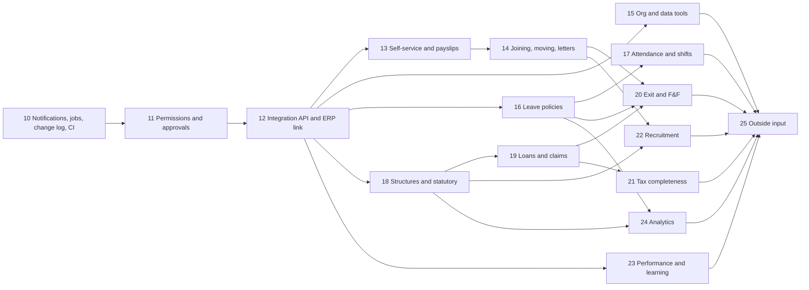

# Build plan: extended features

How to build every feature in [ROADMAP.md](ROADMAP.md), phase by phase. It continues the numbering in [BUILD_PLAN.md](BUILD_PLAN.md), whose phases 0 to 9 are done, so this plan starts at **phase 10**.

**Status: Part A in progress. Phase 10 is done; phase 11 is next.** Where each phase stands is in [STATUS.md](STATUS.md).

This HRMS is a module of the ERP the client is building on their side. The two must exchange data **in both directions through an API**, so that integration is a foundation of this plan — built early in phase 12 and extended by every phase after it — rather than a feature added at the end. How the two systems work together is set out in [Working with the client's ERP](#working-with-the-clients-erp).

The plan is in two parts:

- **Part A — phases 10 to 24.** Everything that can be built without anyone's input: no accounts, keys, contracts or decisions needed from you or the client. Where a feature eventually needs an outside service, Part A builds all of it and leaves only the switch.
- **Part B — phase 25.** What needs input from you or the client, gathered in one place. Each item says what will already be built, so finishing it is configuration and testing.

It covers the 56 features in ROADMAP.md that are not yet built. What must be true before real employee data or real payroll is in [PRODUCTION_READINESS.md](PRODUCTION_READINESS.md); where a phase leans on one of those items, it says so.

---

## Working with the client's ERP

The HRMS and the client's ERP are two systems with one agreement: a published API contract. Neither reads the other's database. The client's developers build against the contract; this module keeps it.

### What flows each way

The default set below is built in Part A and confirmed with the client in phase 25.

| From → to | What | Through |
|---|---|---|
| HRMS → ERP | **People**: hires, changes to position, department and cost centre, exits | `employee.*` events · `/v1/employees` |
| HRMS → ERP | **Organisation**: companies, locations, departments, positions | `org.*` and `position.*` events · `/v1/org/...` |
| HRMS → ERP | **The payroll journal** for each run, by account and cost centre, with employer contributions | `gl.posting.created` · `/v1/gl-postings` |
| HRMS → ERP | **Payments to make**: net pay per person with bank details, statutory remittances due | `payroll.period.posted`, `remittance.due` · `/v1/payment-batches`, `/v1/remittances` |
| HRMS → ERP | **Time**, for the ERP's project costing or billing: approved leave, attendance, overtime | `leave.*`, `attendance.*` · `/v1/attendance-days` |
| HRMS → ERP | **Loans, claims and settlements**, for the ERP's books | `loan.*`, `claim.*`, `settlement.*` |
| ERP → HRMS | **Chart of accounts and cost centres**, when the ERP owns them | `PUT /v1/gl-accounts/{code}` · `PUT /v1/cost-centres/{code}` |
| ERP → HRMS | **Payment confirmations**: salary credited or failed, remittance paid, with the bank reference | `POST /v1/payment-batches/{id}/confirmations` · `POST /v1/remittances/{id}/payment` |
| ERP → HRMS | **Earnings and deductions that start in the ERP**: sales incentives, canteen or asset recoveries | `POST /v1/one-off-payments` · `/v1/recurring-payments` |
| ERP → HRMS | **Approved expense claims**, if expenses are handled in the ERP | `POST /v1/claims` |
| ERP → HRMS | **Hours from ERP projects or timesheets**, for overtime and cost splits | `POST /v1/timesheets` |
| ERP → HRMS | **Acknowledgements**: the ERP's own document number for each journal and payment batch it books, or its reason for rejecting one | `POST /v1/gl-postings/{id}/acknowledgement` |

### Who owns what

Every kind of record has **one owner**, set per record type, and where needed per field, on the Integrations screen. Only the owner writes it:

- The other side reads it, and its screens show the field as read-only, marked "Managed in the ERP".
- A write to an HRMS-owned record through the API is refused with the code `owned_by_hrms`, and the reverse is refused too.

| Record | Owner by default |
|---|---|
| People, their dated history, org structure, positions, leave, attendance, pay results, tax | HRMS |
| Chart of accounts; payments once made | ERP |
| Cost centres | ERP, since finance usually keeps them — switchable to HRMS |

### How a change travels

- **HRMS to ERP.** A change commits together with its event, through one outbox, so there is never an event for a change that did not happen. The ERP receives the event as a signed webhook, or reads it from the pull feed.
- **Business documents are acknowledged.** For journals, payment batches and remittances, the ERP **acknowledges** with its own reference, or **rejects** with a reason. The HRMS screen shows the state — "Booked in the ERP as JV/2026/0912", or "Rejected: account 5010 is closed" — and HR can resend after fixing.
- **ERP to HRMS.** The ERP calls the API with its own credentials, an idempotency key and its own record id. The HRMS validates the write exactly as its screens would, records it in the change log with the ERP as the actor, and emits the resulting event.
- **No echoes.** Every event carries the client that caused it, and a client is not sent its own changes back by default. The two systems never bounce an update between them.
- **Conflicts.** Updates carry `If-Match`. A stale write is refused with `412`, and the ERP re-reads and retries. Anything that cannot be applied automatically lands in a **sync issues** queue on the Integrations screen, with the payload, the reason, and retry or discard.
- **Catching up after an outage.** The ERP reads everything changed and deleted since its last sync; the HRMS replays webhooks from the first one that failed.

### What HR can see

The Integrations screen shows, for the ERP's connection:
- its health and the last event delivered;
- deliveries pending and failed;
- the sync issues queue;
- the acknowledgement state of every journal and payment batch;
- a **reconciliation report**: every posted journal, whether it was sent and acknowledged, the ERP's reference, and totals compared.

### What the client's developers get

- **The contract**: OpenAPI at `/developers`, downloadable and versioned, with a changelog and an example for every event.
- **A reference "mock ERP"** in the repository (`tools/mock-erp`): a small program that does everything the client's ERP will do. It subscribes to events, verifies signatures, acknowledges journals, confirms payments and pushes cost centres. It runs in CI against the API, so both directions are proven end to end on every change, and it is working sample code for their team.
- **A local sandbox**: one command runs the HRMS on a local database with the demo organisation and the mock ERP, so their developers can integrate before any shared environment exists. A hosted sandbox is a phase 25 item.
- **A certification checklist**: the flows their ERP must pass before production credentials are issued — receive a hire, acknowledge a journal, reject one, confirm a payment, push a cost centre, recover after an outage.

---

## The integration API

The contract every phase from 12 onwards follows.

### Principles

- **One set of rules.** Business logic moves into a service layer that the screens' Server Functions and the API both call. The API can do exactly what the screens can, with the same validation, permissions, change log and access log — never a second, weaker path.
- **The API keeps up with the screens.** Every phase ships its endpoints and events with its screens. A feature is not done until the ERP can use it.
- **The contract only grows.** Within `v1`, changes are additions. Anything that would break the client's ERP waits for `v2`, and `v1` stays available alongside it until the client has moved.

### Access

| Part | What |
|---|---|
| Clients | Each connected system is a registered client: a name, the companies it may see, its scopes, and optionally the IP addresses it may call from. HR creates, suspends and rotates clients on an **Integrations** screen. The client's ERP is one client; the mock ERP and any later system are others. |
| Tokens | OAuth 2.0 **client credentials**. The client exchanges its id and secret at `/api/v1/oauth/token` for a short-lived bearer token, signed with the same `jose` library the sessions use. Secrets are stored hashed and can overlap during rotation. |
| Scopes | Scopes are the permissions from phase 11: `employees:read`, `employees:write`, `org:write`, `time:write`, `payroll:read`, `gl:read` and so on. **Sensitive fields need their own scope** — `pay:read` for salary, `bank:read` for bank accounts, `tax_ids:read` for PAN. Without it, those fields are absent from the response, not empty. |
| Devices | Attendance devices (phase 17) are a restricted client type that may only send punches. |
| Accountability | Every call is logged with its client, route, status, duration and a correlation id. Reads of personal data go to the access log, and writes to the change log, with the client recorded as the actor. |

### Conventions

| Topic | Rule |
|---|---|
| Shape | REST over HTTPS with JSON under `/api/v1`, plural resource names, and `snake_case` fields throughout |
| Identity | Each record has a stable `id`, and can also carry the ERP's own id — `{"external_ids": {"erp": "EMP-0042"}}`. The ERP finds records by its own keys and never has to store ours. |
| Dates and money | Dates are `YYYY-MM-DD`; timestamps are ISO 8601 in UTC. **Money is a decimal string with its currency** — `{"amount": "72000.00", "currency": "INR"}` — never a float, the same rule as paise in the database. |
| Effective dating | Dated records say `valid_from` and `valid_to`. `?as_of=2025-06-01` answers "what was true then", and `/history` returns every slice. This is the time-slice engine, exposed. |
| Listing | Cursor pagination (`?limit=` and the returned `next_cursor`), filters per resource, `?fields=` to choose fields, and `?include=` to embed related records |
| Syncing | `?updated_since=` returns what changed, and `/v1/deletions?since=` what was deleted, so the ERP can keep an exact copy by polling. The change log makes both possible. |
| Safe writes | `POST` accepts an `Idempotency-Key`: the same key returns the first result instead of acting twice. Updates use `ETag` and `If-Match`, so neither system silently overwrites the other. |
| Bulk | Large imports and exports are asynchronous. They return `202 Accepted` and a job resource to poll, or a `job.completed` event. |
| Errors | RFC 9457 problem details with a stable machine `code` and a sentence a person can act on — the same rule as §12 of the design language |
| Limits | Per-client rate limits, with `RateLimit` headers and `429` plus `Retry-After` |
| Versions | `Deprecation` and `Sunset` headers on anything scheduled for removal, and a changelog the client's team can follow |

### Events

| Part | What |
|---|---|
| Envelope | **CloudEvents 1.0** JSON: `id`, `type` (such as `employee.hired`), `source`, `time`, `subject` and `data`. `data` carries the record as the API would return it, filtered by the client's scopes, plus the client that caused the change. |
| Written with the change | Through the phase 10 outbox, **in the same batch as the change that caused it** |
| Webhooks | Signed to the **Standard Webhooks** specification (HMAC over id, timestamp and body), so the client's ERP can verify them with a published library in any language. Delivery is at least once, with retries backing off, then parked for replay. Each record carries a sequence number, so the ERP can tell which event is newer. |
| Pull feed | `/v1/events?after=` returns the same events, for when the ERP would rather ask than be told |
| Catalogue | Every event type is listed at `/developers` with an example, and grows phase by phase |

### What the API covers, and from which phase

| Module | Read | The ERP can write | From phase |
|---|---|---|---|
| Organisation | companies, areas, departments, jobs, positions, reporting lines | cost centres, and accounts where the ERP owns them | 12 |
| People | employees and every infotype, with `as_of` and history; documents | guided actions such as hire, with the same checks as the screens | 12, then 14 and 20 |
| Time | holidays, absences, leave requests, quotas, attendance | absences, leave requests, timesheets, punches | 12, then 16 and 17 |
| Payroll | periods, runs, results with lines, payslips, bank files, GL postings, remittances, payment batches | one-off and recurring payments, payment confirmations, journal acknowledgements | 12, then 18 and 19 |
| Tax | declarations, register, Form 16 | challan deposits | 12, then 21 |
| Recruitment | requisitions, candidates, applications, offers | applications | 12, then 22 |
| Performance and learning | cycles, appraisals, goals, courses, certifications | training completions, certificates | 12, then 23 |
| Integration | events, deletions, jobs, sync issues, acknowledgement states | acknowledgements | 12 |
| Reporting | report data and monthly metrics | — | 24 |

---

## How the phases are ordered

Most roadmap features need the same capabilities, and none of them exists yet. Building each once, first, is cheaper than building it badly inside the first feature that needs it.

| Shared capability | Built in | Needed by |
|---|---|---|
| **Notifications, an outbox and background jobs** | 10 | reminders, accrual, escalation, the ERP's webhooks, payslip and report delivery, certificate expiry |
| **A change log** — every write, before and after | 10 | correction requests, transfers, imports, regularisation, the API's change tracking |
| **Permissions and an approval engine** — roles from permissions, configurable approvals, delegation | 11 | API scopes, corrections, headcount requests, confirmations, regularisation, loans, claims, exits, offers, training |
| **The integration API and the two-way link with the client's ERP** | 12 | every later phase's endpoints and events |
| **Document generation** — records rendered to PDF | 13 | payslip PDFs, letters, offer letters, settlement statements, 12BA, scheduled reports |

After those, modules follow their dependencies. People move through the organisation (joining, moving, leaving), time comes before the payroll that pays it, and statutory payroll before the tax that depends on it. Part B comes last, because it waits on other people rather than on other code.

---

## Decided in this plan

Technical choices that need nobody's input, taken here so Part A can proceed without waiting.

| Decision | Choice | Why |
|---|---|---|
| API style | REST with webhooks and a pull feed | The client's team can build against it in any language, and every client library, gateway and monitoring tool handles it. |
| Machine authentication | OAuth 2.0 client credentials, issued by this system with `jose` | A standard their developers already know, with no third-party account and no per-token cost |
| Event format and signatures | CloudEvents 1.0, signed to the Standard Webhooks specification | Both are published standards with verification libraries in every language, so the client's team writes no crypto. |
| API specification | OpenAPI 3.1 generated from the zod schemas that validate requests | The specification cannot drift from the code. |
| API documentation | Scalar, served from this application | Readable, renders OpenAPI 3.1, needs no account |
| Background jobs | A job table in the database, processed right after the request that queued it and by a scheduled tick | No external service or account; works on any host. A queue service can replace it later without changing any caller. |
| Email | Every email is built and written to the outbox through a pluggable transport, which records instead of sending until phase 25 | Everything that sends mail can be built, previewed and tested now. |
| Document storage | The database, as today, until R2 in phase 25 | It exists, and the switch is already written. |
| PDF rendering | Headless Chromium printing the existing HTML, proven by a spike at the start of phase 13; `@react-pdf/renderer` if the spike fails | The payslip and Form 16 already print to one A4 page from HTML, so screen, print and PDF stay one layout. |
| Careers-page protection until keys exist | Rate limits and a honeypot field | Works without an account; Turnstile adds to it in phase 25. |
| Attendance devices until a vendor is chosen | CSV upload and a generic punch endpoint | Every device can export CSV, and any middleware can call an endpoint. |
| Continuous integration | GitHub Actions running typecheck, lint, tests, build, the UI audit and the mock ERP against a local database | Needs no secrets, because tests never touch Turso. |

---

## The phases at a glance

**Part A — built without outside input**

| # | Phase | Roadmap features | Depends on |
|---|---|---|---|
| 10 | Notifications, jobs, the change log and CI | Notifications, change log viewer | — |
| 11 | Permissions and approvals | Roles and permissions screen, configurable approvals, delegate approvals | 10 |
| 12 | Integration API and the two-way ERP link | Two-way integration with the client's ERP | 10, 11 |
| 13 | Self-service and payslips | Request a correction, year-to-date on the payslip, payslips by email (all but delivery), installable phone app | 11, 12 |
| 14 | Joining, moving and letters | Onboarding checklists, probation and confirmation, transfers and promotions as actions, letters from templates | 13 |
| 15 | Org and data tools | Headcount requests, bulk import, a drawn org chart | 11, 12 |
| 16 | Leave policies | Policies by grade, regional holiday calendars, accrual with carry-forward and lapse, leave balance forecast, compensatory off, leave encashment | 11, 12 |
| 17 | Attendance and shifts | Shift rosters, attendance devices (CSV and a generic endpoint), team attendance regularisation | 12, 16 |
| 18 | Salary structures and statutory payroll | Salary structures and CTC; ESI, professional tax, LWF and employer PF; ECR file; split cost centres; accounting export | 11, 12 |
| 19 | Loans and reimbursements | Loans and advances, reimbursement claims | 18 |
| 20 | Exit and full and final settlement | Exit management, full and final settlement | 14, 16, 18, 19 |
| 21 | Tax completeness | Investment proofs (12BB), HRA from rent, tax regime comparison, Form 12BA, section 89 relief, 24Q return file | 18, 19 |
| 22 | Recruitment | Careers page, interview scheduling, structured scorecards, offer letters (all but e-signature), referral tracking, recruitment analytics | 14, 18 |
| 23 | Performance and learning | Goal check-ins, 360-degree feedback, calibration distribution, improvement plans, training catalogue and nominations, certification expiry | 11, 12 |
| 24 | Analytics | Trends over time, leave liability, scheduled reports (all but email delivery) | 16, 18 |

**Part B — needs input from you or the client**

| # | Phase | What it finishes |
|---|---|---|
| 25 | Outside input | Email delivery, R2, a hosted sandbox, the client's ERP go-live, e-signature, careers-page keys, device vendor adapters, scheduling frequency, government format validation, compliance review, token rotation |

---

# Part A — built without outside input

## Phase 10 — Notifications, jobs, the change log and CI

**Goal.** The system can tell people things, do work in the background, show who changed what, and check itself on every change.

**Features.** Notifications (in-app, and email written to the outbox) · Change log viewer · plus background jobs and continuous integration, which later phases need.

**Build**

| Part | What |
|---|---|
| Data | `app_notification` (recipient, kind, title, body, link, read at) · `app_notification_pref` (per person, per kind, in-app and email on or off) · `app_outbox` (every message waiting to go — email now, webhooks from phase 12 — with kind, payload, attempts, sent at, error) · `app_job` (kind, payload, run after, attempts, status) and `app_job_run` (started, finished, outcome) · `app_change_log` (who, when, entity, subject employee, create/update/delete, before, after, reason) |
| Logic | `notify()` writes the notification and its outbox row **in the same batch as the change that caused it**. Jobs are processed right after the request that queued them (`after()`) and by a scheduled tick at `/api/cron/tick`, protected by a secret, so work continues without a browser. **Payroll runs move onto the job table**, closing the "browser drives payroll" gap. Email goes through a pluggable transport that records messages instead of sending them until phase 25. The time-slice engine and every Server Function record changes through one `recordChange()` helper. |
| First notifications | Leave submitted (to the manager), leave decided (to the employee), period posted (payslip ready), self review due, rating finalised |
| Screens | A bell with an unread count (§9 count badge) and an inbox · notification preferences on My profile · a **Change log** tab on the employee record ("Basic pay ₹65,000 → ₹72,000 from 1 Apr 2025, by hr.admin") · an HR-wide change log with filters · an **Outbox** screen for HR, showing each email as it would be sent |
| CI | GitHub Actions on every push and pull request: typecheck, lint, `npm test`, build, and `npm run audit:ui` against a dev server on a local database |
| API groundwork | The outbox is built for more than email: phase 12's webhooks are more rows in it. The change log records deletions, which becomes the API's deletion feed. |

**Done when**
- Approving leave notifies the employee in-app and puts exactly one email in the outbox, even if the job runs twice (test).
- A salary change appears in the change log with before and after values.
- A payroll run finishes with the browser tab closed.
- Every push runs the full check, and a failing test fails the build.

**Built.** All four hold, each with a test. Where the build differs from the plan above:

- **Preferences** are a Preferences tab on the Notifications screen (`/inbox/preferences`), so HR, who has no profile, has them too. My profile links there.
- **One helper became three**: `changeStatement` for writes already in a transaction (the time-slice engine, hiring, conversion, the leave decision), `audited()` for an update or delete that reads the record before and after, and `recordCreated()` / `recordDeleted()` for the rows an insert or delete returns. A new time slice records the values it replaced, so the log reads "₹65,000 → ₹72,000".
- **The scheduled tick runs once a day**, the most the current hosting plan allows. The runner does not rely on it: it hands off to a fresh invocation of itself, with a signed request, while work remains. The tick accepts any caller until `CRON_SECRET` is set, which is harmless because it only runs work already queued; setting it is part of the scheduling item in phase 25.
- **CI audits the production build**, started on a fresh local database, rather than a dev server.
- **Leave decisions were tightened on the way.** A manager could decide any request, including their own, by calling the Server Function directly; approval checked the status and then wrote, so two approvals at once could both succeed; and the quota was read, changed and written back. A decision is now one transaction: a conditional claim on the request, a conditional quota update that refuses to overdraw, the absence, the change-log entries and the employee's notification.

---

## Phase 11 — Permissions and approvals

**Goal.** HR decides who can do what, and who approves what, without a developer.

**Features.** Roles and permissions screen · Configurable approvals · Delegate approvals.

**Build**

| Part | What |
|---|---|
| Data | `sec_permission` (such as `pay.view`, `payroll.run`, `employee.edit`) · `sec_role_permission` · roles become rows HR can create, with the three current ones kept as built-in · `sec_role_scope` (limit a role to companies or personnel areas) · `wf_flow` (a process such as leave, correction or claim, versioned) · `wf_step` (order; who approves: reporting manager, their manager, a role, a named person; conditions such as days over 5 or amount over ₹50,000; when to escalate) · `wf_request` · `wf_action` (step, actor, on behalf of, decision, comment) · `wf_delegation` (from, to, dates, processes) |
| Logic | `requirePermission()` replaces `requireRole()` in every Server Function and route. The three built-in roles map to exactly today's rights first, so nothing changes until HR changes it. The approval engine is `submit()`, `decide()` and `resolveApprover()` with delegation, plus escalation on the job table. Leave approval moves onto the engine with a one-step "reporting manager" flow, so it behaves as it does now. |
| Screens | Roles and permissions: roles against permission groups, one plain sentence per permission · approval flows per process, as a form rather than a drag-and-drop designer · one **Approvals** inbox across all processes, with counts per process in the tabs · "While I am away, send my approvals to…" on My profile |
| Tests | An **authorisation matrix**: every Server Function and route, called as every role, allowed or refused. It turns the PRODUCTION_READINESS item into code. |
| API groundwork | Each permission can also be an API scope in phase 12, including separate permissions for salary, bank accounts and tax identifiers. The approval engine takes an actor that can be a person or the ERP, so the ERP can later decide approvals it owns. |

**Done when**
- A recruiter role sees candidates and no pay, on screen and by direct POST.
- Leave over five days goes to the manager, then HR.
- A delegate approves while the manager is away, and the record says "on behalf of".
- The authorisation matrix passes.

**Risks.** The largest refactor in the plan: it touches every `requireRole` call. Map before splitting — first a pure rename to permissions with identical behaviour, then new roles.

---

## Phase 12 — Integration API and the two-way ERP link

**Goal.** The client's ERP and this module exchange data in both directions, under the contract in [The integration API](#the-integration-api), with every flow in [What flows each way](#what-flows-each-way) that the existing modules support.

**Features.** Two-way integration with the client's ERP.

**Build**

| Part | What |
|---|---|
| Service layer | The logic now inside Server Functions moves, module by module, into `src/lib/services/`: validation with the existing zod schemas, permission checks, and change and access logging. Server Functions and API routes both call it. The screens behave exactly as before, and the API gets the same rules. |
| Access | `int_client` (name, companies, scopes, allowed IPs, status) · `int_client_secret` (hashed, overlapping during rotation) · the token endpoint · `int_request_log` (client, route, status, duration, correlation id) |
| Contract | The conventions as shared route middleware: authentication, scopes and field filtering, rate limits, idempotency (`int_idempotency`: key, client, request hash, stored response), problem-details errors, cursor pagination, `as_of`, `updated_since` and ETags |
| Two-way data | `updated_at` on every table the ERP syncs · deletions from the change log · `int_external_ref` (the ERP's id against ours, unique both ways) · `int_ownership` (record type, and optionally field, to owner), enforced on screens and in the API · `int_ack` (a journal, payment batch or remittance; sent, acknowledged or rejected; the ERP's reference or reason) · `int_sync_issue` (payload, reason, state) |
| Outbound | Webhook subscriptions and deliveries on the phase 10 outbox · the `/v1/events` pull feed · no echo of a client's own changes · events for what exists today: `employee.hired`, `employee.updated`, `employee.status_changed`, `org.*`, `position.*`, `leave.approved`, `leave.cancelled`, `payroll.run.completed`, `payroll.period.posted`, `gl.posting.created`, `remittance.due`, `candidate.hired`, `appraisal.finalised` |
| Inbound | Cost centres and accounts from the ERP · one-off and recurring payments that start in the ERP · payment confirmations for salaries and remittances · journal and payment-batch acknowledgements · absences — each through the service layer, so the ERP's writes pass the same checks as HR's |
| Read resources | Everything built in phases 1 to 9, with sensitive fields behind their scopes: organisation, employees and every infotype with history and `as_of`, time, payroll (with **GL postings — the payroll journal the ERP books** — and payment batches), tax, recruitment, performance, documents |
| For the client's team | OpenAPI 3.1 from the zod schemas · `/developers` with Scalar · the **mock ERP** in `tools/mock-erp` · the **local sandbox** command · the certification checklist · a Postman collection and a generated TypeScript client |
| Screens | **Integrations**: create a client, choose its scopes and companies, rotate its secret · record ownership · deliveries, failures and replay · sync issues with retry and discard · acknowledgement state · the reconciliation report · and on each journal and payment batch, its state in the ERP |
| Tests | Contract tests validate every endpoint against the specification · the mock ERP runs both directions in CI |

**Done when**
- The mock ERP, with nothing but client credentials:
  - syncs every employee changed since a timestamp, and the deletions;
  - receives a signed `employee.hired` webhook within a minute of a hire;
  - pushes a cost centre;
  - acknowledges a posted journal with its reference, which then shows on the posting screen;
  - confirms a salary payment batch.
- A webhook refused with a `500` is retried until it succeeds; the pull feed returns the same event; a change the mock ERP made is not sent back to it.
- Without `pay:read`, salary is absent from every response (test).
- Two posts with the same `Idempotency-Key` act once (test).
- A write to an HRMS-owned field is refused with `owned_by_hrms`, and a stale update with `412`.
- Every endpoint passes the contract tests.

**Risks.** The service-layer move touches every module. That is why it comes this early: after phase 12 every module is born on the service layer instead of being moved later.

---

## Phase 13 — Self-service and payslips

**Goal.** Employees fix their records through HR, get payslips as PDFs, and carry the app on their phone.

**Features.** Request a correction · Year-to-date on the payslip · Payslips by email (everything but delivery, which is phase 25) · Installable phone app · plus document generation.

**Build**

| Part | What |
|---|---|
| Data | `pa_change_request` (employee, infotype, proposed values, effective date, evidence document, approval request) |
| Logic | A correction is an approval request (phase 11); on approval it is written through the time-slice engine from its effective date, and the change log records "requested by the employee, approved by HR". **Bank changes need evidence and two approvers**, because a changed bank account is how payroll fraud starts. Year-to-date sums the stored result lines of the financial year by wage type up to the period — no recalculation. PDFs are rendered from the existing payslip HTML (decided above), protected with the employee's PAN and date of birth. Posting a period queues one payslip email per person in the outbox, with a deliberate "Resend". |
| Phone app | Web app manifest, icons, and a service worker caching the **application shell only**. No pay data is cached on the device. |
| Screens | "Request a change" on each section of My profile · a current-versus-proposed view in the Approvals inbox · a year-to-date column on the payslip · "Download PDF" on each payslip · "Email payslips when posted" on the period, with resend per person |
| API and events | `POST /v1/employees/{id}/change-requests` · year-to-date on payroll results · `GET /v1/payroll/results/{id}/payslip` as PDF, so the ERP's own portal can show payslips · `change_request.decided`, `payslip.published` |

**Done when**
- An address change, approved by HR, shows on the profile from its effective date with the history intact.
- A bank change needs two approvers.
- Posting a period queues exactly one payslip email per person, each with a protected PDF, and the outbox shows it.
- Year-to-date equals the sum of that year's payslips (test).
- The app installs on Android and iOS home screens, and the UI audit still passes.

---

## Phase 14 — Joining, moving and letters

**Goal.** The moments in an employee's life are guided actions with their paperwork, not raw record edits.

**Features.** Onboarding checklists · Probation and confirmation · Transfers and promotions as actions · Letters from templates.

**Build**

| Part | What |
|---|---|
| Data | `pa_checklist_template` and its items (task, owner role, due days from the event), shared with offboarding in phase 20 · `pa_task` (employee, item, assignee, due, done by, done at) · `pa_it0019_monitoring` — SAP's dated reminders: probation end, contract end, visa expiry · `pa_letter_template` (kind, body with merge fields, version) · `pa_letter` (employee, template version, merged text as issued, stored document, issued by, status) |
| Logic | The hire action — in Core HR, in recruitment's conversion, and through the API — creates the onboarding checklist. Probation end comes from the hire date and a policy; the manager is reminded ahead of it; confirmation is an approval with confirm, extend or end. **Transfer and promotion become guided actions like hiring:** one transaction writing the IT0000 action, org assignment and basic pay from an effective date through the time-slice engine, vacating and filling positions. A backdated promotion needs nothing new — phase 9's retro pays the arrears. Letters merge the record **as of the issue date**, render to PDF (phase 13), and are stored as the employee's documents. |
| Screens | My tasks for anyone assigned · onboarding progress per joiner as a progress track (§9) · probation due list with confirm and extend · transfer and promotion wizards with a live summary panel, as the hire action has · letter templates with a merge-field picker and preview · "Issue letter" on the employee record |
| API and events | `POST /v1/employees/{id}/actions` for transfer, promotion and confirmation, validated exactly like the wizards · `/v1/tasks`, so the ERP can close tasks it owns, such as issuing a laptop · `/v1/letters` with the issued PDF · `employee.transferred`, `employee.promoted`, `employee.confirmed`, `onboarding.completed`, `letter.issued` |

**Done when**
- Hiring someone creates their onboarding tasks with owners and dates.
- A promotion effective next month writes action, assignment and pay in one transaction, and that month's payroll reads the new pay.
- A backdated promotion pays arrears once.
- The manager is reminded ahead of probation end.
- An issued appointment letter matches the record as it stood on the issue date and cannot be edited afterwards.
- The mock ERP receives `employee.promoted` with the new position, and the new pay if it holds `pay:read`.

---

## Phase 15 — Org and data tools

**Goal.** Grow the structure through approvals, load real data in bulk, and see the organisation.

**Features.** Headcount requests · Bulk import · A drawn org chart.

**Build**

| Part | What |
|---|---|
| Data | `om_headcount_request` (department, job, title, grade, budgeted cost, reason, approval request) · a budget on `om_position` · `app_import` (kind, file, status, counts, error report) · `app_import_row` (row, outcome, messages) |
| Logic | A headcount request goes manager → HR → a finance role; approval creates the vacant position, and optionally its requisition. **Imports validate everything before writing anything:** a dry run with a report per row, then batches through the service layer on the job table. Templates cover the org structure; employees with their dated history (personal data, assignment, pay, bank); and **opening balances** — leave, and year-to-date pay and tax, which the TDS projection needs to be right mid-year. Re-importing the same file changes nothing. The org chart draws positions as boxes and lines in SVG: hairlines, ink text, vacancies as outlined badges, search, collapse, pan and zoom. The indented list stays as the accessible version. |
| Screens | Headcount requests · an import wizard: choose, download the template, upload, read the dry run, confirm · a chart view on the org structure |
| API and events | **Imports and the API share one engine**: `POST /v1/imports` takes the same files, and bulk JSON uses the same validation and dry run, so the ERP can load its existing employees with the same checks as a spreadsheet · `/v1/headcount-requests`, so a position budgeted in the ERP can be requested from there · `/v1/org-chart` as a tree · `headcount_request.decided`, `import.completed` |

**Done when**
- An approved headcount request produces a vacant position recruitment can open a requisition against.
- 5,000 employees with history import through batches, and a second import of the same file changes nothing (test).
- Imported year-to-date tax reduces the next month's TDS (test).
- A 500-position chart renders and passes the UI audit.

---

## Phase 16 — Leave policies

**Goal.** Leave behaves the way Indian companies actually run it: by grade, by state, earned monthly, carried and lapsed.

**Features.** Policies by grade · Regional holiday calendars · Leave accrual, carry-forward and lapse · Leave balance forecast · Compensatory off · Leave encashment.

**Build**

| Part | What |
|---|---|
| Data | `pt_leave_policy` (quota type; applies to grade, area or employment type; entitlement; accrual monthly or yearly; pro-rata for joiners; carry-forward cap; lapse date; encashable days; request limits; sandwich rule) · `pt_holiday_calendar`, with each personnel area on a calendar and optional holidays · `pt_quota_ledger` — every credit and debit (accrual, use, carry-forward, lapse, encashment, adjustment); the balance is the sum, and IT2006 becomes a summary of it · `pt_comp_off` (earned on, expires on, status) |
| Logic | Monthly accrual and year-end jobs on the job table. **Working days use the employee's own calendar** everywhere: the quota engine, time evaluation and the payroll engine, which today uses one national list. The forecast is balance plus future accrual less approved future leave, to a date. Holiday or weekend work, once approved, earns compensatory off, which expires. Encashment — on request, at year end, or on exit — creates a one-off payment at the policy's daily rate, which payroll already knows how to pay. |
| Screens | Leave policies · holiday calendars per area · the ledger behind a balance ("why do I have 11.5 days") · "On 31 Dec you will have 14 days" on My leave · compensatory off on My leave |
| API and events | `/v1/leave-policies` · `/v1/holiday-calendars` · `/v1/leave-balances?as_of=` · `/v1/leave-ledger` · leave requests writable, so the ERP's own portal can apply for leave · `leave.requested`, `leave_balance.changed`, `leave.encashed` |

**Done when**
- Employees in Karnataka and Maharashtra get different holidays, and payroll prorates each against its own.
- A joiner on 1 July gets a pro-rated entitlement.
- Year end carries forward up to the cap and lapses the rest, each as a ledger entry.
- A balance always equals its ledger sum (test).
- Encashing five days pays through the next run.

---

## Phase 17 — Attendance and shifts

**Goal.** Plants and support teams run on rosters and punches, not hand-entered attendance.

**Features.** Shift rosters · Attendance devices (CSV and a generic endpoint; vendor adapters in phase 25) · Team attendance regularisation.

**Build**

| Part | What |
|---|---|
| Data | `pt_shift` (start, end, break, night, grace minutes) · `pt_roster_pattern` (a weekly rotation) · `pt_roster` (employee, date, shift) · `pt_device` (location, its phase 12 client) · `pt_punch` (employee, device, time, direction, source) · `pt_regularisation` (date, claimed in and out, reason, approval request) |
| Logic | Rosters are generated from patterns and edited by exception. A daily job turns punches into attendance: first in, last out, hours against the shift, late, half day, absent — **night shifts that cross midnight belong to the day they started**. Results feed time evaluation and payroll (overtime hours as an OT wage type, a night-shift allowance). Devices, and any middleware in front of them, are **phase 12 clients limited to punches**, sending batches to `/v1/punches`; CSV upload covers everything else. Punches are unique on device, time and employee, so a re-sent batch does nothing. A regularisation, once approved, changes that day's attendance, and the change log keeps the original. |
| Screens | A roster planner (team by day, in the calendar grid's style, assign a pattern in bulk) · today's attendance board (in, late, absent) · My attendance, with punches and "Regularise" · devices |
| API and events | `POST /v1/punches` in batches · `POST /v1/timesheets`, for hours recorded in the ERP's projects · `/v1/rosters` · `/v1/attendance-days` · `attendance.day_finalised`, `regularisation.decided` |

**Done when**
- A rotating three-shift pattern generates a month's roster.
- Punches sent to the endpoint become daily attendance with late marks.
- Overtime reaches payroll as its own line.
- A missed punch, regularised and approved, corrects the day.
- A duplicate upload creates no duplicate punches (test).

---

## Phase 18 — Salary structures and statutory payroll

**Goal.** Payroll covers what Indian law requires, pay is defined as CTC by structure, and the results reach the ERP's ledger the way finance books them.

**Features.** Salary structures and CTC · ESI, professional tax, LWF and employer PF · ECR file for EPFO (generated to the published format; validation with the government's tools is phase 25) · Split cost centres · Accounting export.

**Build**

| Part | What |
|---|---|
| Data | `py_salary_structure` and its components (percentage of CTC, percentage of basic, fixed, and a balancing special allowance) · annual CTC and structure as a dated record, from which basic and allowances derive · `py_statutory_rate`, **all dated**: PF rates and wage ceiling, EPS cap, EDLI, admin charges; ESI rates and wage ceiling; professional tax slabs per state, including Maharashtra's February rule; LWF per state and frequency · the standard deduction, 87A limits and cess move out of code into the same kind of dated rows · a statutory details infotype (UAN, ESI number, professional tax state) · `py_cost_split` (employee, cost centre, percentage, dates) · `py_gl_mapping` (wage type to the ERP's account, per company) |
| Logic | The payroll engine gains a statutory stage after gross. Employee PF stays; **employer PF, EPS, EDLI and admin charges arrive as a new line kind, "employer contribution"** — shown on the payslip as part of CTC, posted to the ledger as cost and liability, never deducted from pay. ESI applies for whole contribution periods (April to September, October to March), so a raise mid-period does not end it. Professional tax and LWF follow the state. The ECR file follows EPFO's published format, with UAN and each wage base; the ESI file and the professional tax and LWF summaries follow the same pattern. Remittances gain each authority and its due date. Ledger posting splits cost by percentage. The journal also exports as a CSV file, for audit and as a fallback when the link to the ERP is down. |
| Screens | Salary structures with a preview for any CTC · CTC on the hire, transfer and promotion actions, and "Your CTC" on My profile · dated statutory rates · a statutory details tab · remittances with ECR and ESI downloads · cost splits on the employee · GL mapping (the ERP's accounts, as synced in phase 12) and the export |
| API and events | **The payroll journal is the most important thing the ERP takes from the HRMS.** `/v1/gl-postings` gains the ERP's accounts from the GL mapping, cost-centre splits, employer contributions and a per-company breakdown, and each journal carries its acknowledgement state. · `/v1/payment-batches` for the salaries the ERP will pay, with confirmations back · `/v1/remittances` with payment back · `/v1/salary-structures` · `/v1/employees/{id}/ctc` · `/v1/payroll/periods/{id}/statutory-files` · `remittance.paid`, `gl.posting.created` carrying the full journal |

**Done when**
- A ₹6 lakh CTC produces the same monthly components as a hand calculation.
- ESI continues after a raise until its contribution period ends (test).
- Professional tax matches the Karnataka and Maharashtra slabs, including February.
- The ECR file for a test month matches EPFO's published format field by field.
- Employer contributions reach the ledger and CTC, not net pay.
- A 60/40 split posts to two cost centres.
- The mock ERP books the journal against its own accounts and acknowledges it, confirms the payment batch, and each person's salary shows as paid.
- The engine passes a mutation check like phase 9's.

---

## Phase 19 — Loans and reimbursements

**Goal.** Money lent to and spent by employees flows through payroll with its paperwork, from whichever system it starts in.

**Features.** Loans and advances · Reimbursement claims.

**Build**

| Part | What |
|---|---|
| Data | `py_loan` (type, principal, interest, EMI, start, status, approval request) · `py_loan_schedule` (period, principal, interest, balance, the run that recovered it) · `py_claim_category` (limit per grade, taxable or not: fuel, phone, medical, LTA) · `py_claim` and `py_claim_line` (date, what, amount, the bill as a stored document) |
| Logic | An approved loan generates its schedule, and payroll deducts each EMI exactly once — the same "paid by run" rule as one-off payments. Prepayment reschedules the rest; closure stops it. **A concessional or interest-free loan over ₹20,000 creates a perquisite value**, which phase 21's Form 12BA reports. Claims carry their bills, go manager → finance, are checked against limits at submission, and are paid as one-off payments — taxable or not by category — in the next run, or off-cycle. |
| Screens | My loans and My claims · loan and claim administration · claim approval with bills side by side |
| API and events | `/v1/loans` with the schedule, so the ERP books the receivable · `POST /v1/claims`, so **claims approved in the ERP arrive to be paid through payroll** instead of being retyped · `loan.approved`, `loan.closed`, `claim.approved`, `claim.paid` |

**Done when**
- A ₹1,20,000 loan over 12 EMIs recovers ₹10,000 a month and closes at zero.
- A prepayment reschedules the remainder.
- An approved claim is paid once, with its bills on file, whether entered on screen or sent by the mock ERP.
- A claim over its limit is refused at submission.
- A concessional loan produces the right perquisite value (test).

---

## Phase 20 — Exit and full and final settlement

**Goal.** Leaving is a guided process that ends with one correct payment, the right letters, and the ERP told on the day.

**Features.** Exit management · Full and final settlement.

**Build**

| Part | What |
|---|---|
| Data | `pa_exit` (resignation, termination or retirement; dates; notice period; requested and approved last day; reason; rehire eligibility; approval request) · offboarding clearance as checklist templates from phase 14 (IT, finance, admin, manager) · `py_settlement` (the statement: each component and its basis, status, the run that paid it) · exit interview responses |
| Logic | The employee resigns; the manager and HR approve; the last day follows the notice policy, with buyout or waiver; clearance tasks go out. On the last day, the termination action runs through the time-slice engine (status, position vacated, sign-in disabled). The settlement pays: • salary to the last day (the regular run already prorates leavers) • leave encashment (phase 16) • notice pay recovered or paid • **gratuity**: after five years of service, 15/26 × last basic × years, capped at ₹20 lakh, with its tax exemption • the outstanding loan recovered (phase 19) • pending claims It is all paid in **one off-cycle run**, with a printable statement. Relieving and experience letters come from phase 14. |
| Screens | Resign, for the employee · the exit board for HR (in notice, clearance progress) · the settlement statement · the exit interview |
| API and events | `/v1/exits` · `/v1/settlements` with every component · clearance tasks through `/v1/tasks`, so the ERP's asset module can close its own item · `employee.resigned`, and `employee.exited` on the last day — what the ERP uses to close accounts, recover assets and stop access · `settlement.paid` |

**Done when**
- A resignation runs from submission to relieving letter.
- One off-cycle run pays the whole settlement, and the statement shows each component and its basis.
- Gratuity is paid at 4 years 7 months and not at 4 years 5 months (tests, with the 240-day rule).
- Sign-in stops working on the last day, and the mock ERP receives `employee.exited` that day and closes its clearance task.

---

## Phase 21 — Tax completeness

**Goal.** Tax is computed from proven figures, and the returns can be prepared from what the system produces.

**Features.** Investment proofs, Form 12BB · HRA computed from rent · Tax regime comparison · Form 12BA · Section 89 relief · 24Q return file (generated to the published format; validation with the government's utility is phase 25).

**Build**

| Part | What |
|---|---|
| Data | `tds_proof` (declaration item, amount, document, verified or rejected, by whom) · `tds_rent` (monthly rent, landlord and their PAN over ₹1 lakh a year, metro or not, period) · `tds_perquisite` (type, value, source: loans from phase 19, and later car or accommodation) · `tds_arrears_relief` (the Form 10E working) |
| Logic | HR opens a proof window; employees upload against each declared item; HR verifies. **After the window, TDS uses verified amounts only.** HRA exemption is computed each month as the least of three: actual HRA; rent less 10% of basic; 50% (metro) or 40% of basic. The regime comparison runs the existing `annualTaxFor` on the employee's own projected figures under both regimes, shown on the declaration screen with the difference. 12BA is drawn from perquisites and issued with Form 16. **Section 89 needs retro across the year end** — closing a phase 9 gap — so arrears belong to the years they relate to and relief is computed as Form 10E does. The 24Q file is generated in the published file format, including the salary annexure in the fourth quarter. |
| Screens | Proof upload per declared item · HR verification queue with document preview · rent details · the regime comparison on the declaration · 12BA with Form 16 · 24Q download on the register |
| API and events | `/v1/tax/declarations` and `/v1/tax/proofs` · `/v1/tax/regime-comparison` · `/v1/tax/register`, with challan deposits writable so finance can record in the ERP the tax it paid · `/v1/tax/returns/24q` · `form16.issued`, `proof.verified` |

**Done when**
- After the window, unverified 80C no longer reduces TDS.
- HRA exemption matches the three-way minimum for metro and non-metro cases (tests).
- The regime comparison equals what payroll would deduct under each regime.
- The 24Q file for a test quarter matches the published format field by field.
- Arrears for last year produce a Form 10E relief figure.

---

## Phase 22 — Recruitment

**Goal.** Candidates apply, interview and accept without HR re-typing anything.

**Features.** Careers page (protection keys in phase 25) · Interview scheduling (invitations sent by email in phase 25) · Structured scorecards · Offer letters (e-signature in phase 25) · Referral tracking · Recruitment analytics.

**Build**

| Part | What |
|---|---|
| Data | `rc_job_posting` (requisition, public text, dates, address) · `rc_scorecard_template` (criteria and weights per job) and `rc_scorecard` (per interview: ratings, notes, recommendation) · `rc_interview_slot` · `rc_offer` (CTC by structure from phase 18, joining date, expiry, letter, status) · `rc_referral` (referrer, candidate, bonus rule, status) · the applicant's consent |
| Logic | Public careers pages sit outside the sign-in proxy, with rate limits and a honeypot field. Resumes go through the storage path, and duplicates are caught by email and phone. **Interviews produce ICS invitations**: queued in the outbox for interviewers and the candidate, downloadable from the schedule, and shown in interviewers' in-app notifications. A scorecard is required before a candidate moves past Interviewed. An offer is built from a letter template with the CTC breakdown and approved above its band (phase 11). The candidate accepts through a secure link HR shares, which records the acceptance with its time and address. The existing hire conversion then creates the employee and their onboarding tasks (phase 14). A referral bonus is paid as a one-off once the hire is still employed after the qualifying days. Analytics: time to hire, time in each stage, source effectiveness, offer acceptance, drop-off by stage, as bar lists. |
| Screens | The public careers site (the design language, with the company's name) · a posting editor · the interview scheduler · scorecards inside the interview · the offer builder and the candidate's acceptance page · "Refer someone" for every employee · recruitment analytics |
| API and events | `/v1/job-postings` · `POST /v1/applications`, so the ERP's own careers portal, if it has one, can send candidates in, resume included · `/v1/interviews`, `/v1/offers`, `/v1/referrals` · `candidate.applied`, `offer.sent`, `offer.accepted`, `candidate.hired` |

**Done when**
- An applicant applies on the public page and appears in the pipeline with their resume, and repeated rapid submissions are refused.
- Each interview queues its invitations and offers a downloadable calendar file.
- An offer accepted through its link converts to an employee with onboarding tasks, and nobody retypes anything.
- A referral bonus is paid once, after the qualifying period.
- The analytics equal hand counts on seeded data.

---

## Phase 23 — Performance and learning

**Goal.** Performance is continuous rather than annual, and skills are tracked, not assumed.

**Features.** Goal check-ins · 360-degree feedback · Calibration distribution · Improvement plans · Training catalogue and nominations · Certification expiry.

**Build**

| Part | What |
|---|---|
| Data | `pm_goal_checkin` (progress, on track or at risk, comments from both sides) · `pm_feedback_request` and `pm_feedback` (reviewer, relationship, competencies, comments) · `pm_pip` (goals, dates, check-ins, outcome, approval request) · `ld_course`, `ld_session` (dates, capacity, place, cost), `ld_nomination` (approval, attendance, feedback) · `ld_certification` (issuer, issued, expires, document, whether the job requires it) |
| Logic | Check-in reminders run on the job table, and progress rolls up to the goal. The 360 has an **anonymity threshold**: peer feedback is shown in aggregate only once three responses exist. Calibration shows the distribution of ratings per team against the guideline as it changes. An improvement plan is approved, checked in on, and closed or passed to exit (phase 20). Nominations are approved against a department training budget. Certificates warn their holder and manager ahead of expiry, and reports flag anyone whose job needs a certificate they lack. |
| Screens | Check-ins on My appraisal and for the team · 360 requests and responses · the distribution on calibration · improvement plans · the training catalogue and My training · certificates on the profile, and a compliance report |
| API and events | `/v1/goals` with check-ins · `/v1/courses`, `/v1/sessions` and `/v1/nominations`, so training booked or paid through the ERP stays in step · `/v1/certifications` writable, for certificates recorded on the ERP side · **360 feedback is not exposed**, to protect its anonymity · `appraisal.finalised`, `training.completed`, `certification.expiring` |

**Done when**
- Everyone with open goals receives the check-in reminder.
- Peer feedback stays hidden until three responses exist (test).
- The distribution moves as calibrated ratings change.
- A nomination over budget is refused.
- An expiring forklift certificate warns its holder and manager ahead of time.

---

## Phase 24 — Analytics

**Goal.** Reports show how things are changing, not only how they stand, and arrive without being asked for.

**Features.** Trends over time · Leave liability · Scheduled reports (delivered in-app and queued as email; email delivery in phase 25).

**Build**

| Part | What |
|---|---|
| Data | `rp_snapshot` (month, measure, dimensions, value) · `rp_schedule` (report, filters, recipients, frequency, format) |
| Logic | A monthly snapshot job, **back-filled from history** — dated records mean headcount on any past month end is a question the time-slice engine can already answer. Trends cover headcount, joiners, leavers, rolling attrition, payroll cost, overtime and leave, by department and location. Leave liability is each person's encashable balance times their daily rate (phase 16): the provision finance books. Scheduled reports render to CSV or PDF, land in the recipient's inbox, and are queued in the outbox. |
| Screens | Trend charts on Reports, in one hue (§10) · the leave liability report · "Schedule this report" |
| API and events | `/v1/reports/{name}` with the screens' filters, and `/v1/metrics` for monthly snapshots, so the ERP's own dashboards can show HR figures without copying tables · the leave liability figure for the ERP to book as a provision each month · `report.delivered` |

**Done when**
- The 24-month headcount trend equals as-of counts computed from the time slices (test).
- Leave liability equals a hand calculation on seeded data.
- A monthly report lands in its recipients' inboxes on the first of the month, with the right attachment.

---

# Part B — needs input from you or the client

## Phase 25 — Outside input

**Goal.** Finish what Part A built up to the edge of another party: switch on the outside services, and take the client's ERP live.

Each item names who has to act, what they provide, and what it switches on. Part A leaves every one of them ready, so the work here is configuration, a small adapter where noted, and testing.

| Item | From | What they provide | Already built in Part A | What it switches on |
|---|---|---|---|---|
| **The client's ERP go-live** | The client, with you | Agreement on the ownership of each record type (the default table in [Who owns what](#who-owns-what)); the address their ERP receives webhooks on, or confirmation that it will read the pull feed; the result of the certification checklist; a secure exchange of production credentials. **If their ERP expects this module to call its API** rather than receive events, their API specification, address and credentials, for an outbound adapter written here. | The full API in both directions, events, ownership, acknowledgements, sync issues, reconciliation, the mock ERP, the local sandbox, documentation | Live two-way data between the HRMS and the client's ERP |
| **A hosted sandbox** | You | A second Turso database, and the deployment settings pointing a preview deployment at it | The seed, the sandbox configuration, the mock ERP | A shared environment where the client's developers test against the real API before production |
| **Email delivery** | You | A choice of provider (Resend is the recommendation), an account and API key, and a sending domain with SPF, DKIM and DMARC records at your DNS host | Every email, built, queued and previewable in the outbox; the transport interface | Email notifications, payslips by email, interview invitations, scheduled reports by email, offer emails |
| **Cloudflare R2** | You | R2 enabled on the Cloudflare account, and an API token with object read and write | The R2 driver, tested against signed requests | Documents stored in R2 instead of the database; existing ones keep being read from where they are |
| **E-signature** | You | A choice of provider (Leegality or Digio recommended, for Aadhaar eSign), a contract, and API credentials for a test account | Offer letters as PDFs, acceptance tracking, the offer states | Offers signed online, with the signed document stored |
| **Careers-page protection** | You | A Cloudflare Turnstile site key and secret, from the same Cloudflare account | Rate limits and the honeypot | Human verification on public applications |
| **Attendance devices** | You, or the client's operations team | Which devices are installed (make and model), and how their data can be reached — the vendor's cloud API, its export format, or middleware — plus a device or sample data to test with | CSV upload and the generic punch endpoint | Punches arriving from the devices automatically |
| **Scheduling frequency** | You | Confirmation of the hosting plan: if scheduled jobs can only run once a day, either a plan that allows them every minute or an account with a queue service; and a `CRON_SECRET` in Vercel | The job table, its self-continuing runner and the daily tick | Reminders, escalations and webhook retries on the minute rather than on the next request or the daily tick, and a tick only Vercel can call |
| **Government format validation** | Someone with EPFO and TRACES access | Running the generated ECR through EPFO's upload and the 24Q file through the government's validation utility, with the company's real UAN and TAN details | Both files generated to the published formats | Files the authorities accept, and fixes for anything their tools reject |
| **Payroll compliance review** | A payroll or compliance professional | A review of the statutory calculations — PF, ESI, professional tax, LWF, gratuity and TDS — against current law and rates | Every rate as dated data, so a correction is a row edit | Confidence to run the parallel payroll that PRODUCTION_READINESS requires |
| **The Turso token** | You | A rotated token, in `.env.local` and in Vercel | — | Closes the exposure from the token being pasted into chat |

**Done when**
- The client's ERP passes the certification checklist in the hosted sandbox, and then exchanges data both ways in production.
- A real email arrives from the company's domain and passes SPF and DKIM.
- New documents land in R2.
- An offer is signed online.
- The government's tools accept the ECR and 24Q files.

---

## Every phase ends with

The conventions from BUILD_PLAN §13, plus what these phases add:

- [ ] The migration generated, **read** (drizzle-kit drops `ON DELETE` on added columns), and applied to production.
- [ ] Tests for every engine and repository change, and a mutation check for anything that computes money, tax or leave.
- [ ] `npm run audit:ui` clean as every role, including new roles and screens, at 1280 and 375 pixels.
- [ ] From phase 10, CI green, the change log recording new writes, and the access log recording new sensitive reads.
- [ ] From phase 11, every new Server Function and route has a permission and a row in the authorisation matrix.
- [ ] From phase 12, **the phase's API endpoints and events ship with its screens**:
  - built in the service layer;
  - added to the OpenAPI specification;
  - in the event catalogue with an example;
  - covered by the contract tests;
  - exercised by the mock ERP where the client's ERP will use them.

  Nothing breaking inside `v1`.
- [ ] STATUS.md rewritten; README.md, BUILD_PLAN.md and ROADMAP.md updated (mark what is built).
- [ ] Committed as tfthushaar with no attribution lines, pushed, CI green, and the Vercel deployment green.

---

## If one company must go live on payroll first

The order that gets there, before the rest of Part A:

1. Phases 10, 11 and 12 — the foundations and the link to the client's ERP.
2. Phase 18 — statutory payroll and the journal.
3. Phase 21 — tax.
4. Phase 15's import, to load the company's employees and year-to-date figures.
5. The phase 25 items that payroll needs: the ERP go-live, the hosted sandbox, email delivery, government format validation and the compliance review.

Then the company runs payroll in parallel with its current one, as PRODUCTION_READINESS requires, and everything else follows.

---

## Where each roadmap feature lands

| Roadmap feature | Phase |
|---|---|
| Notifications | 10, email delivery in 25 |
| Change log viewer | 10 |
| Roles and permissions screen | 11 |
| Configurable approvals | 11 |
| Delegate approvals | 11 |
| Two-way integration with the client's ERP | 12, go-live in 25 |
| Request a correction | 13 |
| Year-to-date on the payslip | 13 |
| Payslips by email | 13, delivery in 25 |
| Installable phone app | 13 |
| Onboarding checklists | 14 |
| Probation and confirmation | 14 |
| Transfers and promotions as actions | 14 |
| Letters from templates | 14 |
| Headcount requests | 15 |
| Bulk import | 15 |
| A drawn org chart | 15 |
| Policies by grade | 16 |
| Regional holiday calendars | 16 |
| Leave accrual, carry-forward and lapse | 16 |
| Leave balance forecast | 16 |
| Compensatory off | 16 |
| Leave encashment | 16 |
| Shift rosters | 17 |
| Attendance devices | 17, vendor adapters in 25 |
| Team attendance regularisation | 17 |
| Salary structures and CTC | 18 |
| ESI, professional tax, LWF, employer PF | 18, compliance review in 25 |
| ECR file for EPFO | 18, validation in 25 |
| Split cost centres | 18 |
| Accounting export | 18 |
| Loans and advances | 19 |
| Reimbursement claims | 19 |
| Exit management | 20 |
| Full and final settlement | 20 |
| Investment proofs (Form 12BB) | 21 |
| HRA computed from rent | 21 |
| Tax regime comparison | 21 |
| Form 12BA | 21 |
| Section 89 relief | 21 |
| 24Q return file | 21, validation in 25 |
| Careers page | 22, protection keys in 25 |
| Interview scheduling | 22, email invitations in 25 |
| Structured scorecards | 22 |
| Offer letters with e-signature | 22, e-signature in 25 |
| Referral tracking | 22 |
| Recruitment analytics | 22 |
| Goal check-ins | 23 |
| 360-degree feedback | 23 |
| Calibration distribution | 23 |
| Improvement plans | 23 |
| Training catalogue and nominations | 23 |
| Certification expiry | 23 |
| Trends over time | 24 |
| Leave liability | 24 |
| Scheduled reports | 24, email delivery in 25 |
